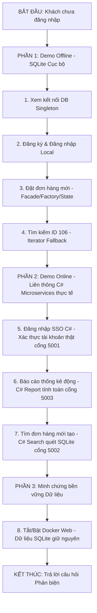

# CẨM NANG HƯỚNG DẪN DEMO DỰ ÁN CHI TIẾT (STEP-BY-STEP DEMO GUIDE)
## HỆ THỐNG QUẢN LÝ ĐƠN HÀNG (OMS) - SOFTWARE ARCHITECTURE

Tài liệu này là cẩm nang hướng dẫn thao tác thực tế (click-by-click) dùng trong buổi bảo vệ bài tập lớn. Tài liệu chia thành 3 phần: Chuẩn bị môi trường, Kịch bản thao tác chi tiết (Thao tác - Màn hình - Lời thoại - Mục tiêu) và các mẹo xử lý tình huống phát sinh nhanh.

---

## 🛠️ PHẦN 1: CHUẨN BỊ TRƯỚC BUỔI DEMO (PREREQUISITES)

Trước khi thầy cô gọi nhóm lên máy chiếu, hãy đảm bảo:
1.  **Docker Desktop** đã được bật (Biểu tượng cá voi ở góc màn hình có màu xanh lá).
2.  Đã tắt tất cả các ứng dụng đang chiếm dụng các cổng mạng: `8000` (Web), `5001` (C# SSO), `5002` (C# Search), `5003` (C# Report).
3.  Mở sẵn 2 cửa sổ **PowerShell** bằng quyền **Administrator** để sẵn sàng gõ lệnh.

---

## 🚀 PHẦN 2: CÁC BƯỚC KHỞI CHẠY HỆ THỐNG NHANH

Gõ lần lượt các lệnh sau vào 2 cửa sổ PowerShell đã chuẩn bị:

### 🖥️ Bước A: Khởi chạy Web Server chính (FastAPI + SQLite)
Mở cửa sổ PowerShell thứ nhất, chạy lệnh:
```powershell
cd "D:\HSU\2533Semester 3(2025-2026)\Kiến trúc phần mềm\Kien_Truc_Phan_Mem_Test-main\Kien_Truc_Phan_Mem_Test-main\Project\src\web_mvc"
docker-compose up -d --build
```
> [!NOTE]
> Hệ thống sẽ mất khoảng 5-10 giây để khởi động Container. Sau khi chạy xong, bạn có thể kiểm tra xem web đã online chưa bằng cách truy cập: `http://localhost:8000`.

### ⚡ Bước B: Khởi chạy Cụm C# Microservices (.NET Core)
Mở cửa sổ PowerShell thứ hai, chạy lệnh:
```powershell
cd "D:\HSU\2533Semester 3(2025-2026)\Kiến trúc phần mềm\Kien_Truc_Phan_Mem_Test-main\Kien_Truc_Phan_Mem_Test-main\Project\src\microservices_csharp"
powershell -ExecutionPolicy Bypass -File .\run_microservices.ps1
```
> [!IMPORTANT]
> Script này sẽ tự động biên dịch và mở **3 cửa sổ Command Prompt (CMD)** chạy song song các cổng `5001`, `5002`, và `5003`. **Tuyệt đối không tắt 3 cửa sổ CMD này** trong suốt quá trình demo.

---

## 🎭 PHẦN 3: KỊCH BẢN DEMO TỪNG BƯỚC CHI TIẾT (LIVE DEMO SCRIPT)

Mở trình duyệt Web tại địa chỉ: **`http://localhost:8000`**



---

### 📦 GIAI ĐOẠN 1: TRÌNH DIỄN HỆ THỐNG OFFLINE (CƠ CHẾ DỰ PHÒNG - FALLBACK)
*(Giai đoạn này chứng minh tính sẵn sàng cao của hệ thống: Khi Microservices C# bị tắt hoặc lỗi, Web chính vẫn hoạt động trơn tru bằng database nội bộ).*

#### 📍 Bước 1: Giới thiệu giao diện & Kết nối DB Singleton
*   **Thao tác**: Cuộn trang web, chỉ vào header của Dashboard.
*   **Kết quả màn hình**: Góc phải trang web hiển thị trạng thái: `SQLite Connected (Singleton)`.
*   **Lời thoại thuyết trình**: 
    > *"Kính chào thầy cô và hội đồng phản biện. Đây là giao diện chính của Hệ thống Quản lý Đơn hàng (OMS). Ở góc bên phải tiêu đề, hệ thống hiển thị dòng trạng thái kết nối Database. Kết nối này được thiết lập thông qua **Singleton Pattern** để đảm bảo ứng dụng chỉ dùng duy nhất một Instance kết nối SQLite trong suốt vòng đời chạy, tiết kiệm tài nguyên và chống Race Condition."*
*   **Mục tiêu chứng minh**: Giải thích vai trò và cách cài đặt **Singleton Pattern** trong file `singleton.py`.

#### 📍 Bước 2: Đăng ký & Đăng nhập tài khoản cục bộ (Local Database Fallback)
*   **Thao tác**:
    1. Nhấn nút **Đăng xuất (Logout)** trên Sidebar nếu tài khoản đang đăng nhập sẵn. Giao diện Login Form sẽ xuất hiện.
    2. Nhấp vào tab **Đăng Ký** trên form đăng nhập. Nhập:
       * *Tên tài khoản*: `customer_test`
       * *Email*: `test@gmail.com`
       * *Mật khẩu*: `123`
    3. Nhấn **Đăng ký**. Hệ thống hiển thị Alert màu xanh lá: `Đăng ký thành công User ID 7!`.
    4. Nhấp lại tab **Đăng Nhập**. Nhập `customer_test` và mật khẩu `123`, nhấn **Đăng Nhập**.
*   **Kết quả màn hình**: Giao diện đăng nhập thành công. Nhãn trên Sidebar hiển thị:
    * *Tên người dùng*: `customer_test`
    * *Quyền hạn*: `User`
    * *Trạng thái xác thực*: `Xác thực: SQLite Local Database (Fallback)`.
*   **Lời thoại thuyết trình**:
    > *"Lúc này cụm Microservice SSO C# chưa được kết nối trực tiếp, hệ thống đã tự động chuyển hướng xác thực xuống bảng `users` của SQLite cục bộ. Chúng em vừa tạo thành công tài khoản mới và đăng nhập. Nhãn trạng thái báo rõ nguồn xác thực là SQLite Local Fallback."*
*   **Mục tiêu chứng minh**: Minh chứng tính năng quản lý thành viên (CRUD Users) và cơ chế Fallback của tính năng Đăng nhập.

#### 📍 Bước 3: Xem danh sách thành viên (User Management)
*   **Thao tác**: Nhấp vào tab **Quản lý Users** trên Sidebar bên trái.
*   **Kết quả màn hình**: Bảng hiển thị danh sách tất cả các tài khoản lấy lên từ SQLite, tài khoản `customer_test` vừa tạo nằm ở dòng dưới cùng.
*   **Lời thoại thuyết trình**:
    > *"Khi vào tab Quản lý Users, Controller gọi Service lấy danh sách từ database SQLite thực tế, tài khoản `customer_test` chúng em vừa đăng ký đã được ghi nhận thành công dưới cơ sở dữ liệu."*

#### 📍 Bước 4: Tạo đơn hàng mới (Áp dụng Facade + Factory + State Pattern)
*   **Thao tác**:
    1. Nhấp vào tab **Đặt hàng & Tra cứu** trên Sidebar.
    2. Tại form đặt hàng bên trái:
       * *Sản phẩm*: Chọn `iPhone 15 Pro Max`.
       * *Phương thức vận chuyển*: Chọn **Giao hàng hỏa tốc (Express)** (Hệ thống tính phí ship $15.0).
       * *Địa chỉ*: Nhập `99 Vo Van Tan, Q3`.
    3. Nhấn nút **Tiến hành đặt hàng (Facade Process)**.
*   **Kết quả màn hình**: Hộp thoại Alert màu xanh lá xuất hiện thông báo: `Đặt hàng thành công! Mã đơn: 106. Mã vận đơn (Facade): TRACK_EXPRESS_...` (Lưu ý nhớ mã đơn này, ví dụ là `106`).
*   **Lời thoại thuyết trình**:
    > *"Khi em click nút Đặt hàng, một quy trình nghiệp vụ phức tạp sẽ được kích hoạt thông qua **Facade Pattern**. Lớp Facade này làm trung gia điều phối 3 hệ thống con: Kiểm kho (Inventory), Thanh toán (Payment) và Vận chuyển (Shipping). 
    > 
    > Facade sẽ gọi **Factory Method Pattern** để khởi tạo đơn hàng hỏa tốc (`ExpressOrder`), tự động áp mức phí ship $15.0. 
    > 
    > Sau đó, **State Pattern** (`OrderContext`) sẽ quản lý vòng đời trạng thái của đơn hàng tự động chuyển từ `Pending` sang `Paid` và sang `Shipped` sau khi thanh toán thành công. Cuối cùng, dữ liệu được ghi vào SQLite."*
*   **Mục tiêu chứng minh**: Nắm rõ cách 3 patterns (Facade, Factory Method, State) phối hợp với nhau trong một API đặt hàng tại `api_router.py`.

#### 📍 Bước 5: Tra cứu đơn hàng bằng ID (Áp dụng Iterator Pattern Fallback)
*   **Thao tác**:
    1. Nhìn sang phần **Tra cứu đơn hàng** bên phải, nhập ID đơn hàng vừa tạo: `106`. Nhấn nút **Tìm**.
    2. Nhấn nút **Làm mới danh sách** ở bảng bên dưới để cập nhật đơn hàng 106 vào danh sách.
*   **Kết quả màn hình**:
    * Khung kết quả hiển thị thông tin đơn hàng 106 kèm dòng: **`Nguồn tìm kiếm: SQLite Local (Iterator Pattern Fallback)`**.
    * Bảng danh sách đơn hàng xuất hiện thêm đơn hàng 106 ở cuối bảng.
*   **Lời thoại thuyết trình**:
    > *"Chúng em tiến hành tra cứu đơn hàng 106 vừa đặt. Hệ thống duyệt qua cơ sở dữ liệu bằng **Iterator Pattern** trên lớp `OrderCollection` để tìm kiếm đơn hàng. Nhãn hiển thị nguồn dữ liệu tìm kiếm báo rõ là SQLite Local Fallback do hệ thống tìm kiếm C# đang chạy offline."*
*   **Mục tiêu chứng minh**: Cách hoạt động của lớp Iterator `OrderCollection`.

---

### 🌐 GIAI ĐOẠN 2: TRÌNH DIỄN HỆ THỐNG ONLINE (LIÊN THÔNG C# MICROSERVICES THỰC TẾ)
*(Giai đoạn này chứng minh khả năng giao tiếp phân tán và đồng bộ dữ liệu thời gian thực: Khi cụm C# được khởi chạy, Web Component sẽ tự động chuyển sang cấu trúc tích hợp chéo và phân phối tải nghiệp vụ).*

#### 📍 Bước 6: Đăng nhập SSO bằng C# Microservice (Đăng nhập tài khoản thật)
*   **Thao tác**:
    1. Nhấn nút **Đăng xuất (Logout)** trên Sidebar để quay lại màn hình Login.
    2. Sử dụng tài khoản `customer_test` vừa tạo ở Bước 2 với mật khẩu `123` (hoặc tài khoản `bob_johnson` / `123` có sẵn trong database).
    3. Nhấn **Đăng Nhập**.
*   **Kết quả màn hình**: 
    * Sidebar cập nhật thông tin tài khoản thành công.
    * Dòng trạng thái đổi thành: **`Xác thực: C# SSO Microservice (:5001)`** với màu xanh lá nổi bật.
*   **Lời thoại thuyết trình**:
    > *"Bây giờ cụm C# Microservices đã được bật, khi em đăng nhập bằng tài khoản `customer_test` mới tạo, FastAPI sẽ đóng vai trò Proxy gửi yêu cầu xác thực trực tiếp sang **C# SSO Service** ở cổng 5001. 
    > 
    > Dịch vụ C# SSO không dùng tài khoản code cứng, mà đã kết nối trực tiếp vào file SQLite `orders.db` dùng chung để kiểm tra thông tin tài khoản thật. Hệ thống xác thực thành công và trả về token xác thực tập trung. Sidebar hiển thị rõ nguồn xác thực từ C# SSO."*
*   **Mục tiêu chứng minh**: Luồng gọi chéo HTTP API giữa Python và C# và khả năng đọc chung database SQLite để xác thực tài khoản thật.

#### 📍 Bước 7: Xem số liệu thống kê thời gian thực từ C# Report Microservice (Báo cáo động)
*   **Thao tác**: Click chọn tab **Dashboard** (Hoặc nhấp vào nút **Lấy báo cáo C#** ở khu vực thống kê).
*   **Kết quả màn hình**:
    * Thống kê Tổng đơn hàng hiển thị số lượng đơn hàng thực tế trong Database SQLite (ví dụ: `6` hoặc `10` đơn hàng).
    * Tổng doanh thu hiển thị số tiền được tính toán động (giá các sản phẩm cộng với phí vận chuyển).
    * Dòng nguồn dữ liệu Dashboard hiển thị: **`C# Report Microservice (:5003)`**.
*   **Lời thoại thuyết trình**:
    > *"Ở màn hình Dashboard, dữ liệu báo cáo tài chính được kết nối trực tiếp với **C# Report Service** cổng 5003. Dịch vụ C# sẽ thực hiện truy vấn động bảng `orders` từ SQLite, bóc tách phương thức vận chuyển và sản phẩm để tính toán ra tổng số đơn và doanh thu thực tế. Khi chúng em đặt thêm đơn hàng, số liệu này sẽ tăng lên tương ứng thay vì dùng dữ liệu giả lập."*

#### 📍 Bước 8: Tra cứu đơn hàng thật qua C# Search Microservice
*   **Thao tác**:
    1. Click tab **Đặt hàng & Tra cứu**.
    2. Tại ô tra cứu đơn hàng, nhập ID đơn hàng vừa tạo ở Bước 4 (ví dụ: `106`). Nhấn **Tìm**.
*   **Kết quả màn hình**: Khung kết quả tra cứu hiển thị thông tin sản phẩm kèm dòng nhãn: **`Nguồn tìm kiếm: C# Search Microservice (:5002)`** màu xanh lá cây và dòng chi tiết chứa chữ `(Đã xác minh qua C# Search)`.
*   **Lời thoại thuyết trình**:
    > *"Khi em tra cứu đơn hàng vừa đặt, FastAPI sẽ chuyển tiếp yêu cầu đến **C# Search Microservice** ở cổng 5002. C# Search Service quét dữ liệu trong SQLite và tìm thấy đơn hàng thật, trả về kết quả kèm chuỗi chữ xác nhận. Điều này chứng minh sự liên thông dữ liệu 100% giữa cụm microservice C# và database của ứng dụng chính."*

---

### 💾 GIAI ĐOẠN 3: MINH CHỨNG TÍNH BỀN VỮNG DỮ LIỆU (PERSISTENCE)
*(Giai đoạn này chứng minh dữ liệu được lưu xuống ổ đĩa vật lý của DB SQLite chứ không phải lưu tạm trên RAM).*

#### 📍 Bước 9: Tắt Server Web Docker và Khởi động lại
*   **Thao tác**:
    1. Quay lại cửa sổ PowerShell thứ nhất (chạy Docker), gõ lệnh tắt server:
       ```powershell
       docker-compose down
       ```
    2. F5 lại trình duyệt `http://localhost:8000` $\rightarrow$ Màn hình báo lỗi không thể kết nối (Server đã chết hoàn toàn).
    3. Chạy lại lệnh mở server:
       ```powershell
       docker-compose up -d
       ```
    4. Quay lại trình duyệt F5 tải lại trang $\rightarrow$ Đăng nhập bằng tài khoản `customer_test` đã tạo ở giai đoạn 1.
    5. Vào tab **Quản lý Users** và tab **Đặt hàng & Tra cứu**.
*   **Kết quả màn hình**:
    * Tài khoản `customer_test` đăng nhập thành công bình thường.
    * Trong danh sách Users vẫn tồn tại tài khoản `customer_test`.
    * Trong danh sách Đơn hàng vẫn tồn tại đơn hàng `106` đã tạo.
*   **Lời thoại thuyết trình**:
    > *"Để chứng minh tính bền vững của dữ liệu, chúng em vừa hạ máy chủ Web Docker xuống và khởi động lại. Khi truy cập lại, toàn bộ thông tin tài khoản đăng ký mới và các đơn hàng đã đặt vẫn được bảo toàn nguyên vẹn trong tệp `orders.db` SQLite vật lý được kết nối qua Singleton, chứng minh hệ thống đạt chuẩn persistence và không bị mất dữ liệu khi restart."*

---

## 💡 PHẦN 4: MẸO NHỎ GIÚP ĐẠT ĐIỂM TỐI ĐA (TIPS FOR A+)

1.  **Chủ động nêu tên các Pattern**: Khi thao tác đến bước nào, hãy nhấn mạnh ngay tên Pattern áp dụng ở bước đó (ví dụ: *"Đây là Singleton"*, *"Chỗ này chạy Facade"*). Thầy cô rất thích sinh viên định vị được Pattern trong code.
2.  **Mở sẵn mã nguồn**: Mở sẵn phần code của các file pattern: `singleton.py`, `facade.py`, `state.py`, `factory.py`, `iterator.py` trên VS Code. Nếu thầy cô hỏi: *"Code Singleton của em nằm ở đâu?"*, hãy Alt-Tab chuyển ngay sang VS Code và chỉ vào đoạn code `_lock` và `Double-Checked Locking`.
3.  **Tự tin giải thích Fallback**: Nhấn mạnh rằng hệ thống được thiết kế theo tư duy **Microservices phân tán** (Loose Coupling), các dịch vụ không làm sập lẫn nhau. Nếu dịch vụ C# chết, khách hàng vẫn đặt hàng và đăng ký bình thường qua SQLite nội bộ của Python Web.
4.  **Giải thích đồng bộ dữ liệu thời gian thực**: Trình bày rõ ràng rằng cụm C# Microservices được viết bằng .NET Core sử dụng thư viện `Microsoft.Data.Sqlite` để truy cập trực tiếp và chia sẻ file database `orders.db` với Python FastAPI, giúp loại bỏ hoàn toàn việc sử dụng dữ liệu giả lập và biến đây thành một hệ thống phân tán thực thụ.
