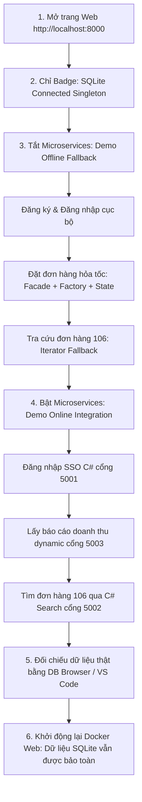

# 🎯 CẨM NANG HƯỚNG DẪN DEMO DỰ ÁN CHI TIẾT (ULTIMATE LIVE DEMO GUIDE)
## HỆ THỐNG QUẢN LÝ ĐƠN HÀNG (OMS) - SOFTWARE ARCHITECTURE

Tài liệu này là cẩm nang hướng dẫn thao tác thực tế (click-by-click) cùng kịch bản thuyết minh chi tiết từng giây, cách thiết lập màn hình và các mẹo đối chiếu mã nguồn trực tiếp dành cho nhóm sinh viên trong buổi bảo vệ trước Hội đồng chấm thi.

---

## 🛠️ PHẦN 1: CHUẨN BỊ TRƯỚC BUỔI DEMO (SETUP & RUN ENVIRONMENT)

Trước khi Hội đồng gọi tên nhóm lên trình bày, hãy chuẩn bị sẵn sàng môi trường như sau:

### 1. Kiểm tra phần mềm nền tảng
*   Đảm bảo **Docker Desktop** đã khởi động (Icon con cá voi ở khay hệ thống hiển thị màu xanh lá cây `running`).
*   Tắt các ứng dụng chạy ngầm có thể chiếm dụng các cổng mạng: `8000` (Web FastAPI), `5001` (C# SSO), `5002` (C# Search), `5003` (C# Report).

### 2. Các bước khởi chạy hệ thống (Gõ sẵn trên Terminal)
Mở sẵn **2 cửa sổ PowerShell (Administrator)** ở chế độ song song trên màn hình:

*   **Cửa sổ 1 (FastAPI Web chính)**: Chạy lệnh dưới đây để dựng Container Docker chứa Web API:
    ```powershell
    cd "D:\HSU\2533Semester 3(2025-2026)\Kiến trúc phần mềm\Kien_Truc_Phan_Mem_Test-main\Kien_Truc_Phan_Mem_Test-main\Project\src\web_mvc"
    docker-compose up -d --build
    ```
    *Cách kiểm tra*: Mở trình duyệt truy cập `http://localhost:8000`. Nếu giao diện Premium Dark Mode hiển thị là thành công.

*   **Cửa sổ 2 (Cụm C# Microservices)**: Chạy lệnh tự động khởi chạy 3 dịch vụ:
    ```powershell
    cd "D:\HSU\2533Semester 3(2025-2026)\Kiến trúc phần mềm\Kien_Truc_Phan_Mem_Test-main\Kien_Truc_Phan_Mem_Test-main\Project\src\microservices_csharp"
    powershell -ExecutionPolicy Bypass -File .\run_microservices.ps1
    ```
    *Lưu ý quan trọng*: Lệnh này sẽ tự động biên dịch (.NET Restore & Build) và mở lên **3 cửa sổ Command Prompt (CMD) màu đen** lắng nghe các cổng `5001`, `5002` và `5003`. **Tuyệt đối không tắt các cửa sổ CMD này** vì đó là log hoạt động thời gian thực của Microservices.

---

## 🎭 PHẦN 2: KỊCH BẢN DEMO TỪNG BƯỚC CHI TIẾT (LIVE DEMO SCRIPT)

### 🗺️ Luồng Demo Tổng Quan (Mermaid Flow)


---

### GIAI ĐOẠN 1: TRÌNH DIỄN HỆ THỐNG OFFLINE (CƠ CHẾ DỰ PHÒNG - FALLBACK)
*(Giai đoạn này nhằm gây ấn tượng mạnh với Hội đồng về tính sẵn sàng cao (High Availability) và khả năng cô lập lỗi của hệ thống: Khi cụm C# Microservices gặp sự cố, Web API chính vẫn phục vụ khách hàng bình thường).*

#### 📍 Bước 1: Mở trang Web và Giới thiệu Kết nối Database Singleton
*   **Thao tác**: Mở trình duyệt tại `http://localhost:8000`. Trỏ chuột vào góc phải thanh tiêu đề nơi có nhãn **`SQLite Connected (Singleton)`**.
*   **Hiện tượng trên màn hình**: Nhãn trạng thái hiển thị màu xám/xanh dương dịu, báo hiệu hệ thống đã liên kết với file dữ liệu SQLite vật lý.
*   **🎤 Lời thoại thuyết trình**:
    > *"Kính thưa quý thầy cô trong Hội đồng. Đây là giao diện chính của ứng dụng quản lý đơn hàng. Ở góc phải thanh tiêu đề, thầy cô có thể thấy huy hiệu **'SQLite Connected (Singleton)'**. 
    > 
    > Để quản lý kết nối cơ sở dữ liệu SQLite một cách tối ưu, chúng em đã áp dụng **Singleton Pattern** tại lớp [DatabaseConnection](file:///d:/HSU/2533Semester%203(2025-2026)/Ki%E1%BA%BFn%20tr%C3%BAc%20ph%E1%BA%A7n%20m%E1%BB%81m/Kien_Truc_Phan_Mem_Test-main/Kien_Truc_Phan_Mem_Test-main/Project/src/web_mvc/app/patterns/singleton.py#L6) của file `singleton.py`. Lớp này sử dụng kỹ thuật khóa đa luồng **Double-Checked Locking** để đảm bảo toàn bộ Web API chỉ dùng duy nhất một thực thể kết nối SQLite trong suốt vòng đời chạy, giúp loại bỏ nguy cơ nghẽn tài nguyên và lỗi khóa ghi đọc của SQLite."*

#### 📍 Bước 2: Đăng ký & Đăng nhập cục bộ (Offline Fallback)
*   **Thao tác**:
    1. Nhấn nút **Đăng xuất (Logout)** trên Sidebar nếu tài khoản đang đăng nhập sẵn. Giao diện Login Form sẽ xuất hiện.
    2. Click vào tab **Đăng Ký** trên form. Nhập tài khoản: `khachhang_demo`, Email: `demo@hsu.edu.vn`, Mật khẩu: `123`. Nhấn **Đăng ký**.
    3. Nhấp lại tab **Đăng Nhập**. Nhập `khachhang_demo` và mật khẩu `123`. Nhấn **Đăng Nhập**.
*   **Hiện tượng trên màn hình**: 
    * Xuất hiện Alert màu xanh thông báo đăng ký thành công User mới kèm ID.
    * Đăng nhập thành công, Sidebar hiển thị trạng thái màu vàng: **`Xác thực: SQLite Local Database (Fallback)`**.
*   **🎤 Lời thoại thuyết trình**:
    > *"Hiện tại, do cụm Microservices C# phía sau đang offline (chưa được bật hoặc gặp sự cố mạng), hệ thống Web chính viết bằng FastAPI đã tự động kích hoạt cơ chế **Fallback (dự phòng cục bộ)** cài đặt tại phương thức [AuthService.login](file:///d:/HSU/2533Semester%203(2025-2026)/Ki%E1%BA%BFn%20tr%C3%BAc%20ph%E1%BA%A7n%20m%E1%BB%81m/Kien_Truc_Phan_Mem_Test-main/Kien_Truc_Phan_Mem_Test-main/Project/src/web_mvc/app/services/auth_service.py#L12). 
    > 
    > Thay vì báo lỗi sập hệ thống, FastAPI tự động chuyển hướng truy vấn xuống bảng `users` của SQLite cục bộ để xác thực. Như thầy cô thấy, tài khoản `khachhang_demo` vừa được đăng ký mới và đăng nhập hoàn toàn trơn tru."*

#### 📍 Bước 3: Xem danh sách Users & Đặt hàng mới (Facade + Factory + State)
*   **Thao tác**:
    1. Click tab **Quản lý Users** trên Sidebar để xác nhận user mới đã nằm trong bảng SQLite.
    2. Click tab **Đặt hàng & Tra cứu** trên Sidebar.
    3. Điền thông tin đặt đơn hàng:
       * *Sản phẩm*: Chọn `MacBook Pro M3`.
       * *Vận chuyển*: Chọn **Giao hàng hỏa tốc (Express)** (Chi phí ship tự động nhảy lên $15.0).
       * *Địa chỉ*: Nhập `8 Nguyen Van Chiem, Q1`.
    4. Nhấn nút **Tiến hành đặt hàng (Facade Process)**.
*   **Hiện tượng trên màn hình**:
    * Trong bảng danh sách Users xuất hiện dòng chứa `khachhang_demo`.
    * Đặt đơn hàng thành công, hiển thị mã đơn hàng dạng số (ví dụ: `106`) và mã vận đơn chứa chữ `TRACK_EXPRESS_...`
*   **🎤 Lời thoại thuyết trình**:
    > *"Tiếp theo, chúng em tiến hành đặt đơn hàng mới. Quy trình đặt hàng này tích hợp đồng thời 3 Design Patterns để tách biệt trách nhiệm:
    > 
    > 1. Đầu tiên, Controller gọi tới lớp [OrderFacade](file:///d:/HSU/2533Semester%203(2025-2026)/Ki%E1%BA%BFn%20tr%C3%BAc%20ph%E1%BA%A7n%20m%E1%BB%81m/Kien_Truc_Phan_Mem_Test-main/Kien_Truc_Phan_Mem_Test-main/Project/src/web_mvc/app/patterns/facade.py#L23) (**Facade Pattern**). Lớp mặt tiền này bao bọc quy trình phức tạp gồm: kiểm tra kho, xử lý thanh toán và giao hàng.
    > 2. Facade gọi tới [OrderFactory](file:///d:/HSU/2533Semester%203(2025-2026)/Ki%E1%BA%BFn%20tr%C3%BAc%20ph%E1%BA%A7n%20m%E1%BB%81m/Kien_Truc_Phan_Mem_Test-main/Kien_Truc_Phan_Mem_Test-main/Project/src/web_mvc/app/patterns/factory.py#L33) (**Factory Method Pattern**) để tự động tạo đúng đối tượng đơn hàng hỏa tốc `ExpressOrder` và áp mức phí ship $15.0.
    > 3. Trạng thái vòng đời đơn hàng được luân chuyển tuần tự thông qua lớp [OrderContext](file:///d:/HSU/2533Semester%203(2025-2026)/Ki%E1%BA%BFn%20tr%C3%BAc%20ph%E1%BA%A7n%20m%E1%BB%81m/Kien_Truc_Phan_Mem_Test-main/Kien_Truc_Phan_Mem_Test-main/Project/src/web_mvc/app/patterns/state.py#L36) (**State Pattern**) từ trạng thái `Pending` (Chờ thanh toán) sang `Paid` (Đã thanh toán) và `Shipped` (Đang giao hàng) ngay khi hoàn tất quy trình mà không hề dùng lệnh rẽ nhánh if/else."*

#### 📍 Bước 4: Tìm kiếm đơn hàng cục bộ bằng Iterator Pattern Fallback
*   **Thao tác**: Nhập mã đơn hàng vừa tạo (ví dụ: `106`) vào ô **Tra cứu đơn hàng** bên phải màn hình. Nhấn **Tìm**.
*   **Hiện tượng trên màn hình**: Kết quả thông tin đơn hàng hiển thị kèm nhãn màu vàng: **`Nguồn tìm kiếm: SQLite Local (Iterator Pattern Fallback)`**.
*   **🎤 Lời thoại thuyết trình**:
    > *"Khi em nhấn nút Tìm kiếm đơn hàng 106, hệ thống nhận thấy C# Search Service đang offline. Lúc này cơ chế dự phòng cục bộ kích hoạt: Nạp toàn bộ đơn hàng trong SQLite vào bộ sưu tập [OrderCollection](file:///d:/HSU/2533Semester%203(2025-2026)/Ki%E1%BA%BFn%20tr%C3%BAc%20ph%E1%BA%A7n%20m%E1%BB%81m/Kien_Truc_Phan_Mem_Test-main/Kien_Truc_Phan_Mem_Test-main/Project/src/web_mvc/app/patterns/iterator.py#L3) (**Iterator Pattern**). Bộ duyệt này tự động chạy vòng lặp tuần tự để tìm kiếm và trả về thông tin đơn hàng mà không để lộ cấu trúc lưu trữ nội bộ ra ngoài."*

---

### GIAI ĐOẠN 2: TRÌNH DIỄN HỆ THỐNG ONLINE (LIÊN THÔNG C# MICROSERVICES THỰC TẾ)
*(Giai đoạn này chứng minh tính kết nối thời gian thực chéo nền tảng giữa Web FastAPI Python và cụm Microservices C# .NET Core thông qua việc đọc/ghi chung SQLite Database).*

#### 📍 Bước 5: Đăng nhập SSO bằng C# Microservice (Cổng 5001)
*   **Thao tác**:
    1. Nhấn nút **Đăng xuất (Logout)** trên Sidebar.
    2. Đăng nhập lại bằng tài khoản `khachhang_demo` vừa đăng ký ở Giai đoạn 1 với mật khẩu `123`. Nhấn **Đăng Nhập**.
*   **Hiện tượng trên màn hình**: Sidebar cập nhật thông tin thành công và nhãn trạng thái đổi thành màu xanh lá cây nổi bật: **`Xác thực: C# SSO Microservice (:5001)`**.
*   **🎤 Lời thoại thuyết trình**:
    > *"Bây giờ cụm dịch vụ C# Microservices đã hoạt động ổn định. Khi em thực hiện đăng nhập lại bằng tài khoản `khachhang_demo` vừa tạo, FastAPI đã đóng vai trò làm Proxy, gửi yêu cầu HTTP POST chứa thông tin đăng nhập trực tiếp tới cổng 5001 của **C# SSOService**. 
    > 
    > Dịch vụ C# SSO không dùng tài khoản code cứng, mà đã kết nối trực tiếp vào tệp SQLite `orders.db` dùng chung để kiểm tra thông tin tài khoản thật do Python Web vừa ghi nhận ở Giai đoạn 1. SSO xác nhận thành công và cấp Token bảo mật tập trung."*

#### 📍 Bước 6: Lấy báo cáo thống kê chéo từ C# Report Service (Cổng 5003)
*   **Thao tác**: Click chọn tab **Dashboard** trên Sidebar (Hoặc nhấp vào nút **Lấy báo cáo C#** ở thẻ Dashboard).
*   **Hiện tượng trên màn hình**: Số lượng đơn hàng và doanh thu cập nhật tự động khớp hoàn toàn với SQLite thực tế. Nhãn hiển thị nguồn dữ liệu Dashboard chuyển thành màu xanh lá: **`C# Report Microservice (:5003)`**.
*   **🎤 Lời thoại thuyết trình**:
    > *"Ở màn hình Dashboard thống kê, khi em nhấn nút 'Lấy báo cáo C#', FastAPI gửi yêu cầu GET tới **C# ReportService** cổng 5003. Dịch vụ C# sẽ thực thi câu lệnh SQL để đọc và tính toán động doanh thu (bằng giá trị sản phẩm cộng phí ship tương ứng) trực tiếp từ SQLite và trả về kết quả thời gian thực cho trang Web."*

#### 📍 Bước 7: Tìm kiếm đơn hàng nâng cao qua C# Search Service (Cổng 5002)
*   **Thao tác**: Click tab **Đặt hàng & Tra cứu**. Nhập ID đơn hàng vừa tạo ở Giai đoạn 1 (ví dụ: `106`) vào ô tìm kiếm. Nhấn **Tìm**.
*   **Hiện tượng trên màn hình**: Kết quả hiển thị thông tin đơn hàng, tại mục Chi tiết có ghi chữ `(Đã xác minh qua C# Search)` và nhãn nguồn tìm kiếm chuyển thành màu xanh lá: **`Nguồn tìm kiếm: C# Search Microservice (:5002)`**.
*   **🎤 Lời thoại thuyết trình**:
    > *"Tương tự với chức năng tra cứu đơn hàng, FastAPI đã chuyển tiếp yêu cầu đến **C# SearchService** ở cổng 5002. C# Search quét bảng `orders` của SQLite và tìm thấy đơn hàng 106, tự động đính kèm chữ xác minh và gửi về cho client hiển thị."*

---

### GIAI ĐOẠN 3: MINH CHỨNG TÍNH BỀN VỮNG DỮ LIỆU (PERSISTENCE)
*(Giai đoạn này giúp bạn ghi điểm tuyệt đối về tính toàn vẹn dữ liệu).*

#### 📍 Bước 8: Tắt Container Docker và khởi động lại để chứng minh dữ liệu lưu thật
*   **Thao tác**:
    1. Quay lại **Cửa sổ PowerShell thứ nhất** (chạy Docker), gõ lệnh tắt server:
       ```powershell
       docker-compose down
       ```
    2. F5 lại trình duyệt $\rightarrow$ Màn hình báo lỗi không thể truy cập (Server đã tắt hoàn toàn).
    3. Chạy lại lệnh mở server:
       ```powershell
       docker-compose up -d
       ```
    4. Quay lại trình duyệt F5 tải lại trang. Tiến hành đăng nhập bằng tài khoản `khachhang_demo` / `123`.
    5. Click vào tab **Quản lý Users** và kiểm tra đơn hàng tại tab **Đặt hàng & Tra cứu**.
*   **Hiện tượng trên màn hình**:
    * Đăng nhập thành công, tài khoản `khachhang_demo` vẫn có trong bảng quản lý Users.
    * Đơn hàng `106` đã đặt trước đó vẫn nằm ở cuối danh sách đơn hàng.
*   **🎤 Lời thoại thuyết trình**:
    > *"Để chứng minh hệ thống đạt chuẩn bền vững dữ liệu (Persistence) và dữ liệu không chỉ được lưu tạm trên bộ nhớ đệm RAM, chúng em đã hạ hoàn toàn Container chạy Web Python xuống và khởi động lại. Khi truy cập lại trang Web, toàn bộ thông tin người dùng đăng ký mới và đơn hàng 106 trước đó vẫn tồn tại nguyên vẹn, chứng minh dữ liệu được ghi nhận bền vững xuống file SQLite vật lý trên ổ đĩa."*

---

## 💾 PHẦN 3: HƯỚNG DẪN ĐỐI CHIẾU DỮ LIỆU BẰNG PHẦN MỀM THỨ BA
*(Hội đồng chấm thi rất thích khi sinh viên sử dụng công cụ quản trị bên thứ ba để chứng minh tính trung thực của cơ sở dữ liệu).*

Nếu thầy cô yêu cầu: *"Hãy mở Database lên cho tôi xem dữ liệu thực tế có khớp không?"*, bạn hãy làm theo các bước sau:

1.  **Cách 1: Sử dụng DB Browser for SQLite (Khuyên dùng)**:
    *   Mở phần mềm **DB Browser for SQLite** đã chuẩn bị ở phần cài đặt.
    *   Bấm **Open Database** (hoặc nhấn tổ hợp phím `Ctrl + O`).
    *   Dẫn đến đường dẫn file SQLite chung của dự án:
        `D:\HSU\2533Semester 3(2025-2026)\Kiến trúc phần mềm\Kien_Truc_Phan_Mem_Test-main\Kien_Truc_Phan_Mem_Test-main\Project\src\web_mvc\orders.db`
    *   Chọn tab **Browse Data** ở trên cùng.
    *   Tại mục **Table**, chọn bảng `users` $\rightarrow$ Chỉ cho thầy cô thấy tài khoản `khachhang_demo` vừa đăng ký.
    *   Chọn bảng `orders` $\rightarrow$ Chỉ cho thầy cô thấy dòng đơn hàng `106` với chi tiết địa chỉ và mã vận đơn tương ứng.

2.  **Cách 2: Sử dụng Extension Database Client của VS Code**:
    *   Nhấp vào biểu tượng **Database Client** ở thanh Activity Bar bên trái VS Code (Nếu bạn đã cài extension thay thế thành công).
    *   Nhấp chuột phải vào kết nối SQLite `orders.db` $\rightarrow$ Chọn **Open Table** cho bảng `orders`.

---

## 🛡️ PHẦN 4: MẸO PHÒNG THỦ & TRẢ LỜI CÂU HỎI NHANH (DEFENSE TRICKS)

Để tránh bị động khi bị thầy cô hỏi bất chợt, bạn nên chuẩn bị trước các tab mã nguồn trên VS Code theo sơ đồ sau:

| Tên Mẫu Thiết Kế | Đường dẫn file cần mở sẵn | Dòng cần chỉ ra khi thầy cô hỏi |
| :--- | :--- | :--- |
| **Singleton** | [singleton.py](file:///d:/HSU/2533Semester%203(2025-2026)/Ki%E1%BA%BFn%20tr%C3%BAc%20ph%E1%BA%A7n%20m%E1%BB%81m/Kien_Truc_Phan_Mem_Test-main/Kien_Truc_Phan_Mem_Test-main/Project/src/web_mvc/app/patterns/singleton.py) | Dòng 17-25: Kiểm tra kép Double-Checked Locking và đồng bộ đa luồng bằng `cls._lock`. |
| **Factory Method** | [factory.py](file:///d:/HSU/2533Semester%203(2025-2026)/Ki%E1%BA%BFn%20tr%C3%BAc%20ph%E1%BA%A7n%20m%E1%BB%81m/Kien_Truc_Phan_Mem_Test-main/Kien_Truc_Phan_Mem_Test-main/Project/src/web_mvc/app/patterns/factory.py) | Lớp cha trừu tượng `Order` và hàm `create_order` phân loại đơn Standard/Express. |
| **Facade** | [facade.py](file:///d:/HSU/2533Semester%203(2025-2026)/Ki%E1%BA%BFn%20tr%C3%BAc%20ph%E1%BA%A7n%20m%E1%BB%81m/Kien_Truc_Phan_Mem_Test-main/Kien_Truc_Phan_Mem_Test-main/Project/src/web_mvc/app/patterns/facade.py) | Dòng 34-70: Hàm `place_order` gọi tuần tự check kho $\rightarrow$ thanh toán $\rightarrow$ giao vận. |
| **State** | [state.py](file:///d:/HSU/2533Semester%203(2025-2026)/Ki%E1%BA%BFn%20tr%C3%BAc%20ph%E1%BA%A7n%20m%E1%BB%81m/Kien_Truc_Phan_Mem_Test-main/Kien_Truc_Phan_Mem_Test-main/Project/src/web_mvc/app/patterns/state.py) | Lớp `OrderContext` chứa biến trạng thái hiện tại và gọi `next_step` để tự cập nhật trạng thái. |
| **Iterator** | [iterator.py](file:///d:/HSU/2533Semester%203(2025-2026)/Ki%E1%BA%BFn%20tr%C3%BAc%20ph%E1%BA%A7n%20m%E1%BB%81m/Kien_Truc_Phan_Mem_Test-main/Kien_Truc_Phan_Mem_Test-main/Project/src/web_mvc/app/patterns/iterator.py) | Cài đặt các hàm `__iter__` và `__next__` để duyệt qua mảng chứa các đơn hàng. |
| **C# SSO Service** | [SSOService/Program.cs](file:///d:/HSU/2533Semester%203(2025-2026)/Ki%E1%BA%BFn%20tr%C3%BAc%20ph%E1%BA%A7n%20m%E1%BB%81m/Kien_Truc_Phan_Mem_Test-main/Kien_Truc_Phan_Mem_Test-main/Project/src/microservices_csharp/SSOService/Program.cs) | Dòng 41-77: Nhận thông tin từ FastAPI và thực thi câu lệnh truy vấn SQLite để xác thực. |
| **C# Report Service** | [ReportService/Program.cs](file:///d:/HSU/2533Semester%203(2025-2026)/Ki%E1%BA%BFn%20tr%C3%BAc%20ph%E1%BA%A7n%20m%E1%BB%81m/Kien_Truc_Phan_Mem_Test-main/Kien_Truc_Phan_Mem_Test-main/Project/src/microservices_csharp/ReportService/Program.cs) | Dòng 41-110: Hàm `summary` thực thi truy vấn tất cả đơn hàng, bóc tách và tính tổng doanh thu động. |
