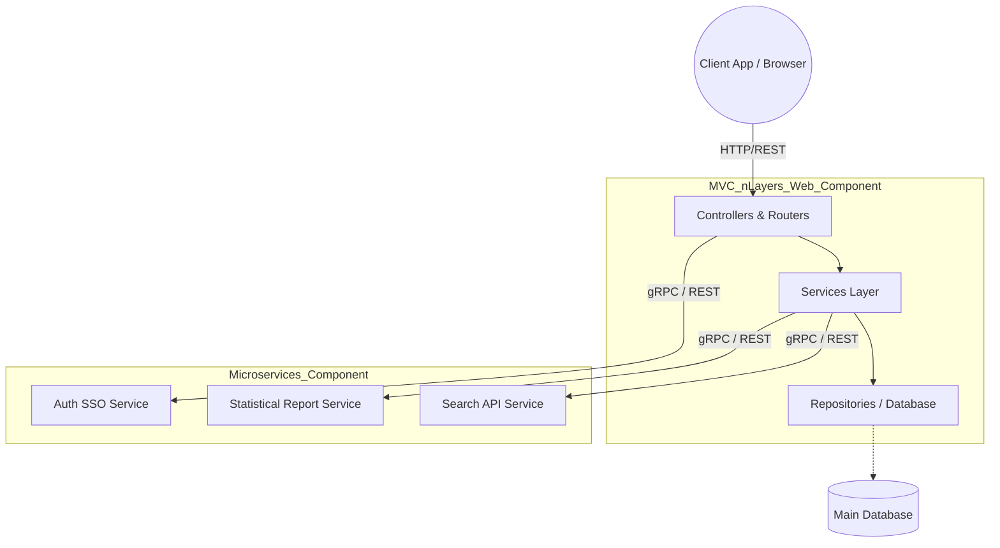
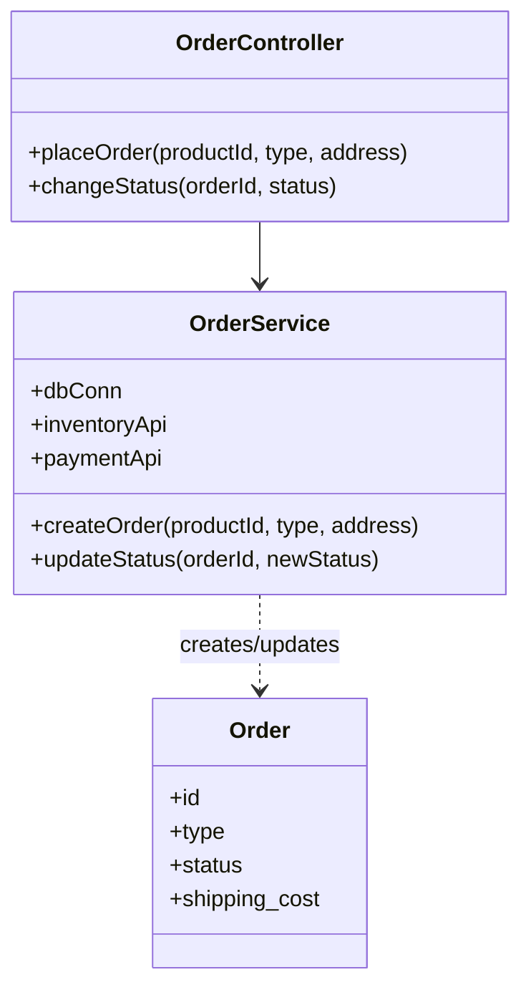
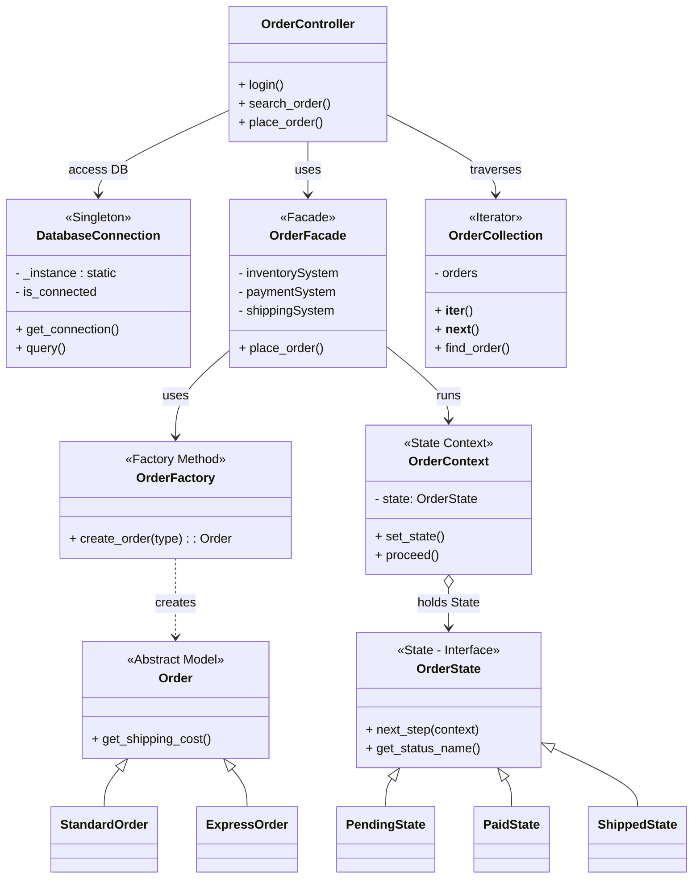
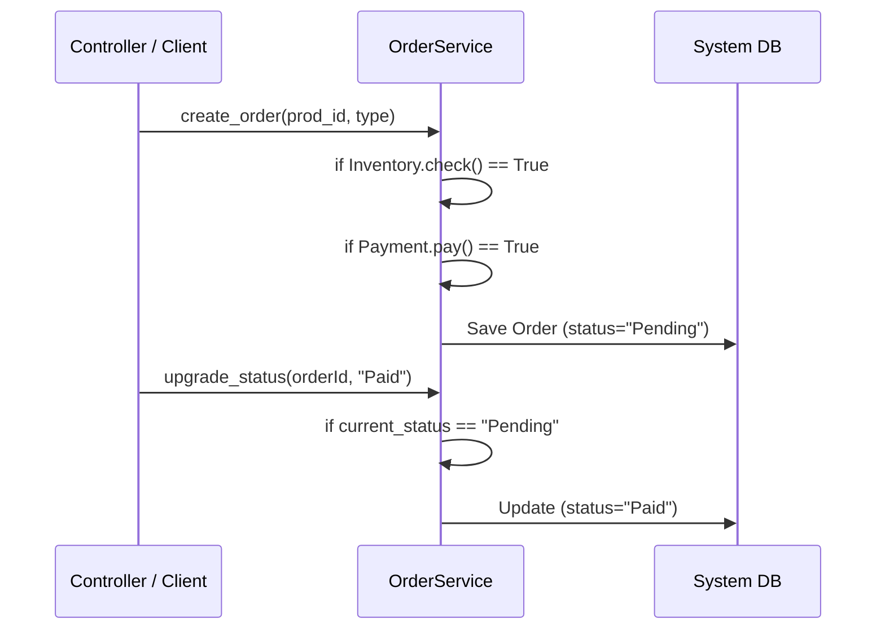
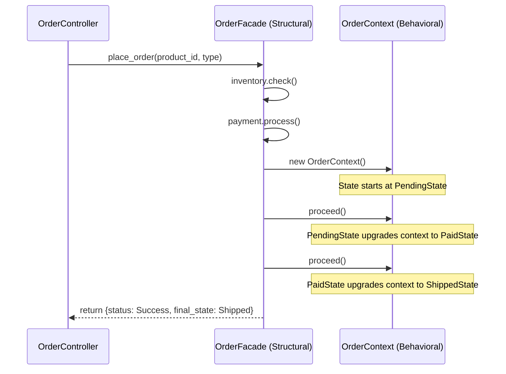

# Tài Liệu Thiết Kế (Architecture Document) - Hệ Thống Quản Lý Đơn Hàng

## 1. Problem Description (Mô tả bài toán)
Hệ thống quản lý đơn hàng gặp thách thức về tính mở rộng khi nghiệp vụ xử lý đơn hàng phức tạp dần lên (phải tương tác với kho hàng, thanh toán, giao vận, xuất báo cáo...). Quản lý trạng thái đơn hàng (Đang chờ -> Đã thanh toán -> Đã giao) bằng cấu trúc lệnh `if/else` truyền thống dễ gây ra mã nguồn phức tạp (Spaghetti code) và khó bảo trì.
Ngoài ra, cần đảm bảo ứng dụng có thể chịu tải dưới kiến trúc n-Tiers (MVC) và giao tiếp với các Microservices độc lập (ví dụ: SSO - Single Sign On) thông qua API REST.

---

## 2. System Diagram (Component / Deployment Diagram)

Sơ đồ triển khai hệ thống cho thấy Cụm MVC phục vụ Client và kết nối với các Microservices nội bộ.

---

## 3. Class Diagram (1st details - Thiết kế ban đầu chưa có Pattern)

Trước khi áp dụng Pattern, logic tạo hóa đơn và xử lý trạng thái bị dồn hết vào class `OrderService`, gây phình to mã nguồn (God/Monster Object).

---

## 4. Class Diagram (Final Design - Áp dụng 5 Design Patterns)
Sự kết nối giữa các Tầng (Controller, Service, Models, Config) khi nhúng 5 Patterns.

---

## 5. Detail Diagrams (Sequence: Trạng thái Đơn hàng 1st vs Final)

Yêu cầu vẽ 2 Detail diagram dùng để phân tích lợi ích của 1 Mẫu (State Pattern).

### 5.1. 1st Diagram: Quy trình Đặt hàng lúc CHƯA có Facade và State Pattern
Chữ kí của sơ đồ là Client phải gọi từng hàm lẻ tẻ để kiểm kho, trả tiền và gửi yêu cầu, sau đó dùng `if` lồng để chỉnh trạng thái.

### 5.2. Final Diagram: Quy trình Đặt hàng ĐÃ áp dụng Facade + State Pattern
Client làm việc ở mức rất trừu tượng. Facade che giấu sự phức tạp của Payment/Inventory. State tự quyết định vòng đời của đơn hàng.

