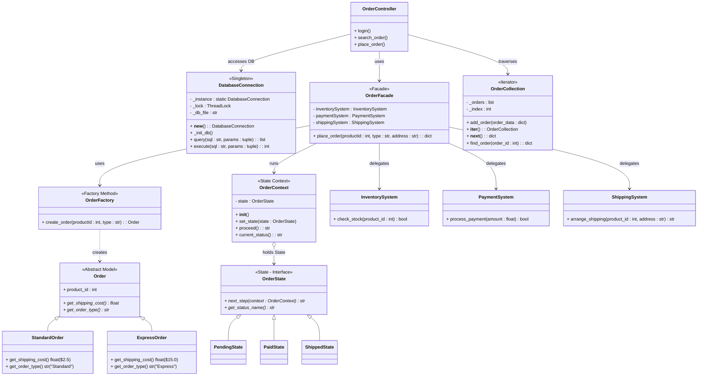
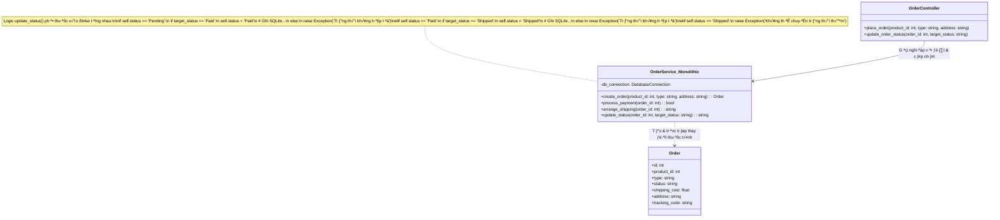
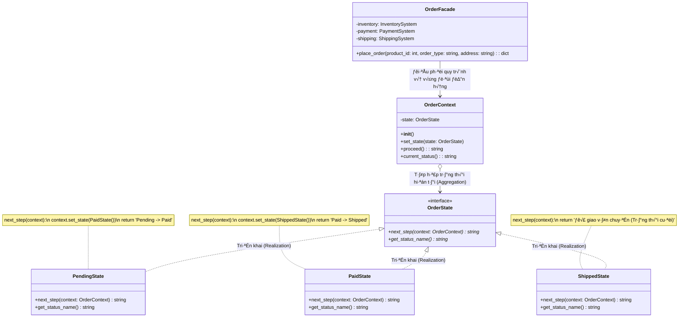
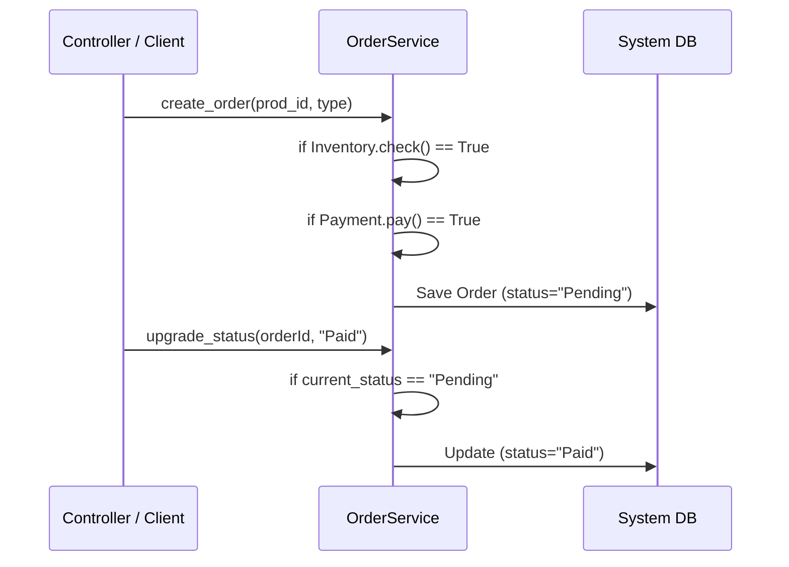
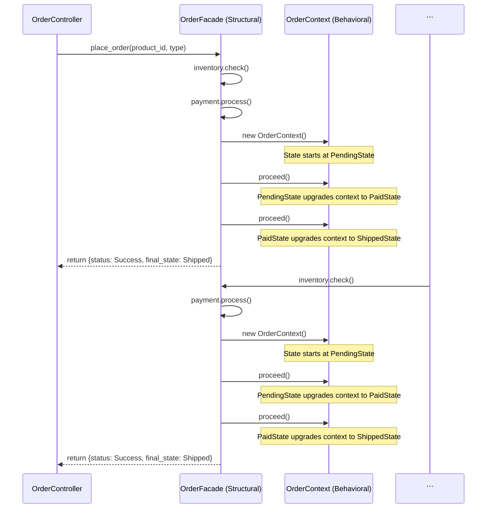

# Tài Liệu Thiết Kế (Architecture Document) - Hệ Thống Quản Lý Đơn Hàng

## 1. Problem Description (Mô tả bài toán)
Hệ thống quản lý đơn hàng gặp thách thức về tính mở rộng khi nghiệp vụ xử lý đơn hàng phức tạp dần lên (phải tương tác với kho hàng, thanh toán, giao vận, xuất báo cáo...). Quản lý trạng thái đơn hàng (Đang chờ -> Đã thanh toán -> Đã giao) bằng cấu trúc lệnh `if/else` truyền thống dễ gây ra mã nguồn phức tạp (Spaghetti code) và khó bảo trì.
Ngo√†i ra, c·∫ßn ƒë·∫£m b·∫£o ·ª©ng d·ª•ng c√≥ th·ªÉ ch·ª## 2. System Diagram (Component / Deployment Diagram with 5+ Design Patterns)

Sơ đồ triển khai hệ thống chi tiết cho thấy Cụm MVC phục vụ Client được đóng gói trong Docker Container và kết nối với các Microservices nội bộ trên máy host Windows. Đồng thời thể hiện rõ vị trí hoạt động của **5+ Design Patterns** trong kiến trúc.

```mermaid
graph TB
    classDef client fill:#d4ebf2,stroke:#1a73e8,stroke-width:2px;
    classDef container fill:#fcfcfc,stroke:#5f6368,stroke-width:2px,stroke-dasharray: 5 5;
    classDef component fill:#e8f0fe,stroke:#1a73e8,stroke-width:2px;
    classDef pattern fill:#fef7e0,stroke:#f9ab00,stroke-width:2px;
    classDef db fill:#e6f4ea,stroke:#137333,stroke-width:2px;
    classDef service fill:#fce8e6,stroke:#c5221f,stroke-width:2px;

    Client((Client App / Browser)):::client

    subgraph Web_Application_Docker_Container ["Web Application Container (FastAPI MVC - Port 8000)"]
        
        subgraph Controller_Layer ["Controller Layer"]
            api_router[api_router.py<br/><i>(Proxy Gateway Pattern)</i>]:::component
        end

        subgraph Business_Logic_Service_Layer ["Business Logic & Design Patterns Layer"]
            facade[OrderFacade<br/><b>[Facade Pattern]</b>]:::pattern
            
            subgraph Subsystems ["Internal Subsystems (Facade Hidden)"]
                inv[InventorySystem]:::component
                pay[PaymentSystem]:::component
                ship[ShippingSystem]:::component
            end
            
            factory[OrderFactory<br/><b>[Factory Method Pattern]</b>]:::pattern
            
            subgraph Order_Hierarchy ["Order Class Hierarchy"]
                order[Order (Abstract)]:::component
                std_order[StandardOrder]:::component
                exp_order[ExpressOrder]:::component
            end

            context[OrderContext<br/><b>[State Pattern Context]</b>]:::pattern
            
            subgraph State_Hierarchy ["Order State Hierarchy"]
                state[OrderState (Interface)]:::component
                pending_st[PendingState]:::component
                paid_st[PaidState]:::component
                shipped_st[ShippedState]:::component
            end
            
            collection[OrderCollection<br/><b>[Iterator Pattern]</b>]:::pattern
        end

        subgraph Repository_Persistence_Layer ["Repository & Persistence Layer"]
            db_conn[DatabaseConnection<br/><b>[Singleton Pattern]</b>]:::pattern
        end
    end

    subgraph CSharp_Microservices_Cluster ["Host Windows OS (C# Microservices Cluster)"]
        SSO[Auth SSO Service<br/>Port 5001]:::service
        Search[Search API Service<br/>Port 5002]:::service
        Report[Statistical Report Service<br/>Port 5003]:::service
    end

    subgraph Storage_Tier ["Storage Tier"]
        DB[(SQLite DB<br/>orders.db)]:::db
    end

    %% Interactions
    Client -- "1. HTTP Request" --> api_router
    
    %% Proxy / Gateway Pattern
    api_router -- "HTTP POST (Verify SSO Token)" --> SSO
    api_router -- "HTTP GET (Advanced Search)" --> Search
    api_router -- "HTTP GET (Dynamic Report Summary)" --> Report
    
    %% Controller calling Facade, Iterator, Singleton
    api_router -- "2. place_order()" --> facade
    api_router -- "Traverses / Finds Orders" --> collection
    api_router -- "Reads/Writes User Session" --> db_conn
    
    %% Facade orchestrates subsystems
    facade -- "a. create_order()" --> factory
    factory --> order
    order <|-- std_order
    order <|-- exp_order
    
    facade -- "b. check_stock()" --> inv
    facade -- "c. process_payment()" --> pay
    facade -- "d. arrange_shipping()" --> ship
    
    facade -- "e. proceed() (Updates status)" --> context
    context o-- state
    state <|-- pending_st
    state <|-- paid_st
    state <|-- shipped_st
    
    %% Database Connection (Singleton)
    db_conn -- "Maintains Connection" --> DB
    api_router -- "Fallback Local Database Queries" --> db_conn
    collection -- "Reads records via sqlite3" --> db_conn
```

---

## 3. Class Diagram (Final Design - Áp dụng 5 Design Patterns)

Sự kết nối chặt chẽ giữa các Tầng (Controller, Service, Models, Config) khi nhúng đầy đủ 5 Design Patterns: Singleton, Factory Method, Facade, State và Iterator.

```mermaid
classDiagram
    %% ======= PATTERNS ======= %%
    class DatabaseConnection {
        <<Singleton>>
        - _instance : static DatabaseConnection
        - _lock : ThreadLock
        - _db_file : str
        + __new__() : DatabaseConnection
        + _init_db()
        + query(sql : str, params : tuple) : list
        + execute(sql : str, params : tuple) : int
    }

    class OrderFactory {
        <<Factory Method>>
        + create_order(productId : int, type : str) : Order
    }

    class OrderFacade {
        <<Facade>>
        - inventorySystem : InventorySystem
        - paymentSystem : PaymentSystem
        - shippingSystem : ShippingSystem
        + place_order(productId : int, type : str, address : str) : dict
    }

    class OrderState {
        <<State - Interface>>
        + next_step(context : OrderContext)* str
        + get_status_name()* str
    }

    class OrderContext {
        <<State Context>>
        - state : OrderState
        + __init__()
        + set_state(state : OrderState)
        + proceed() : str
        + current_status() : str
    }

    class OrderCollection {
        <<Iterator>>
        - _orders : list
        - _index : int
        + add_order(order_data : dict)
        + __iter__() : OrderCollection
        + __next__() : dict
        + find_order(order_id : int) : dict
    }

    %% ======= CLASSES ======= %%
    class OrderController {
        + login()
        + search_order()
        + place_order()
    }
    
    class Order {
        <<Abstract Model>>
        + product_id : int
        + get_shipping_cost()* float
        + get_order_type()* str
    }
    class StandardOrder {
        + get_shipping_cost() float ($2.5)
        + get_order_type() str ("Standard")
    }
    class ExpressOrder {
        + get_shipping_cost() float ($15.0)
        + get_order_type() str ("Express")
    }

    class InventorySystem {
        + check_stock(product_id : int) bool
    }
    class PaymentSystem {
        + process_payment(amount : float) bool
    }
    class ShippingSystem {
        + arrange_shipping(product_id : int, address : str) str
    }
    
    Order <|-- StandardOrder
    Order <|-- ExpressOrder

    OrderState <|-- PendingState
    OrderState <|-- PaidState
    OrderState <|-- ShippedState

    %% ======= RELATIONSHIPS ======= %%
    OrderController --> OrderFacade : uses
    OrderController --> OrderCollection : traverses
    OrderController --> DatabaseConnection : accesses DB

    OrderFacade --> OrderFactory : uses
    OrderFacade --> OrderContext : runs
    OrderFacade --> InventorySystem : delegates
    OrderFacade --> PaymentSystem : delegates
    OrderFacade --> ShippingSystem : delegates
    OrderFactory ..> Order : creates
    OrderContext o--> OrderState : holds State
```

---

## 4. Detail Diagrams (State Pattern - Before vs After)

Đặc tả chi tiết để phân tích so sánh trước và sau khi áp dụng mẫu thiết kế hành vi (State Pattern).

### 4.1. 1st Detail Diagram: Trước khi áp dụng State Pattern (Before)
Các trạng thái được quản lý thủ công qua thuộc tính `status` kiểu chuỗi, kết hợp với các câu lệnh điều kiện `if/else` lồng nhau phức tạp bên trong lớp xử lý nghiệp vụ monolithic `OrderService`.

```mermaid
classDiagram
    class OrderController {
        +place_order(product_id: int, type: string, address: string)
        +update_order_status(order_id: int, target_status: string)
    }
    
    class Order {
        +id: int
        +product_id: int
        +type: string
        +status: string
        +shipping_cost: float
        +address: string
        +tracking_code: string
    }

    class OrderService_Monolithic {
        -db_connection: DatabaseConnection
        +create_order(product_id: int, type: string, address: string): Order
        +process_payment(order_id: int): bool
        +arrange_shipping(order_id: int): string
        +update_status(order_id: int, target_status: string): string
    }

    note for OrderService_Monolithic "Logic update_status() phụ thuộc vào if/else lồng nhau:\n\nif self.status == 'Pending':\n    if target_status == 'Paid':\n        self.status = 'Paid'\n        # Ghi SQLite...\n    else:\n        raise Exception('Trạng thái không hợp lệ')\nelif self.status == 'Paid':\n    if target_status == 'Shipped':\n        self.status = 'Shipped'\n        # Ghi SQLite...\n    else:\n        raise Exception('Trạng thái không hợp lệ')\nelif self.status == 'Shipped':\n    raise Exception('Không thể chuyển trạng thái thêm')"

    OrderController --> OrderService_Monolithic : Gọi nghiệp vụ đặt & cập nhật
    OrderService_Monolithic ..> Order : Tạo & trực tiếp thay đổi thuộc tính
```

---

### 4.2. 2nd Detail Diagram: Sau khi áp dụng State Pattern (After)
Tách biệt toàn bộ các trạng thái đơn hàng thành các lớp độc lập kế thừa từ lớp cơ sở `OrderState`. `OrderContext` đóng vai trò lưu giữ trạng thái hiện tại và chuyển giao xử lý hành vi động.

```mermaid
classDiagram
    class OrderFacade {
        -inventory: InventorySystem
        -payment: PaymentSystem
        -shipping: ShippingSystem
        +place_order(product_id: int, order_type: string, address: string): dict
    }

    class OrderContext {
        -state: OrderState
        +__init__()
        +set_state(state: OrderState)
        +proceed(): string
        +current_status(): string
    }

    class OrderState {
        <<interface>>
        +next_step(context: OrderContext)* string
        +get_status_name()* string
    }

    class PendingState {
        +next_step(context: OrderContext) string
        +get_status_name() string
    }

    class PaidState {
        +next_step(context: OrderContext) string
        +get_status_name() string
    }

    class ShippedState {
        +next_step(context: OrderContext) string
        +get_status_name() string
    }

    OrderFacade --> OrderContext : Điều phối quy trình và vòng đời đơn hàng
    OrderContext o--> OrderState : Tập hợp trạng thái hiện tại (Aggregation)
    OrderState <|.. PendingState : Triển khai (Realization)
    OrderState <|.. PaidState : Triển khai (Realization)
    OrderState <|.. ShippedState : Triển khai (Realization)

    note for PendingState "next_step(context):\n    context.set_state(PaidState())\n    return 'Pending -> Paid'"
    note for PaidState "next_step(context):\n    context.set_state(ShippedState())\n    return 'Paid -> Shipped'"
    note for ShippedState "next_step(context):\n    return 'Đã giao vận chuyển (Trạng thái cuối)'"
```

---

## 5. Sequence Diagram: Luồng nghiệp vụ (Sequence: Trạng thái Đơn hàng 1st vs Final)

### 5.1. Quy trình Đặt hàng lúc CHƯA có Facade và State Pattern
Chữ kí của sơ đồ là Client phải gọi từng hàm lẻ tẻ để kiểm kho, trả tiền và gửi yêu cầu, sau đó dùng `if` lồng để chỉnh trạng thái.

```mermaid
sequenceDiagram
    participant C as Controller / Client
    participant S as OrderService
    participant DB as System DB

    C->>S: create_order(prod_id, type)
    S->>S: if Inventory.check() == True
    S->>S: if Payment.pay() == True
    S->>DB: Save Order (status="Pending")
    
    C->>S: upgrade_status(orderId, "Paid")
    S->>S: if current_status == "Pending"
    S->>DB: Update (status="Paid")
```

### 5.2. Quy trình Đặt hàng ĐÃ áp dụng Facade + State Pattern
Client làm việc ở mức rất trừu tượng. Facade che giấu sự phức tạp của Payment/Inventory. State tự quyết định vòng đời của đơn hàng.

```mermaid
sequenceDiagram
    participant C as OrderController
    participant F as OrderFacade (Structural)
    participant ST as OrderContext (Behavioral)
    
    C->>F: place_order(product_id, type)
    
    F->>F: inventory.check()
    F->>F: payment.process()
    
    F->>ST: new OrderContext()
    note over ST: State starts at PendingState

    F->>ST: proceed()
    note over ST: PendingState upgrades context to PaidState
    
    F->>ST: proceed()
    note over ST: PaidState upgrades context to ShippedState
    
    F-->>C: return {status: Success, final_state: Shipped}
```->>F: inventory.check()
    F->>F: payment.process()
    
    F->>ST: new OrderContext()
    note over ST: State starts at PendingState

    F->>ST: proceed()
    note over ST: PendingState upgrades context to PaidState
    
    F->>ST: proceed()
    note over ST: PaidState upgrades context to ShippedState
    
    F-->>C: return {status: Success, final_state: Shipped}
```
