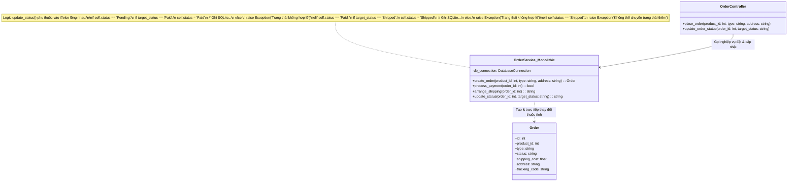
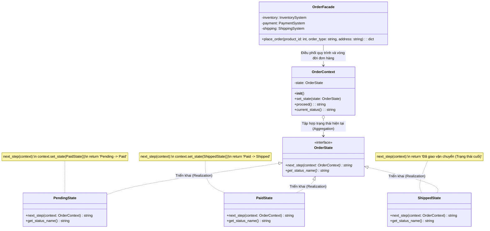
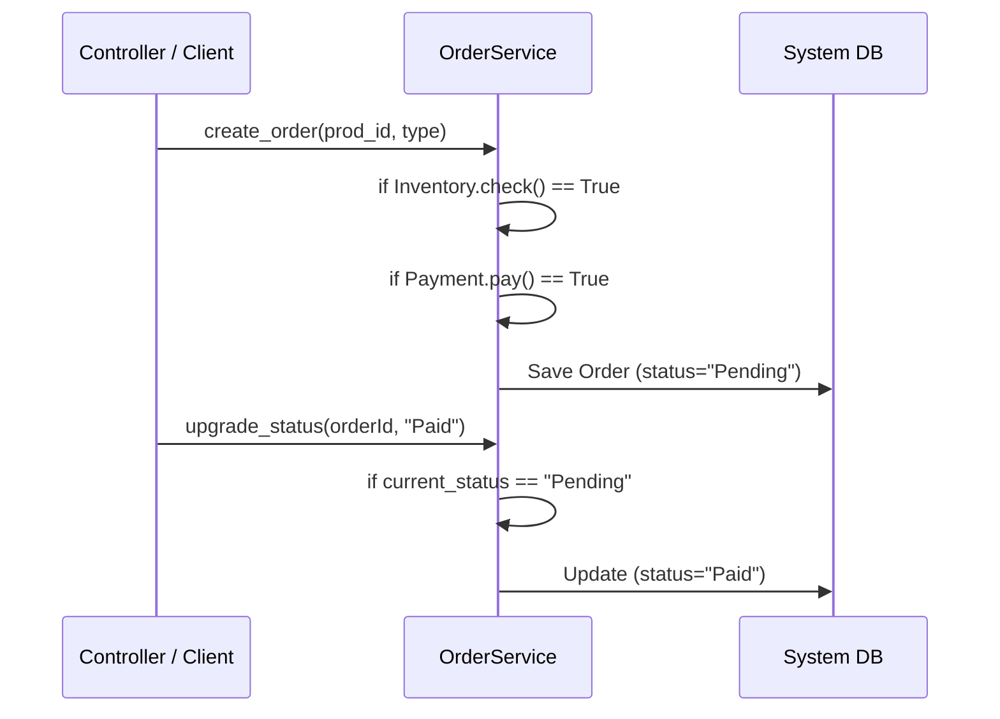
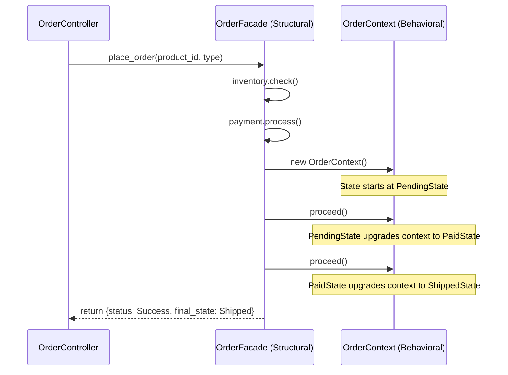

# Tài Liệu Thiết Kế (Architecture Document) - Hệ Thống Quản Lý Đơn Hàng

## 1. Problem Description & Architectural Styles (Mô tả bài toán & Phong cách Kiến trúc)

### 1.1 Mô tả bài toán thực tế (Problem Description)
Trong các doanh nghiệp thương mại điện tử hiện nay, hệ thống xử lý đơn hàng (Order Management System - OMS) phải đối mặt với sự phức tạp ngày càng tăng của quy trình nghiệp vụ. Một đơn hàng từ lúc khởi tạo đến lúc hoàn tất cần đi qua hàng loạt bước kiểm tra tồn kho hàng hóa (Inventory System), xử lý giao dịch thanh toán thông qua ngân hàng/ví điện tử (Payment System), và thiết lập vận đơn vận chuyển giao cho đối tác logistics (Shipping System).

Nếu cài đặt theo tư duy lập trình cấu trúc tuần tự hoặc sử dụng các câu lệnh rẽ nhánh `if/else` lồng nhau để quản lý trạng thái đơn hàng (Đang chờ duyệt -> Đã thanh toán -> Đang giao -> Hoàn tất), hệ thống sẽ gặp các vấn đề nghiêm trọng:
1.  **Mã nguồn Spaghetti**: Logic nghiệp vụ bị phân tán và đan xen chéo, làm cho các class trở nên phình to khó đọc (God Object/Monster Class).
2.  **Vi phạm nguyên lý OCP (Open/Closed Principle)**: Mỗi khi doanh nghiệp bổ sung trạng thái đơn hàng mới (như Trả hàng, Giao thất bại, Chờ hoàn tiền) hoặc loại hình giao hàng mới (giao hỏa tốc 2h), ta buộc phải chỉnh sửa trực tiếp mã nguồn hiện hữu, dễ dẫn đến các lỗi dây chuyền khó kiểm soát.
3.  **Tải trọng tập trung và Khó tích hợp**: Hệ thống đơn lẻ (Monolithic) không thể phân tách các dịch vụ phụ trợ như Xác thực, Tìm kiếm nâng cao và Thống kê để chịu tải độc lập hoặc triển khai trên các công nghệ phần cứng tối ưu hơn.

### 1.2 Giải pháp kỹ thuật và Kiến trúc Hệ thống (Architectural Styles)
Hệ thống OMS được thiết kế kết hợp giữa hai phong cách kiến trúc hiện đại và mạnh mẽ:

#### A. Kiến trúc phân tầng n-Tier (Mô hình MVC) cho Web API
Web API chính được xây dựng trên nền tảng **Python FastAPI** và cơ sở dữ liệu vật lý **SQLite**, tuân thủ nghiêm ngặt mô hình phân tách trách nhiệm **Model - View - Controller**:
*   **View (Tầng giao diện)**: Sử dụng Single Page Application (SPA) viết bằng Vanilla HTML, CSS (chủ đề Slate Modern) và Javascript. View không chứa logic nghiệp vụ, giao tiếp với Controller hoàn toàn bất đồng bộ thông qua các yêu cầu AJAX/Fetch API.
*   **Controller (Tầng điều hướng)**: Tiếp nhận các yêu cầu HTTP Request từ Client, thực hiện kiểm tra dữ liệu đầu vào (Validation) sơ bộ, sau đó chuyển giao yêu cầu cho tầng Service xử lý. Tầng này cũng đảm nhận vai trò định tuyến và làm Proxy Gateway liên thông dữ liệu tới các Microservices.
*   **Service & Patterns Layer (Tầng xử lý nghiệp vụ)**: Nơi chứa toàn bộ logic xử lý chính của đơn hàng. Đây là nơi 5 Design Patterns được nhúng trực tiếp để module hóa code, cách ly logic và thúc đẩy Loose Coupling (liên kết lỏng).
*   **Repository (Tầng truy xuất dữ liệu)**: Chịu trách nhiệm giao tiếp trực tiếp với cơ sở dữ liệu SQLite (`orders.db`) để thực hiện các thao tác CRUD dữ liệu người dùng và đơn hàng.

##### Bảng ánh xạ cấu trúc thư mục thực tế (Directory Mapping):
| Tầng kiến trúc | Thư mục / Tệp tin trên Disk | Nhiệm vụ cụ thể trong dự án |
| :--- | :--- | :--- |
| **View** | `Project/src/web_mvc/app/static/` | Gồm `index.html` (giao diện), `style.css` (style Slate), `app.js` (xử lý logic client). |
| **Controller** | `Project/src/web_mvc/app/controllers/api_router.py` | Định tuyến REST API, kiểm tra phiên đăng nhập và định cấu hình Proxy Gateway. |
| **Service & Patterns** | `Project/src/web_mvc/app/patterns/` | Chứa 5 patterns: `facade.py`, `factory.py`, `state.py`, `iterator.py`, `singleton.py`. |
| **Model** | `Project/src/web_mvc/app/models/` | Định nghĩa các lớp dữ liệu và thực thể ánh xạ (ORM/Schema). |
| **Repository (Data)** | `Project/src/web_mvc/app/patterns/singleton.py` | Lớp `DatabaseConnection` quản lý tập trung toàn bộ truy vấn SQL thô tới tệp `orders.db`. |

#### B. Kiến trúc Microservices phân tán (Distributed Services Architecture)
Hệ thống OMS tách rời 3 chức năng phụ trợ sang **3 Microservices độc lập** viết bằng ngôn ngữ **C# (.NET 8.0 Minimal APIs)**, chạy trên các cổng (port) riêng biệt nhằm tăng khả năng chịu tải và độc lập bảo trì:
1.  **Auth SSO Service (Port 5001)**: Quản lý đăng nhập tập trung, kiểm tra thông tin tài khoản trực tiếp từ SQLite và cấp mã phiên (JWT Token).
2.  **Search API Service (Port 5002)**: Thực hiện tìm kiếm nhanh thông tin đơn hàng theo ID trực tiếp từ database SQLite dùng chung.
3.  **Statistical Report Service (Port 5003)**: Thu thập toàn bộ dữ liệu đơn hàng trong SQLite, thực hiện phân tích tổng hợp (Aggregations) để tính toán doanh thu thực tế và phân tích xu hướng vận chuyển.

##### Giao thức truyền tin và Cơ chế dự phòng lỗi (Communication & Resiliency)
*   **Giao thức**: Giao tiếp giữa FastAPI Web Component và C# Microservices được thực hiện bất đồng bộ hoặc đồng bộ qua cổng mạng nội bộ bằng **HTTP/RESTful APIs** với định dạng dữ liệu chuẩn JSON.
*   **Cơ chế dự phòng (Resiliency / Fallback)**: Để đảm bảo tính sẵn sàng cao, hệ thống triển khai cơ chế **Graceful Degradation** (Suy giảm mượt mà):
    - Khi **C# SSO Service** hoặc **C# Search Service** offline: Hệ thống tự động kích hoạt **Fallback**, chuyển dịch logic xác thực và tìm kiếm xuống database SQLite cục bộ thông qua các hàm dự phòng chạy bằng **Iterator Pattern**.
    - Khi **C# Report Service** offline: Hệ thống FastAPI tự động bắt lỗi và trả về dữ liệu thống kê giả lập/cached gần nhất (Mock Fallback) thay vì trả về lỗi 500 cho Client.

---

## 2. System Diagram (Component / Deployment Diagram with 5+ Design Patterns)

Sơ đồ triển khai hệ thống chi tiết cho thấy Cm MVC phục vụ Client được đóng gói trong Docker Container và kết nối với các Microservices nội bộ trên máy host Windows. Đồng thời thể hiện rõ vị trí hoạt động của **5+ Design Patterns** trong kiến trúc.

```mermaid
graph TB
    classDef client fill:#d4ebf2,stroke:#1a73e8,stroke-width:2px;
    classDef container fill:#fcfcfc,stroke:#5f6368,stroke-width:2px,stroke-dasharray: 5 5;
    classDef component fill:#e8f0fe,stroke:#1a73e8,stroke-width:2px;
    classDef pattern fill:#fef7e0,stroke:#f9ab00,stroke-width:2px;
    classDef db fill:#e6f4ea,stroke:#137333,stroke-width:2px;
    classDef service fill:#fce8e6,stroke:#c5221f,stroke-width:2px;

    Client((Client App / Browser)):::client

    subgraph Web_Application_Docker_Container ["Web Application Container (FastAPI MVC - Port 8000)"]
        
        subgraph Controller_Layer ["Controller Layer"]
            api_router[api_router.py<br/><i>(Proxy Gateway Pattern)</i>]:::component
        end

        subgraph Business_Logic_Service_Layer ["Business Logic & Design Patterns Layer"]
            facade[OrderFacade<br/><b>[Facade Pattern]</b>]:::pattern
            
            subgraph Subsystems ["Internal Subsystems (Facade Hidden)"]
                inv[InventorySystem]:::component
                pay[PaymentSystem]:::component
                ship[ShippingSystem]:::component
            end
            
            factory[OrderFactory<br/><b>[Factory Method Pattern]</b>]:::pattern
            
            subgraph Order_Hierarchy ["Order Class Hierarchy"]
                order[Order (Abstract)]:::component
                std_order[StandardOrder]:::component
                exp_order[ExpressOrder]:::component
            end

            context[OrderContext<br/><b>[State Pattern Context]</b>]:::pattern
            
            subgraph State_Hierarchy ["Order State Hierarchy"]
                state[OrderState (Interface)]:::component
                pending_st[PendingState]:::component
                paid_st[PaidState]:::component
                shipped_st[ShippedState]:::component
            end
            
            collection[OrderCollection<br/><b>[Iterator Pattern]</b>]:::pattern
        end

        subgraph Repository_Persistence_Layer ["Repository & Persistence Layer"]
            db_conn[DatabaseConnection<br/><b>[Singleton Pattern]</b>]:::pattern
        end
    end

    subgraph CSharp_Microservices_Cluster ["Host Windows OS (C# Microservices Cluster)"]
        SSO[Auth SSO Service<br/>Port 5001]:::service
        Search[Search API Service<br/>Port 5002]:::service
        Report[Statistical Report Service<br/>Port 5003]:::service
    end

    subgraph Storage_Tier ["Storage Tier"]
        DB[(SQLite DB<br/>orders.db)]:::db
    end

    %% Interactions
    Client -- "1. HTTP Request" --> api_router
    
    %% Proxy / Gateway Pattern
    api_router -- "HTTP POST (Verify SSO Token)" --> SSO
    api_router -- "HTTP GET (Advanced Search)" --> Search
    api_router -- "HTTP GET (Dynamic Report Summary)" --> Report
    
    %% Controller calling Facade, Iterator, Singleton
    api_router -- "2. place_order()" --> facade
    api_router -- "Traverses / Finds Orders" --> collection
    api_router -- "Reads/Writes User Session" --> db_conn
    
    %% Facade orchestrates subsystems
    facade -- "a. create_order()" --> factory
    factory --> order
    order <|-- std_order
    order <|-- exp_order
    
    facade -- "b. check_stock()" --> inv
    facade -- "c. process_payment()" --> pay
    facade -- "d. arrange_shipping()" --> ship
    
    facade -- "e. proceed() (Updates status)" --> context
    context o-- state
    state <|-- pending_st
    state <|-- paid_st
    state <|-- shipped_st
    
    %% Database Connection (Singleton)
    db_conn -- "Maintains Connection" --> DB
    api_router -- "Fallback Local Database Queries" --> db_conn
    collection -- "Reads records via sqlite3" --> db_conn
```

---

## 3. Class Diagram (Final Design - Áp dụng 5 Design Patterns)

Sự kết nối chặt chẽ giữa các Tầng (Controller, Service, Models, Config) khi nhúng đầy đủ 5 Design Patterns: Singleton, Factory Method, Facade, State và Iterator.

```mermaid
classDiagram
    %% ======= PATTERNS ======= %%
    class DatabaseConnection {
        <<Singleton>>
        - _instance : static DatabaseConnection
        - _lock : ThreadLock
        - _db_file : str
        + __new__() : DatabaseConnection
        + _init_db()
        + query(sql : str, params : tuple) : list
        + execute(sql : str, params : tuple) : int
    }

    class OrderFactory {
        <<Factory Method>>
        + create_order(productId : int, type : str) : Order
    }

    class OrderFacade {
        <<Facade>>
        - inventorySystem : InventorySystem
        - paymentSystem : PaymentSystem
        - shippingSystem : ShippingSystem
        + place_order(productId : int, type : str, address : str) : dict
    }

    class OrderState {
        <<State - Interface>>
        + next_step(context : OrderContext)* str
        + get_status_name()* str
    }

    class OrderContext {
        <<State Context>>
        - state : OrderState
        + __init__()
        + set_state(state : OrderState)
        + proceed() : str
        + current_status() : str
    }

    class OrderCollection {
        <<Iterator>>
        - _orders : list
        - _index : int
        + add_order(order_data : dict)
        + __iter__() : OrderCollection
        + __next__() : dict
        + find_order(order_id : int) : dict
    }

    %% ======= CLASSES ======= %%
    class OrderController {
        + login()
        + search_order()
        + place_order()
    }
    
    class Order {
        <<Abstract Model>>
        + product_id : int
        + get_shipping_cost()* float
        + get_order_type()* str
    }
    class StandardOrder {
        + get_shipping_cost() float ($2.5)
        + get_order_type() str ("Standard")
    }
    class ExpressOrder {
        + get_shipping_cost() float ($15.0)
        + get_order_type() str ("Express")
    }

    class InventorySystem {
        + check_stock(product_id : int) bool
    }
    class PaymentSystem {
        + process_payment(amount : float) bool
    }
    class ShippingSystem {
        + arrange_shipping(product_id : int, address : str) str
    }
    
    Order <|-- StandardOrder
    Order <|-- ExpressOrder

    OrderState <|-- PendingState
    OrderState <|-- PaidState
    OrderState <|-- ShippedState

    %% ======= RELATIONSHIPS ======= %%
    OrderController --> OrderFacade : uses
    OrderController --> OrderCollection : traverses
    OrderController --> DatabaseConnection : accesses DB

    OrderFacade --> OrderFactory : uses
    OrderFacade --> OrderContext : runs
    OrderFacade --> InventorySystem : delegates
    OrderFacade --> PaymentSystem : delegates
    OrderFacade --> ShippingSystem : delegates
    OrderFactory ..> Order : creates
    OrderContext o--> OrderState : holds State
```

---

## 4. Detail Diagrams (State Pattern - Before vs After)

Đặc tả chi tiết để phân tích so sánh trước và sau khi áp dụng mẫu thiết kế hành vi (State Pattern).

### 4.1. 1st Detail Diagram: Trước khi áp dụng State Pattern (Before)
Các trạng thái được quản lý thủ công qua thuộc tính `status` kiểu chuỗi, kết hợp với các câu lệnh điều kiện `if/else` lồng nhau phức tạp bên trong lớp xử lý nghiệp vụ monolithic `OrderService`.

```mermaid
classDiagram
    class OrderController {
        +place_order(product_id: int, type: string, address: string)
        +update_order_status(order_id: int, target_status: string)
    }
    
    class Order {
        +id: int
        +product_id: int
        +type: string
        +status: string
        +shipping_cost: float
        +address: string
        +tracking_code: string
    }

    class OrderService_Monolithic {
        -db_connection: DatabaseConnection
        +create_order(product_id: int, type: string, address: string): Order
        +process_payment(order_id: int): bool
        +arrange_shipping(order_id: int): string
        +update_status(order_id: int, target_status: string): string
    }

    note for OrderService_Monolithic "Logic update_status() phụ thuộc vào if/else lồng nhau:\n\nif self.status == 'Pending':\n    if target_status == 'Paid':\n        self.status = 'Paid'\n        # Ghi SQLite...\n    else:\n        raise Exception('Trạng thái không hợp lệ')\nelif self.status == 'Paid':\n    if target_status == 'Shipped':\n        self.status = 'Shipped'\n        # Ghi SQLite...\n    else:\n        raise Exception('Trạng thái không hợp lệ')\nelif self.status == 'Shipped':\n    raise Exception('Không thể chuyển trạng thái thêm')"

    OrderController --> OrderService_Monolithic : Gọi nghiệp vụ đặt & cập nhật
    OrderService_Monolithic ..> Order : Tạo & trực tiếp thay đổi thuộc tính
```

---

### 4.2. 2nd Detail Diagram: Sau khi áp dụng State Pattern (After)
Tách biệt toàn bộ các trạng thái đơn hàng thành các lớp độc lập kế thừa từ lớp cơ sở `OrderState`. `OrderContext` đóng vai trò lưu giữ trạng thái hiện tại và chuyển giao xử lý hành vi động.

```mermaid
classDiagram
    class OrderFacade {
        -inventory: InventorySystem
        -payment: PaymentSystem
        -shipping: ShippingSystem
        +place_order(product_id: int, order_type: string, address: string): dict
    }

    class OrderContext {
        -state: OrderState
        +__init__()
        +set_state(state: OrderState)
        +proceed(): string
        +current_status(): string
    }

    class OrderState {
        <<interface>>
        +next_step(context: OrderContext)* string
        +get_status_name()* string
    }

    class PendingState {
        +next_step(context: OrderContext) string
        +get_status_name() string
    }

    class PaidState {
        +next_step(context: OrderContext) string
        +get_status_name() string
    }

    class ShippedState {
        +next_step(context: OrderContext) string
        +get_status_name() string
    }

    OrderFacade --> OrderContext : Điều phối quy trình và vòng đời đơn hàng
    OrderContext o--> OrderState : Tập hợp trạng thái hiện tại (Aggregation)
    OrderState <|.. PendingState : Triển khai (Realization)
    OrderState <|.. PaidState : Triển khai (Realization)
    OrderState <|.. ShippedState : Triển khai (Realization)

    note for PendingState "next_step(context):\n    context.set_state(PaidState())\n    return 'Pending -> Paid'"
    note for PaidState "next_step(context):\n    context.set_state(ShippedState())\n    return 'Paid -> Shipped'"
    note for ShippedState "next_step(context):\n    return 'Đã giao vận chuyển (Trạng thái cuối)'"
```

---

### 4.3 Phân tích học thuật chi tiết 5 Design Patterns áp dụng

#### A. Singleton Pattern (`singleton.py`)
*   **Ý tưởng cốt lõi & Bài toán giải quyết**: Trong môi trường web đa luồng, việc mỗi luồng tự tạo một kết nối database SQLite vật lý độc lập sẽ nhanh chóng làm cạn kiệt tài nguyên file descriptor và gây ra lỗi `Database is locked`. Mẫu **Singleton** được áp dụng để đảm bảo toàn bộ ứng dụng chỉ duy trì duy nhất một thực thể kết nối database `DatabaseConnection` trong suốt vòng đời chạy.
*   **Thành phần tham gia**: `DatabaseConnection` chứa thực thể tĩnh duy nhất `_instance`, khóa `_lock` và các phương thức thực thi SQL.
*   **Đánh giá Ưu và Nhược điểm**:
    *   *Ưu điểm*: Kiểm soát tập trung tài nguyên kết nối, tiết kiệm RAM, ngăn chặn Race Condition khi ghi SQLite.
    *   *Nhược điểm*: Tạo ra Global State gây khó khăn khi viết Unit Test độc lập.
*   **Mối liên hệ SOLID**: Tuân thủ nguyên lý **Single Responsibility Principle (SRP)**: Lớp này chỉ chịu trách nhiệm duy nhất là quản lý kết nối và thực thi các truy vấn SQL an toàn đa luồng.

#### B. Factory Method Pattern (`factory.py`)
*   **Ý tưởng cốt lõi & Bài toán giải quyết**: Tránh khởi tạo trực tiếp các lớp con cụ thể (`StandardOrder` hoặc `ExpressOrder`) bằng từ khóa New trong tầng nghiệp vụ, giúp độc lập hóa quá trình tạo đối tượng đơn hàng.
*   **Thành phần tham gia**: `Order` (Abstract Product), `StandardOrder` / `ExpressOrder` (Concrete Products), `OrderFactory` (Creator).
*   **Đánh giá Ưu và Nhược điểm**:
    *   *Ưu điểm*: Loại bỏ sự phụ thuộc chằng chit giữa Client và các lớp sản phẩm cụ thể.
    *   *Nhược điểm*: Số lượng class con tăng lên tương ứng khi mở rộng dịch vụ.
*   **Mối liên hệ SOLID**:
    *   Tuân thủ nguyên lý **Open/Closed Principle (OCP)**: Thêm loại hình giao hàng mới chỉ cần viết thêm Class mới kế thừa `Order` mà không cần chỉnh sửa các class giao hàng cũ.
    *   Tuân thủ nguyên lý **Dependency Inversion Principle (DIP)**: Tầng nghiệp vụ phụ thuộc vào lớp trừu tượng `Order` chứ không phụ thuộc vào lớp cụ thể.

#### C. Facade Pattern (`facade.py`)
*   **Ý tưởng cốt lõi & Bài toán giải quyết**: Đặt hàng là một quy trình tích hợp phức tạp, liên quan đến 3 hệ thống con độc lập (Subsystems): Kiểm tra tồn kho hàng hóa (`InventorySystem`), xử lý thanh toán cổng ngân hàng (`PaymentSystem`), và thiết lập thông tin đối tác vận chuyển (`ShippingSystem`). Để tránh Controller trực tiếp giao tiếp với cả 3 lớp này gây ra Tight Coupling, **Facade** cung cấp giao diện mặt tiền đơn giản duy nhất để đơn giản hóa giao thức gọi hàm.
*   **Thành phần tham gia**: `OrderFacade` (Facade Class), `InventorySystem`, `PaymentSystem`, `ShippingSystem` (Subsystems).
*   **Đánh giá Ưu và Nhược điểm**:
    *   *Ưu điểm*: Giảm sự phụ thuộc chéo (Loose Coupling) giữa Controller và các Subsystem. Dễ đọc, dễ kiểm thử.
    *   *Nhược điểm*: Lớp Facade có thể biến thành God Object gánh vác quá nhiều logic tích hợp nếu không thiết kế chia nhỏ.
*   **Mối liên hệ SOLID**: Tuân thủ nguyên lý **Interface Segregation Principle (ISP)**: Khách hàng chỉ tiếp xúc với giao diện đơn giản nhất có thể mà họ cần (`place_order`), không bị bắt buộc phụ thuộc vào các API chi tiết của từng Subsystem.

#### D. State Pattern (`state.py`)
*   **Ý tưởng cốt lõi & Bài toán giải quyết**: Tránh quản lý trạng thái bằng câu điều kiện rẽ nhánh `if/else` lồng nhau phức tạp bên trong class nghiệp vụ. **State Pattern** đóng gói mỗi trạng thái của đơn hàng thành các lớp thực thể độc lập, chuyển giao trách nhiệm xử lý chuyển trạng thái cho chính lớp trạng thái hiện hành.
*   **Thành phần tham gia**: `OrderContext` (Context), `OrderState` (State Interface), `PendingState` / `PaidState` / `ShippedState` (Concrete States).
*   **Đánh giá Ưu và Nhược điểm**:
    *   *Ưu điểm*: Loại bỏ hoàn toàn Spaghetti code `if/else`, đóng gói chặt chẽ logic chuyển dịch trạng thái.
    *   *Nhược điểm*: Làm tăng số lượng lớp con trạng thái trong mã nguồn.
*   **Mối liên hệ SOLID**:
    *   Tuân thủ nguyên lý **Single Responsibility Principle (SRP)**: Mỗi class trạng thái chịu trách nhiệm duy nhất cho logic nghiệp vụ chuyển dịch trạng thái của chính nó.
    *   Tuân thủ nguyên lý **Open/Closed Principle (OCP)**: Bổ sung thêm trạng thái đơn hàng mới chỉ cần viết thêm Class trạng thái mới kế thừa từ `OrderState` mà hoàn toàn không ảnh hưởng đến code của các trạng thái hiện tại.

#### E. Iterator Pattern (`iterator.py`)
*   **Ý tưởng cốt lõi & Bài toán giải quyết**: Duyệt qua danh sách các đơn hàng mà không để lộ cấu trúc dữ liệu lưu trữ nội bộ của danh sách (như list, array, tree...) cho Client bên ngoài.
*   **Thành phần tham gia**: `OrderCollection` (Aggregate), Python built-in protocol `__iter__` và `__next__` (Iterator).
*   **Đánh giá Ưu và Nhược điểm**:
    *   *Ưu điểm*: Che giấu cấu trúc dữ liệu lưu trữ bên dưới, đơn giản hóa mã nguồn duyệt phần tử ở Client.
    *   *Nhược điểm*: Duyệt Iterator có thể tốn tài nguyên bộ nhớ hơn so với việc truy cập trực tiếp theo index nếu dữ liệu có kích thước cực lớn.
*   **Mối liên hệ SOLID**: Tuân thủ nguyên lý **Single Responsibility Principle (SRP)**: Tách rời hoàn toàn trách nhiệm quản lý lưu trữ dữ liệu đơn hàng ra khỏi trách nhiệm duyệt qua các phần tử đơn hàng tuần tự.

---

## 5. Sequence Diagram: Luồng nghiệp vụ (Sequence: Trạng thái Đơn hàng 1st vs Final)

### 5.1. Quy trình Đặt hàng lúc CHƯA có Facade và State Pattern
Chữ kí của sơ đồ là Client phải gọi từng hàm lẻ tẻ để kiểm kho, trả tiền và gửi yêu cầu, sau đó dùng `if` lồng để chỉnh trạng thái.

```mermaid
sequenceDiagram
    participant C as Controller / Client
    participant S as OrderService
    participant DB as System DB

    C->>S: create_order(prod_id, type)
    S->>S: if Inventory.check() == True
    S->>S: if Payment.pay() == True
    S->>DB: Save Order (status="Pending")
    
    C->>S: upgrade_status(orderId, "Paid")
    S->>S: if current_status == "Pending"
    S->>DB: Update (status="Paid")
```

### 5.2. Quy trình Đặt hàng ĐÃ áp dụng Facade + State Pattern
Client làm việc ở mức rất trừu tượng. Facade che giấu sự phức tạp của Payment/Inventory. State tự quyết định vòng đời của đơn hàng.

```mermaid
sequenceDiagram
    participant C as OrderController
    participant F as OrderFacade (Structural)
    participant ST as OrderContext (Behavioral)
    
    C->>F: place_order(product_id, type)
    
    F->>F: inventory.check()
    F->>F: payment.process()
    
    F->>ST: new OrderContext()
    note over ST: State starts at PendingState

    F->>ST: proceed()
    note over ST: PendingState upgrades context to PaidState
    
    F->>ST: proceed()
    note over ST: PaidState upgrades context to ShippedState
    
    F-->>C: return {status: Success, final_state: Shipped}
```
