# 🎤 TÀI LIỆU KỊCH BẢN THUYẾT TRÌNH & PHẢN BIỆN BẢO VỆ DỰ ÁN (PRESENTATION GUIDE)
**Đề tài: Hệ thống Quản lý Đơn hàng (OMS) áp dụng 5 Design Patterns & Kiến trúc Microservices**

Tài liệu này tổng hợp toàn bộ nội dung thuyết trình, kịch bản nói chi tiết cho từng Slide, kịch bản demo thực tế trên giao diện, và bộ câu hỏi phản biện chuyên sâu kèm gợi ý trả lời để nhóm sinh viên đạt kết quả cao nhất trước Hội đồng chấm thi.

---

## 📑 MỤC LỤC
1. [PHẦN I: KỊCH BẢN NÓI CHI TIẾT CHO 13 SLIDE THUYẾT TRÌNH](#phần-i-kịch-bản-nói-chi-tiết-cho-13-slide-thuyết-trình)
2. [PHẦN II: KỊCH BẢN DEMO THỰC TẾ (LIVE DEMO FLOW)](#phần-ii-kịch-bản-demo-thực-tế-live-demo-flow)
3. [PHẦN III: BỘ 15 CÂU HỎI PHẢN BIỆN CHUYÊN SÂU & GỢI Ý TRẢ LỜI (Q&A)](#phần-iii-bộ-15-câu-hỏi-phản-biện-chuyên-sâu--gợi-ý-trả-lời-qa)

---

## PHẦN I: KỊCH BẢN NÓI CHI TIẾT CHO 13 SLIDE THUYẾT TRÌNH

### 💻 Slide 1: Trang Tiêu Đề & Giới Thiệu Thành Viên
*   **Nội dung hiển thị trên Slide**:
    *   Tên đề tài: **HỆ THỐNG QUẢN LÝ ĐƠN HÀNG (OMS)**
    *   Tiêu đề phụ: *Ứng dụng Kiến trúc Phân tầng n-Tier & C# Microservices kết hợp áp dụng 5 Design Patterns*
    *   Môn học: Kiến trúc phần mềm (Software Architecture)
    *   GVHD: [Tên Giảng Viên]
    *   Thành viên nhóm: [Tên các thành viên]
    *   Đường dẫn Slide thuyết trình (Gamma App): [Gamma Presentation Link](https://gamma.app/docs/HE-THONG-QUAN-LY-ON-HANG-OMS-fafqe6v198xhdqx)
*   **🎤 Kịch bản nói (Speech Script)**:
    > "Kính thưa quý thầy cô trong Hội đồng phản biện. Hôm nay, nhóm chúng em xin phép được trình bày báo cáo dự án môn học Kiến trúc phần mềm với đề tài: **Hệ thống Quản lý Đơn hàng (OMS)**. Trong dự án này, chúng em tập trung giải quyết bài toán nghiệp vụ phức tạp của thương mại điện tử bằng cách kết hợp kiến trúc phân tầng n-Tier truyền thống với cụm Microservices hiện đại, đồng thời áp dụng 5 mẫu thiết kế (Design Patterns) kinh điển nhằm đạt được một hệ thống có tính Loose Coupling (kết nối lỏng lẻo), dễ bảo trì và dễ dàng mở rộng trong tương lai. Sau đây, chúng em xin đi vào chi tiết bài toán thực tế."

---

### 💻 Slide 2: Mô Tả Bài Toán Thực Tế & Thách Thức (Problem Description)
*   **Nội dung hiển thị trên Slide**:
    *   *Thách thức*: Quy trình xử lý đơn hàng phức tạp (gồm nhiều Subsystems: Kho hàng, Thanh toán, Giao hàng) làm mã nguồn bị rối (Spaghetti code).
    *   *Quản lý trạng thái*: Trạng thái đơn hàng biến động liên tục (Chờ duyệt -> Đã thanh toán -> Đang giao -> Hoàn tất), nếu code bằng `if/else` lồng nhau rất dễ sinh lỗi khi mở rộng.
    *   *Tài nguyên kết nối*: Dễ xảy ra lỗi nghẽn hoặc xung đột ghi đọc dữ liệu SQLite khi có hàng trăm kết nối đồng thời.
*   **🎤 Kịch bản nói (Speech Script)**:
    > "Trong các hệ thống thương mại điện tử thực tế, quy trình xử lý đơn hàng là một trong những luồng nghiệp vụ phức tạp nhất. Nó yêu cầu sự tương tác liên tục của nhiều phân hệ khác nhau từ kiểm kho, xử lý thanh toán đến điều phối vận chuyển. Nếu lập trình theo phong cách tuần tự thông thường, mã nguồn sẽ trở nên cực kỳ phức tạp, tạo ra các lớp 'God Object' nắm giữ quá nhiều trách nhiệm. Hơn nữa, việc quản lý vòng đời đơn hàng với hàng loạt lệnh rẽ nhánh `if/else` sẽ biến mã nguồn thành Spaghetti code, rất khó để cập nhật hay sửa đổi. Để vượt qua các rào cản này, nhóm chúng em đề xuất một giải pháp kỹ thuật kết hợp cấu trúc phân tầng n-Tier kết hợp Microservice và 5 Design Patterns."

---

### 💻 Slide 3: Sơ Đồ Kiến Trúc Hệ Thống Tổng Thể
*   **Nội dung hiển thị trên Slide**:
    *   *Web Component (FastAPI MVC)*: Xử lý giao diện Frontend SPA và API Router chính, lưu trữ SQLite DB cục bộ.
    *   *C# Microservices Component (.NET 8.0)*:
        *   `SSOService` (:5001) - Xác thực người dùng tập trung.
        *   `SearchService` (:5002) - Truy vấn đơn hàng nâng cao.
        *   `ReportService` (:5003) - Báo cáo doanh thu & chi phí vận hành.
    *   *Sơ đồ Mermaid Deployment Diagram*: (Tương tác HTTP REST JSON giữa FastAPI và các dịch vụ C#).
*   **🎤 Kịch bản nói (Speech Script)**:
    > "Đây là sơ đồ kiến trúc tổng thể của hệ thống. Chúng em phân chia dự án thành hai khối thành phần lớn: Khối thứ nhất là **Web Component** viết bằng Python FastAPI theo cấu trúc phân tầng n-Tier (MVC) kết nối với cơ sở dữ liệu SQLite thật. Khối thứ hai là **cụm 3 Microservices viết bằng C# .NET 8.0** chạy độc lập trên các cổng 5001, 5002 và 5003. Khối Web Component giao tiếp chéo với cụm Microservices thông qua giao thức HTTP REST API gửi nhận dữ liệu JSON. Thiết kế này giúp hệ thống vừa tận dụng được sự gọn nhẹ của FastAPI trong làm giao diện, vừa đảm bảo hiệu năng xử lý tác vụ chuyên biệt của .NET."

---

### 💻 Slide 4: Phân Tích Kiến Trúc Web Component (MVC / n-Layers)
*   **Nội dung hiển thị trên Slide**:
    *   *View (Frontend SPA)*: Giao diện tối tối giản (Dark Mode) sử dụng Vanilla HTML/CSS/JS kết nối AJAX.
    *   *Controller (API Router)*: Tiếp nhận request từ Client, điều hướng và thực hiện proxy gọi C# Service.
    *   *Service Layer*: Xử lý Business Logic nghiệp vụ.
    *   *Patterns Layer*: Đóng gói các mẫu thiết kế để tách biệt trách nhiệm logic.
    *   *Data Layer*: Quản lý cấu trúc bảng và đọc/ghi SQLite file (`orders.db`).
*   **🎤 Kịch bản nói (Speech Script)**:
    > "Đi sâu vào kiến trúc của Web Component, chúng em áp dụng mô hình phân tầng n-Tier nghiêm ngặt để đảm bảo nguyên lý Single Responsibility (Đơn trách nhiệm). Tầng View sử dụng Single Page Application viết bằng Vanilla CSS và JS không dùng framework cồng kềnh nhằm tối ưu tốc độ tải trang. Tầng Controller tiếp nhận request và định tuyến. Tầng Service Layer chịu trách nhiệm xử lý logic nghiệp vụ và tương tác với tầng Patterns. Cuối cùng, tầng Data Layer thực hiện truy vấn xuống database SQLite thật, giúp dữ liệu của hệ thống được lưu trữ bền vững lâu dài."

---

### 💻 Slide 5: Mẫu Thiết Kế 1: Singleton Pattern (Creational Group)
*   **Nội dung hiển thị trên Slide**:
    *   *Áp dụng*: Lớp `DatabaseConnection` kết nối SQLite.
    *   *Kỹ thuật*: Khóa Lock đa luồng (`threading.Lock`) kết hợp cơ chế kiểm tra kép **Double-Checked Locking**.
    *   *Lợi ích*: Tránh việc tạo quá nhiều kết nối SQLite đồng thời gây lỗi lock DB, đảm bảo an toàn đa luồng (Thread-safe).
*   **🎤 Kịch bản nói (Speech Script)**:
    > "Mẫu thiết kế đầu tiên nhóm áp dụng là **Singleton Pattern** cho lớp quản lý kết nối cơ sở dữ liệu `DatabaseConnection`. Trong môi trường Web API, có hàng trăm yêu cầu đọc/ghi dữ liệu gửi tới đồng thời. Nếu mỗi request lại tạo ra một kết nối SQLite mới, tài nguyên hệ thống sẽ nhanh chóng bị cạn kiệt và xảy ra lỗi 'Database is locked' của SQLite. Với Singleton kết hợp cơ chế kiểm tra kép Double-Checked Locking và Thread-lock, chúng em đảm bảo toàn bộ hệ thống chỉ duy trì duy nhất một kết nối an toàn trong suốt vòng đời chạy ứng dụng."

---

### 💻 Slide 6: Mẫu Thiết Kế 2: Factory Method (Creational Group)
*   **Nội dung hiển thị trên Slide**:
    *   *Áp dụng*: Lớp cha trừu tượng `Order` và các lớp con `StandardOrder`, `ExpressOrder`.
    *   *Khởi tạo*: Lớp `OrderFactory` trả về đúng thực thể dựa trên tham số phương thức giao hàng (`order_type`).
    *   *Lợi ích*: Đóng gói logic tính toán phí giao hàng riêng biệt ($2.5 và $15.0), giúp dễ dàng thêm các phương thức giao hàng mới.
*   **🎤 Kịch bản nói (Speech Script)**:
    > "Tiếp theo là **Factory Method Pattern**. Khi đặt hàng, phí vận chuyển và quy trình sẽ phụ thuộc vào phương thức giao hàng mà người dùng chọn (Giao hàng thường hoặc giao hỏa tốc). Chúng em đã định nghĩa một lớp cha trừu tượng là `Order`, và các lớp con cụ thể như `StandardOrder` và `ExpressOrder`. Lớp `OrderFactory` đóng vai trò là nhà máy sản xuất, tự động khởi tạo đúng đối tượng đơn hàng tương ứng. Nhờ mẫu thiết kế này, nếu trong tương lai doanh nghiệp muốn mở rộng thêm phương thức giao hàng mới như giao hàng bằng máy bay hay drone, chúng em chỉ cần viết thêm lớp con kế thừa mà hoàn toàn không cần sửa đổi mã nguồn ở tầng Controller."

---

### 💻 Slide 7: Mẫu Thiết Kế 3: Facade Pattern (Structural Group)
*   **Nội dung hiển thị trên Slide**:
    *   *Áp dụng*: Lớp `OrderFacade`.
    *   *Tương tác*: Đại diện giao tiếp với 3 Subsystems: `InventorySystem`, `PaymentSystem`, và `ShippingSystem`.
    *   *Lợi ích*: Cung cấp một hàm duy nhất `place_order()` giúp Controller không cần quan tâm đến các bước nghiệp vụ phức tạp bên trong.
*   **🎤 Kịch bản nói (Speech Script)**:
    > "Để đặt một đơn hàng thành công, hệ thống phải trải qua rất nhiều bước phức tạp: kiểm tra số lượng tồn kho của sản phẩm, thực hiện thanh toán chi phí đơn hàng, và điều phối vận đơn cho đơn vị vận chuyển. Thay vì để Controller giao tiếp trực tiếp với cả 3 phân hệ phức tạp này, chúng em áp dụng **Facade Pattern** thông qua lớp `OrderFacade`. Lớp này cung cấp một giao diện cực kỳ đơn giản là `place_order()`. Controller chỉ cần gọi hàm này, mọi logic nghiệp vụ phức tạp bên dưới sẽ được Facade âm thầm điều phối. Điều này giúp giảm độ phụ thuộc chéo (coupling) và làm mã nguồn ở Controller vô cùng gọn gàng."

---

### 💻 Slide 8: Mẫu Thiết Kế 4: State Pattern (Behavioral Group)
*   **Nội dung hiển thị trên Slide**:
    *   *Áp dụng*: Vòng đời trạng thái đơn hàng (`OrderContext` và `OrderState`).
    *   *Các trạng thái*: `PendingState` -> `PaidState` -> `ShippedState`.
    *   *Lợi ích*: Loại bỏ hoàn toàn Spaghetti code lồng `if/else`, trạng thái tự động chuyển dịch tuần tự thông minh.
*   **🎤 Kịch bản nói (Speech Script)**:
    > "Quản lý vòng đời trạng thái đơn hàng luôn là một thách thức lớn. Thông thường, lập trình viên sẽ viết các hàm cập nhật trạng thái chứa đầy các câu lệnh `if/else` để kiểm tra điều kiện chuyển đổi. Nhóm chúng em đã giải quyết triệt để vấn đề này bằng cách áp dụng **State Pattern**. Trạng thái của đơn hàng được đóng gói thành các đối tượng riêng biệt như `PendingState`, `PaidState` và `ShippedState`. Lớp ngữ cảnh `OrderContext` chỉ cần gọi phương thức `proceed()`, đơn hàng sẽ tự động nâng cấp trạng thái một cách tuần tự và thông minh dựa trên logic đóng gói sẵn trong từng lớp trạng thái, giúp loại bỏ hoàn toàn spaghetti code."

---

### 💻 Slide 9: Mẫu Thiết Kế 5: Iterator Pattern (Behavioral Group)
*   **Nội dung hiển thị trên Slide**:
    *   *Áp dụng*: Bộ sưu tập `OrderCollection` duyệt qua danh sách đơn hàng từ SQLite.
    *   *Kỹ thuật*: Triển khai phương thức chuẩn `__iter__()` và `__next__()` trong Python.
    *   *Lợi ích*: Cho phép duyệt và tìm kiếm đơn hàng bằng vòng lặp `for...in` thông thường mà không làm lộ cấu trúc mảng lưu trữ nội bộ.
*   **🎤 Kịch bản nói (Speech Script)**:
    > "Mẫu thiết kế cuối cùng là **Iterator Pattern**, được cài đặt cho lớp tập hợp `OrderCollection`. Khi truy vấn danh sách đơn hàng từ cơ sở dữ liệu SQLite, dữ liệu được nạp vào đối tượng `OrderCollection`. Nhờ triển khai Iterator, tầng Controller có thể duyệt qua danh sách đơn hàng bằng vòng lặp `for...in` chuẩn mực hoặc thực hiện tìm kiếm đơn hàng thông qua hàm `find_order()`. Mẫu thiết kế này giúp che giấu cấu trúc dữ liệu lưu trữ nội bộ của collection, giúp cho việc thay đổi cấu trúc lưu trữ sau này (từ mảng sang cây hoặc bảng băm) hoàn toàn không ảnh hưởng đến mã nguồn sử dụng bên ngoài."

---

### 💻 Slide 10: Tích Hợp Chéo & Cơ Chế Dự Phòng Fallback
*   **Nội dung hiển thị trên Slide**:
    *   *Tương tác thực*: Gọi HTTP POST tới C# `SSOService` (:5001) và HTTP GET tới C# `ReportService` (:5003).
    *   *Cơ chế Fallback (Dự phòng)*:
        *   Nếu Microservices C# **Online**: Ưu tiên gọi C# để xác thực và lấy báo cáo thống kê chính xác.
        *   Nếu Microservices C# **Offline**: Tự động chuyển vùng dữ liệu sang SQLite cục bộ (đối với đăng nhập) và trả về dữ liệu mock (đối với báo cáo), giúp hệ thống duy trì hoạt động 100% thời gian.
*   **🎤 Kịch bản nói (Speech Script)**:
    > "Để dự án đạt được tính thực tế cao nhất của hệ thống phân tán, chúng em đã phát triển cơ chế tích hợp chéo. Khi người dùng đăng nhập hoặc xem báo cáo, FastAPI sẽ gửi yêu cầu HTTP trực tiếp tới các dịch vụ C# SSO cổng 5001 và Report cổng 5003. Đặc biệt, chúng em đã thiết kế cơ chế **Fallback (dự phòng tự động)**. Nếu các dịch vụ C# Microservices gặp sự cố hoặc offline, hệ thống Python sẽ tự động bắt ngoại lệ kết nối và rơi vào cơ chế dự phòng cục bộ: sử dụng database SQLite để xác thực người dùng và hiển thị báo cáo mock cục bộ, giúp hệ thống không bao giờ bị gián đoạn hay crash ứng dụng."

---

### 💻 Slide 11: Demo Giao Diện Web Frontend SPA (View)
*   **Nội dung hiển thị trên Slide**:
    *   Giao diện thiết kế theo chuẩn tối giản cao cấp (Premium Dark Mode).
    *   Các tab chính: Dashboard (Thống kê chéo), Quản lý Users, Đặt hàng & Tra cứu, Minh họa Design Patterns.
    *   Badge trạng thái động: Kết nối database và nguồn xác thực chéo thời gian thực.
*   **🎤 Kịch bản nói (Speech Script)**:
    > "Tiếp theo, chúng em xin giới thiệu giao diện Web Frontend của ứng dụng. Giao diện được thiết kế theo phong cách Dark Mode cao cấp với bảng màu HSL hài hòa, ứng dụng các micro-animations tinh tế giúp trải nghiệm người dùng trở nên mượt mà. Hệ thống được tổ chức dạng Single Page Application (SPA), giúp người dùng chuyển đổi nhanh giữa các chức năng mà không cần tải lại trang. Các thông tin về cơ sở dữ liệu đang kết nối cũng như nguồn gốc của dữ liệu xác thực đều được hiển thị trực quan thông qua các huy hiệu trạng thái động trên thanh tiêu đề và thẻ Dashboard."

---

### 💻 Slide 12: Demo Cụm C# Microservices (.NET Core)
*   **Nội dung hiển thị trên Slide**:
    *   Sử dụng .NET 8.0 Minimal APIs siêu nhẹ và nhanh.
    *   Script tự động `run_microservices.ps1` khởi động đồng loạt cụm dịch vụ.
    *   Endpoint REST API chuẩn JSON.
*   **🎤 Kịch bản nói (Speech Script)**:
    > "Cụm Microservices của chúng em được viết trên nền tảng .NET 8.0 mới nhất của Microsoft, sử dụng cấu trúc Minimal APIs để đạt tốc độ xử lý nhanh nhất. Cụm dịch vụ này phục vụ đắc lực cho tầng Web Component chính thông qua các API chuẩn REST. Để thuận tiện cho việc vận hành, chúng em đã xây dựng một script PowerShell tự động giúp khởi chạy đồng thời cả 3 dịch vụ dưới dạng các cửa sổ CMD riêng biệt, giúp dễ dàng theo dõi log hoạt động thời gian thực của từng phân hệ."

---

### 💻 Slide 13: Kết Luận & Bài Học Rút Ra
*   **Nội dung hiển thị trên Slide**:
    *   *Đạt được*: Áp dụng thành công 5 Design Patterns theo chuẩn thiết kế SOLID,Loose Coupling.
    *   *Tính thực tế*: Kết nối database SQLite thật và tích hợp liên thông hệ thống phân tán đa nền tảng (Python & C#).
    *   *Khả năng nâng cấp*: Cực kỳ dễ dàng thêm phương thức giao hàng, trạng thái đơn hàng hoặc các microservices mới.
*   **🎤 Kịch bản nói (Speech Script)**:
    > "Tóm lại, thông qua dự án OMS này, nhóm chúng em đã áp dụng thành công các nguyên lý thiết kế SOLID và các mẫu thiết kế mẫu mực vào thực tế. Hệ thống đạt được độ Loose Coupling cao, giúp tách biệt hoàn toàn trách nhiệm giữa giao diện, nghiệp vụ và các cổng dịch vụ microservices độc lập. Đây là nền tảng vững chắc để phát triển các hệ thống thương mại điện tử quy mô lớn. Nhóm chúng em xin chân thành cảm ơn thầy cô trong Hội đồng phản biện đã lắng nghe. Sau đây, chúng em xin phép được thực hiện phần Demo thực tế của ứng dụng và sẵn sàng tiếp nhận các câu hỏi phản biện."

---

## PHẦN II: KỊCH BẢN DEMO THỰC TẾ (LIVE DEMO FLOW)

Khi thầy cô yêu cầu demo chạy thực tế dự án, hãy tuân thủ kịch bản thao tác và lời thuyết minh từng bước dưới đây:

### 🎬 Chuẩn bị (Khởi chạy hệ thống):
1.  **Chạy Docker Web**: Mở PowerShell tại `Project/src/web_mvc` và chạy `docker-compose up -d --build`.
2.  **Chạy C# Microservices**: Mở PowerShell tại `Project/src/microservices_csharp` và chạy `powershell -ExecutionPolicy Bypass -File .\run_microservices.ps1`.
3.  Truy cập vào trình duyệt địa chỉ: **`http://localhost:8000`**.

```mermaid
flowchart LR
    Start([1. Mở http://localhost:8000]) --> LoginAdmin[2. Đăng nhập admin/123]
    LoginAdmin --> CheckSSO[3. Kiểm tra nguồn xác thực C# SSO]
    CheckSSO --> LoadReport[4. Nhấn lấy báo cáo C# cổng 5003]
    LoadReport --> CreateUser[5. Đăng ký khachhang1 / Đăng nhập]
    CreateUser --> UsersTab[6. Vào Quản lý Users xem SQLite]
    UsersTab --> PlaceOrder[7. Đặt đơn hỏa tốc Facade]
    PlaceOrder --> IteratorSearch[8. Tìm kiếm đơn hàng Iterator]
    IteratorSearch --> FallbackDemo[9. Tắt C# Microservice - Demo Fallback]
```

### 📍 Các bước trình diễn Click-by-Click:

1.  **Trình diễn Giao diện và SQLite Connection**:
    *   *Thao tác*: Trỏ chuột vào tiêu đề góc phải: `SQLite Connected (Singleton)`.
    *   *Giải thích*: *"Hệ thống đã kết nối thành công tới database SQLite thật thông qua Singleton Connection."*
2.  **Đăng nhập bằng tài khoản Admin (SSO)**:
    *   *Thao tác*: Nhập username `admin`, password `123`. Nhấn **Đăng Nhập**.
    *   *Giải thích*: *"Chúng em đăng nhập bằng tài khoản quản trị. Hệ thống sẽ tự động gửi yêu cầu xác thực sang cổng 5001 của C# SSOService. Ở góc phải, huy hiệu đã hiển thị rõ **'Xác thực: C# SSO Microservice (:5001)'**."*
3.  **Lấy báo cáo chéo từ C# Microservice**:
    *   *Thao tác*: Click nút **"Lấy báo cáo C#"** trên Dashboard.
    *   *Giải thích*: *"Khi nhấn nút này, FastAPI đóng vai trò là một Proxy gửi yêu cầu tới C# Report Service trên cổng 5003. Số liệu thống kê **'152 đơn hàng'** và **'Doanh thu $35,420.00'** được nạp và hiển thị trực tiếp lên Frontend."*
4.  **Đăng ký tài khoản mới & Kiểm tra Quản lý Users**:
    *   *Thao tác*: Bấm **Đăng xuất**. Chọn tab **Đăng Ký**, nhập `khachhang1`, email `khach1@example.com`, pass `123`. Nhấn đăng ký. Sau đó đăng nhập bằng tài khoản này. Click vào tab **Quản lý Users**.
    *   *Giải thích*: *"Chúng em đăng ký tài khoản mới. Khi vào tab Quản lý Users, tài khoản **khachhang1** vừa đăng ký đã được lưu trực tiếp vào bảng `users` trong SQLite và hiển thị lên bảng."*
5.  **Đặt hàng (Factory, Facade, State)**:
    *   *Thao tác*: Click tab **Đặt hàng & Tra cứu**. Tại Form đặt hàng, chọn sản phẩm *MacBook Pro M3*, phương thức chọn *Giao hàng hỏa tốc (Express - Phí ship $15)*, nhập địa chỉ nhận hàng. Nhấn nút **Tiến hành đặt hàng**.
    *   *Giải thích*: *"Chúng em tiến hành đặt hàng. Quy trình kiểm kho, thanh toán được Facade xử lý. Nhà máy Factory Method đã khởi tạo đúng `ExpressOrder` để tính phí vận chuyển là $15. State Pattern tự chuyển đổi từ Pending sang Paid và Shipped. Đơn hàng được lưu thành công vào database."*
6.  **Tra cứu đơn hàng và xem danh sách (Iterator)**:
    *   *Thao tác*: Nhập mã ID đơn hàng vừa tạo vào ô tìm kiếm bên phải. Bấm **Tìm**. Nhìn xuống bảng bên dưới, bấm **Làm mới**.
    *   *Giải thích*: *"Chúng em có thể tìm kiếm đơn hàng vừa đặt. Toàn bộ danh sách đơn hàng được duyệt qua cấu trúc Iterator Pattern để hiển thị lên bảng."*
7.  **Demo cơ chế Fallback (Dự phòng khi C# tắt)**:
    *   *Thao tác*: Tắt 3 cửa sổ CMD đang chạy C# Microservices. Quay lại giao diện web, nhấn **Đăng xuất** rồi **Đăng Nhập** lại bằng `admin` / `123`. Click nút **Lấy báo cáo C#**.
    *   *Giải thích*: *"Chúng em tắt toàn bộ cụm C# Microservices. Khi đăng nhập lại, hệ thống nhận biết C# Service đã offline, lập tức kích hoạt cơ chế Fallback: xác thực thành công thông qua SQLite cục bộ (Huy hiệu chuyển sang: **Xác thực: SQLite Local Database (Fallback)**) và tải báo cáo giả lập dự phòng mà không làm sập ứng dụng."*

---

## PHẦN III: BỘ 15 CÂU HỎI PHẢN BIỆN CHUYÊN SÂU & GỢI Ý TRẢ LỜI

Hội đồng chấm thi thường xoáy sâu vào cấu trúc mã nguồn, sự hiểu biết về các mẫu thiết kế và lý do chọn lựa kiến trúc. Hãy chuẩn bị kỹ 15 câu hỏi sau:

#### 💬 Câu 1: Tại sao bạn lại chọn cơ chế Double-Checked Locking cho Singleton Pattern của kết nối SQLite? Nó giải quyết vấn đề gì?
*   **Gợi ý trả lời**:
    > "Trong môi trường Web API đa luồng (multi-threaded), nhiều luồng xử lý (request) có thể chạy vào hàm khởi tạo instance kết nối DB cùng một lúc. Nếu chỉ kiểm tra `if instance is None` thông thường, hai luồng chạy song song có thể đồng thời vượt qua điều kiện này và tạo ra 2 kết nối khác nhau, vi phạm nguyên tắc Singleton.
    >
    > Cơ chế **Double-Checked Locking** kiểm tra biến `_instance` 2 lần: Lần 1 không dùng khóa Lock để tránh nghẽn hiệu năng của mọi luồng khi instance đã được tạo. Lần 2 nằm bên trong khối Lock `with self._lock` để đảm bảo chắc chắn chỉ có duy nhất luồng đầu tiên chiếm được khóa mới được quyền khởi tạo đối tượng kết nối DB. Các luồng sau khi chờ khóa xong sẽ thấy instance đã được tạo ở lần kiểm tra thứ 2 và bỏ qua."

#### 💬 Câu 2: Trong Factory Method Pattern, nếu tôi muốn thêm một phương thức vận chuyển mới (Ví dụ: Giao hàng bằng máy bay siêu tốc - SuperExpress với phí $50), bạn sẽ sửa đổi code như thế nào?
*   **Gợi ý trả lời**:
    > "Nhờ cấu trúc Loose Coupling của Factory Method, việc mở rộng rất dễ dàng:
    > 1. Chúng em chỉ cần viết thêm một lớp con mới là `SuperExpressOrder` kế thừa từ lớp trừu tượng `Order` và ghi đè (override) phương thức `get_shipping_cost()` để trả về giá trị `50.0`.
    > 2. Trong lớp `OrderFactory`, tại hàm `create_order()`, thêm một điều kiện kiểm tra chuỗi đầu vào: `if order_type == 'superexpress': return SuperExpressOrder(product_id)`.
    > 3. Toàn bộ mã nguồn xử lý đặt hàng ở Controller và Facade hoàn toàn giữ nguyên không cần thay đổi một dòng code nào."

#### 💬 Câu 3: Hãy phân biệt sự khác nhau giữa Facade Pattern và Mediator Pattern. Tại sao ở đây bạn lại chọn Facade cho chức năng đặt hàng?
*   **Gợi ý trả lời**:
    > "Facade Pattern và Mediator Pattern đều hướng tới việc đơn giản hóa giao tiếp giữa các thành phần nhưng ở hai mục đích khác nhau:
    > *   **Facade Pattern**: Cung cấp một giao diện (interface) đơn giản, một chiều từ trên xuống để bao bọc và tương tác với một nhóm các phân hệ (subsystems) phức tạp bên dưới. Phù hợp cho việc ẩn giấu chi tiết triển khai nội bộ.
    > *   **Mediator Pattern**: Đóng vai trò là một trọng tài trung gian điều phối giao tiếp đa chiều, qua lại giữa các đối tượng đồng cấp (colleagues) để chúng không gọi trực tiếp lẫn nhau.
    > Ở chức năng đặt hàng, tầng Controller chỉ cần gọi thực thi chuỗi đặt hàng một chiều xuống các phân hệ Kho, Thanh toán, Vận chuyển mà các phân hệ này không cần giao tiếp ngược lại với Controller. Do đó, áp dụng **Facade Pattern** là giải pháp tối giản và phù hợp nhất."

#### 💬 Câu 4: Trong State Pattern, tại sao bạn không xử lý logic chuyển đổi trạng thái bằng các câu lệnh `if/else` ngay tại lớp `Order` cho nhanh và gọn?
*   **Gợi ý trả lời**:
    > "Nếu xử lý bằng `if/else` ngay tại lớp `Order`, khi vòng đời đơn hàng trở nên phức tạp (Ví dụ: thêm trạng thái 'Giao thất bại', 'Khách trả hàng', 'Hoàn tiền'), lớp `Order` sẽ nhanh chóng biến thành một 'God Object' chứa hàng trăm dòng code if/else lồng nhau phức tạp (Spaghetti code), cực kỳ khó đọc và dễ phát sinh lỗi khi sửa đổi.
    >
    > Bằng cách áp dụng **State Pattern**, chúng em đã đóng gói hành vi của mỗi trạng thái vào một lớp độc lập (Ví dụ: `PendingState`, `PaidState`). Mỗi trạng thái tự chịu trách nhiệm quyết định bước tiếp theo là gì. Khi muốn thêm trạng thái mới, chúng em chỉ cần tạo một Class trạng thái mới, tuân thủ nguyên lý Open/Closed Principle (Mở rộng để phát triển, đóng để sửa đổi)."

#### 💬 Câu 5: Lớp `OrderCollection` của bạn triển khai Iterator Pattern. Trong Python đã có sẵn kiểu list hỗ trợ duyệt qua vòng lặp, việc viết thêm Iterator này có bị thừa không?
*   **Gợi ý trả lời**:
    > "Dù Python hỗ trợ sẵn duyệt list, việc tự triển khai Iterator Pattern mang lại ý nghĩa kiến trúc rất lớn:
    > 1. Nó giúp che giấu cấu trúc dữ liệu lưu trữ thực tế bên trong. Hiện tại dữ liệu đang lưu trong một mảng (`_orders`), nhưng nếu sau này chúng em tối ưu hiệu năng bằng cách chuyển sang cấu trúc cây (Tree) hoặc bảng băm (Hash Map), mã nguồn của Controller gọi vòng lặp `for...in` hoàn toàn không bị ảnh hưởng.
    > 2. Nó cho phép định nghĩa các logic duyệt đặc thù (như bỏ qua đơn hàng lỗi, lọc đơn hàng chưa thanh toán trong quá trình duyệt) một cách tập trung ngay tại lớp tập hợp."

#### 💬 Câu 6: Tại sao các Microservices của bạn lại được viết bằng C# .NET trong khi ứng dụng Web chính lại viết bằng Python FastAPI? Sự khác biệt ngôn ngữ này có gây khó khăn gì không?
*   **Gợi ý trả lời**:
    > "Việc kết hợp đa ngôn ngữ (Polyglot Architecture) là mô hình phổ biến trong kiến trúc Microservices thực tế để tận dụng thế mạnh của từng nền tảng:
    > *   **Python FastAPI**: Rất mạnh mẽ trong việc xây dựng nhanh giao diện Web, xử lý các logic định tuyến và làm việc với các thư viện AI/Data.
    > *   **C# .NET 8.0**: Có hiệu năng tính toán cực cao, an toàn kiểu dữ liệu (Strongly-typed), và xử lý đa luồng tuyệt vời, rất phù hợp cho các dịch vụ nền tảng cần tốc độ xử lý lớn như SSO và kết xuất thống kê doanh thu.
    > Hai khối giao tiếp chéo với nhau qua giao thức chuẩn **HTTP REST API (dữ liệu JSON)**. Vì JSON là chuẩn chung của mọi ngôn ngữ lập trình, nên sự khác biệt ngôn ngữ hoàn toàn không gây khó khăn cho việc liên thông dữ liệu chéo."

#### 💬 Câu 7: Hãy giải thích cơ chế hoạt động của Fallback (Dự phòng) trong hàm đăng nhập của bạn.
*   **Gợi ý trả lời**:
    > "Trong hàm `AuthService.login()`, luồng xử lý diễn ra như sau:
    > 1. Đầu tiên, dịch vụ sẽ thực hiện gửi một request HTTP POST chứa thông tin đăng nhập tới C# SSOService trên cổng 5001 với thời gian timeout giới hạn là 2.0 giây.
    > 2. Nếu C# SSO Online và xác thực thành công, hệ thống sử dụng kết quả và Token do C# trả về.
    > 3. Nếu xảy ra ngoại lệ kết nối (ví dụ: C# service chưa bật hoặc gặp sự cố mạng), khối lệnh `try...except` sẽ bắt lỗi này và ghi nhận warning cảnh báo. Ngay lập tức, hệ thống tự động rơi vào khối lệnh **Fallback**: thực hiện câu lệnh truy vấn SQL trực tiếp xuống bảng `users` trong SQLite cục bộ. Nếu đúng thông tin, người dùng vẫn đăng nhập thành công. Nhờ vậy, sự cố của dịch vụ xác thực C# không làm tê liệt toàn bộ hệ thống Web."

#### 💬 Câu 8: Cơ sở dữ liệu SQLite của bạn có cấu hình `check_same_thread=False` khi kết nối. Tại sao phải làm vậy và nó có nguy hiểm không?
*   **Gợi ý trả lời**:
    > "Mặc định, thư viện `sqlite3` trong Python ngăn cản việc chia sẻ đối tượng kết nối (Connection object) giữa các luồng khác nhau để tránh xung đột dữ liệu. Tuy nhiên, FastAPI hoạt động theo cơ chế bất đồng bộ và đa luồng, mỗi request có thể chạy trên một luồng khác nhau. Do đó, chúng em phải cấu hình `check_same_thread=False` để cho phép instance Singleton duy nhất của chúng em được gọi từ bất kỳ luồng request nào.
    >
    > Để đảm bảo an toàn và loại bỏ nguy cơ xung đột dữ liệu, chúng em đã bọc các hoạt động ghi/đọc nhạy cảm bằng cơ chế khóa đồng bộ luồng **`threading.Lock()`** trong lớp Singleton, giúp cho việc ghi dữ liệu vào SQLite luôn diễn ra tuần tự, an toàn."

#### 💬 Câu 9: Hãy chỉ ra điểm áp dụng nguyên lý SOLID "Single Responsibility Principle (SRP)" trong dự án của bạn.
*   **Gợi ý trả lời**:
    > "Nguyên lý đơn trách nhiệm được áp dụng rõ ràng xuyên suốt dự án:
    > *   **Tầng Controller** (`api_router.py`): Chỉ làm nhiệm vụ tiếp nhận yêu cầu HTTP, giải nén dữ liệu và gọi dịch vụ, không chứa bất kỳ dòng logic nghiệp vụ hay câu lệnh SQL nào.
    > *   **Tầng Service** (`auth_service.py`): Chỉ chứa logic xử lý nghiệp vụ xác thực và điều phối dữ liệu.
    > *   **DatabaseConnection**: Chỉ có một trách nhiệm duy nhất là quản lý kết nối và thực thi các truy vấn thô xuống SQLite.
    > *   **Các State Classes** (`state.py`): Mỗi class chỉ xử lý hành vi chuyển dịch trạng thái của chính nó."

#### 💬 Câu 10: Làm thế nào bạn bảo vệ mật khẩu của người dùng khi lưu trữ vào database SQLite? Trong dự án thực tế bạn sẽ làm gì?
*   **Gợi ý trả lời**:
    > "Trong phạm vi dự án bài tập lớn để thuận tiện cho việc kiểm tra dữ liệu thô (demo nhanh tài khoản `admin`/`123`), chúng em đang lưu trữ mật khẩu dưới dạng văn bản thuần (plaintext).
    >
    > Tuy nhiên, trong một dự án thực tế, để đảm bảo an ninh, mật khẩu bắt buộc phải được mã hóa một chiều trước khi lưu xuống Database. Chúng em sẽ sử dụng thuật toán băm bảo mật như **bcrypt** hoặc **Argon2** kết hợp với muối ngẫu nhiên (Salt). Khi đăng nhập, hệ thống sẽ băm mật khẩu người dùng nhập vào và so sánh chuỗi băm đó với chuỗi băm lưu trong DB."

#### 💬 Câu 11: Tại sao bạn không gọi trực tiếp từ Container Python tới cổng `localhost:5001` của C# mà phải cấu hình `host.docker.internal`?
*   **Gợi ý trả lời**:
    > "Khi ứng dụng Web Python chạy bên trong một Docker Container, từ khóa `localhost` hoặc địa chỉ `127.0.0.1` bên trong Container sẽ trỏ tới chính môi trường mạng ảo biệt lập của container đó, chứ không trỏ ra máy chủ vật lý Windows bên ngoài nơi các dịch vụ C# đang chạy.
    >
    > Để Container có thể kết nối vượt ra ngoài môi trường ảo và gọi tới các cổng dịch vụ đang lắng nghe trên máy chủ Windows host, Docker cung cấp một DNS đặc biệt là **`host.docker.internal`**. DNS này sẽ tự động phân giải thành địa chỉ IP của card mạng bridge trên máy host, giúp kết nối mạng thông suốt."

#### 💬 Câu 12: Điểm yếu lớn nhất của kiến trúc n-Tier (MVC) so với Microservices là gì? Tại sao bạn lại kết hợp cả hai trong dự án này?
*   **Gợi ý trả lời**:
    > "Điểm yếu lớn nhất của n-Tier Monolith là tính cô lập lỗi kém (nếu một module gặp sự cố crash, toàn bộ ứng dụng sẽ sập) và khó khăn khi mở rộng quy mô (phải scale toàn bộ ứng dụng thay vì chỉ scale module bị nghẽn).
    >
    > Trong dự án này, chúng em kết hợp cả hai để tận dụng ưu điểm của cả hai mô hình: Tầng Web chính sử dụng **n-Tier (MVC)** giúp quy tụ luồng điều hướng giao diện tập trung, rõ ràng và dễ phát triển nhanh. Các nghiệp vụ phụ trợ cần tính độc lập, bảo mật cao và có khả năng scale riêng biệt (như SSO đăng nhập hệ thống, kết xuất báo cáo nặng) được tách thành các **C# Microservices** chạy cổng riêng."

#### 💬 Câu 13: Trong State Pattern, đối tượng `OrderContext` lưu trữ trạng thái hiện tại dưới dạng một đối tượng `OrderState`. Làm sao trạng thái này được lưu bền vững vào database khi ứng dụng tắt?
*   **Gợi ý trả lời**:
    > "Lớp `OrderContext` duy trì trạng thái của đơn hàng trên bộ nhớ RAM khi quy trình đang chạy. Để lưu bền vững trạng thái này xuống SQLite, tại bước cuối cùng của quy trình đặt hàng trong `api_router.py` (sau khi Facade chạy xong và trả về trạng thái cuối cùng là `Shipped` từ Context), hệ thống sẽ thực thi câu lệnh SQL:
    > `INSERT INTO orders (details, status, tracking_code) VALUES (?, ?, ?)`
    >
    > Chuỗi trạng thái (ví dụ: 'Shipped' hoặc 'Paid') được lưu dưới dạng trường văn bản (TEXT) trong SQLite. Khi người dùng truy vấn đơn hàng lên, Iterator sẽ đọc chuỗi văn bản này từ DB để hiển thị trạng thái tương ứng."

#### 💬 Câu 14: Hãy chỉ ra điểm áp dụng nguyên lý SOLID "Open/Closed Principle (OCP)" trong dự án của bạn.
*   **Gợi ý trả lời**:
    > "Nguyên lý Đóng/Mở được thể hiện rõ nét nhất ở:
    > 1. **Factory Method Pattern**: Lớp `OrderFactory` và cấu trúc lớp `Order` đóng với việc sửa đổi. Khi thêm loại đơn hàng mới, chúng em chỉ tạo lớp mới và thêm một dòng trong factory, hoàn toàn không sửa đổi cấu trúc của Controller hay Facade.
    > 2. **State Pattern**: Cấu trúc chuyển đổi trạng thái đóng với việc sửa đổi logic cũ. Thêm trạng thái mới chỉ yêu cầu tạo Class trạng thái mới kế thừa từ `OrderState` mà không sửa đổi các Class trạng thái hiện có."

#### 💬 Câu 15: Dự án của bạn áp dụng những biện pháp gì để tối ưu hóa bảo mật cho hệ thống phân tán?
*   **Gợi ý trả lời**:
    > "Chúng em áp dụng các tiêu chuẩn bảo mật cơ bản sau:
    > 1. **Tách biệt phân vùng mạng**: Web API đóng vai trò là cửa ngõ duy nhất (Gateway) giao tiếp với người dùng và Proxy các cuộc gọi. Cụm Microservices phía sau có thể cấu hình ẩn trong mạng nội bộ, chỉ chấp nhận request từ IP của Web Component.
    > 2. **Xác thực JWT**: SSOService cấp token mã hóa có chữ ký an toàn. Các yêu cầu nhạy cảm bắt buộc phải đính kèm Token xác thực để ngăn chặn truy cập trái phép.
    > 3. **SQL Parameterization**: Mọi câu lệnh SQL truy vấn SQLite đều sử dụng tham số hóa dạng `?` để ngăn chặn hoàn toàn lỗi bảo mật nghiêm trọng **SQL Injection**."
