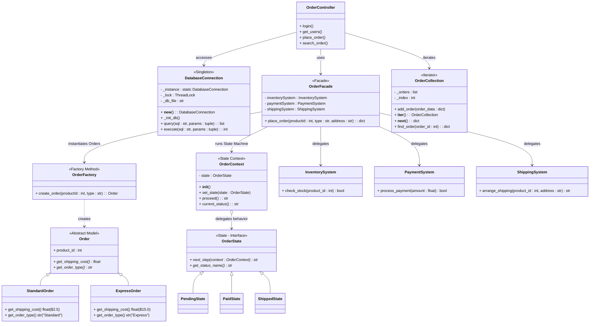
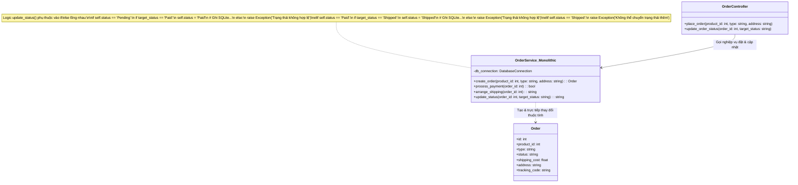
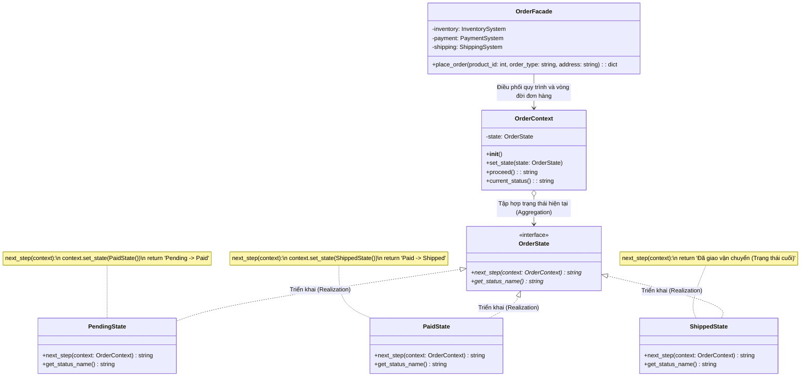
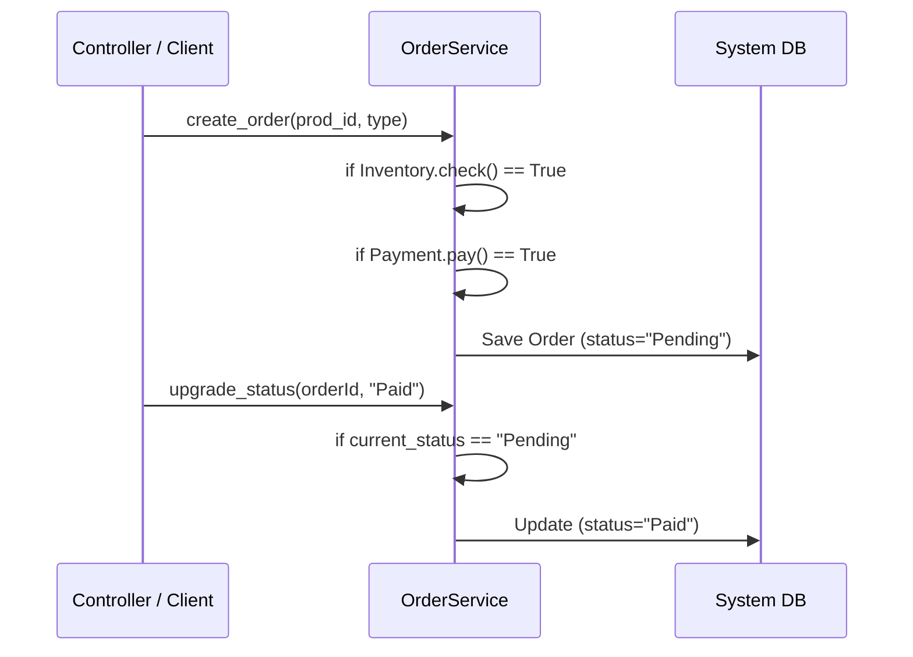
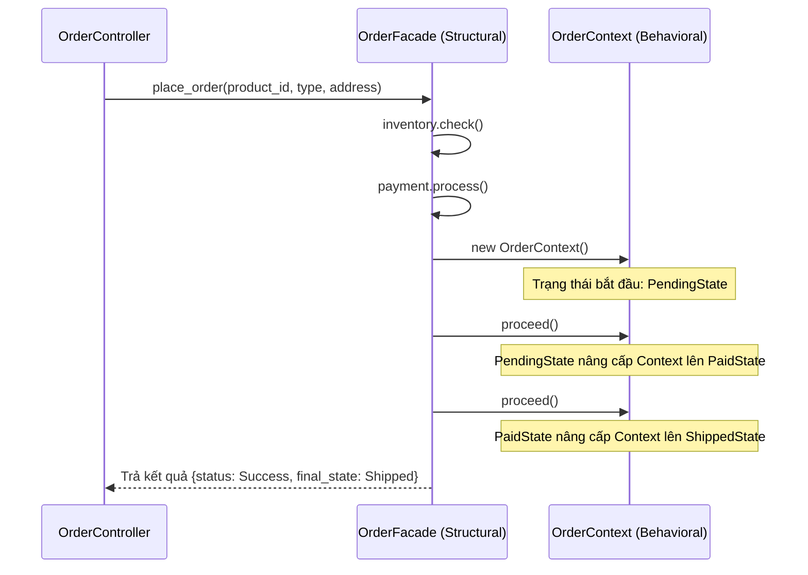
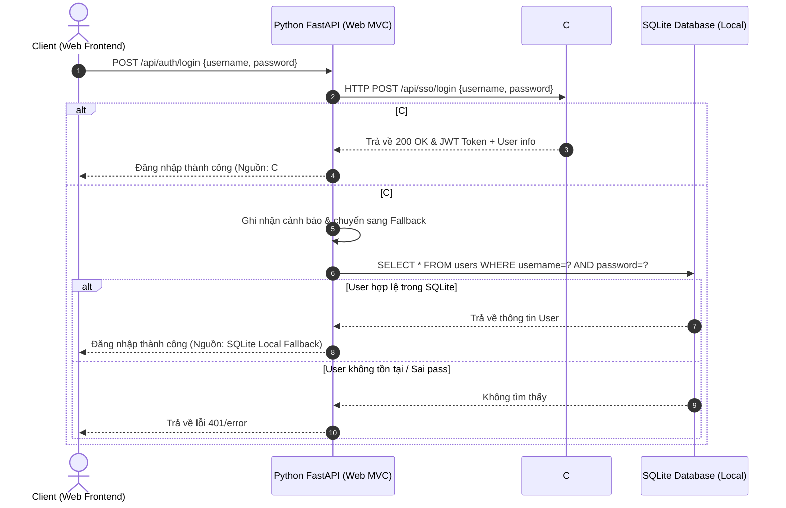
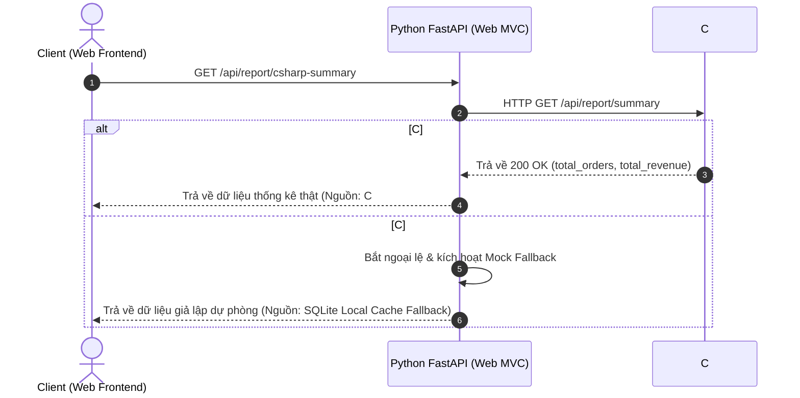

# TÀI LIỆU TỔNG HỢP TOÀN DIỆN DỰ ÁN (PROJECT DOCUMENTATION)
## HỆ THỐNG QUẢN LÝ ĐƠN HÀNG (OMS) - SOFTWARE ARCHITECTURE PROJECT

Dự án này là bài tập lớn kết thúc môn **Kiến trúc phần mềm (Software Architecture)**. 
Tài liệu này tích hợp toàn bộ các báo cáo thiết kế, hướng dẫn vận hành, kịch bản slide thuyết trình bảo vệ và các câu hỏi phản biện để sinh viên dễ dàng theo dõi và nộp bài.

---

## 📑 MỤC LỤC
1. [PHẦN 1: MÔ TẢ BÀI TOÁN & KHÁI QUÁT HỆ THỐNG](#phần-1-mô-tả-bài-toán--khái-quát-hệ-thống)
2. [PHẦN 2: THIẾT KẾ KIẾN TRÚC & SƠ ĐỒ HỆ THỐNG (DIAGRAMS)](#phần-2-thiết-kế-kiến-trúc--sơ-đồ-hệ-thống-diagrams)
3. [PHẦN 3: PHÂN TÍCH CHI TIẾT 5 DESIGN PATTERNS ÁP DỤNG](#phần-3-phân-tích-chi-tiết-5-design-patterns-áp-dụng)
4. [PHẦN 4: HƯỚNG DẪN TRIỂN KHAI & VẬN HÀNH (RUN GUIDE)](#phần-4-hướng-dẫn-triển-khai--vận-hành-run-guide)
5. [PHẦN 5: KỊCH BẢN NỘI DUNG 13 SLIDE THUYẾT TRÌNH BẢO VỆ](#phần-5-kịch-bản-nội-dung-13-slide-thuyết-trình-bảo-vệ)
6. [PHẦN 6: BỘ CÂU HỎI PHẢN BIỆN BẢO VỆ GỢI Ý (Q&A)](#phần-6-bộ-câu-hỏi-phản-biện-bảo-vệ-gợi-ý-qa)
7. [PHẦN 7: TÀI LIỆU API ĐẦY ĐỦ CHI TIẾT (API DOCUMENTATION)](#phần-7-tài-liệu-api-đầy-đủ-chi-tiết-api-documentation)
8. [PHẦN 8: HƯỚNG DẪN SỬA LỖI VÀ XỬ LÝ SỰ CỐ (TROUBLESHOOTING GUIDE)](#phần-8-hướng-dẫn-sửa-lỗi-và-xử-lý-sự-cố-troubleshooting-guide)
9. [PHẦN 9: KỊCH BẢN DEMO BẢO VỆ DỰ ÁN CHI TIẾT (DEMO GUIDE)](#phần-9-kịch-bản-demo-bảo-vệ-dự-án-chi-tiết-demo-guide)

---

---

## PHẦN 1: MÔ TẢ BÀI TOÁN & KHÁI QUÁT HỆ THỐNG

### 1. Mô tả bài toán thực tế (Problem Description)
Trong các doanh nghiệp thương mại điện tử hiện nay, hệ thống xử lý đơn hàng (Order Management System - OMS) phải đối mặt với sự phức tạp ngày càng tăng của quy trình nghiệp vụ. Một đơn hàng từ lúc khởi tạo đến lúc hoàn tất cần đi qua hàng loạt bước kiểm tra tồn kho hàng hóa (Inventory System), xử lý giao dịch thanh toán thông qua ngân hàng/ví điện tử (Payment System), và thiết lập vận đơn vận chuyển giao cho đối tác logistics (Shipping System).

Nếu cài đặt theo tư duy lập trình cấu trúc tuần tự hoặc sử dụng các câu lệnh rẽ nhánh `if/else` lồng nhau để quản lý trạng thái đơn hàng (Đang chờ duyệt -> Đã thanh toán -> Đang giao -> Hoàn tất), hệ thống sẽ gặp các vấn đề nghiêm trọng:
1.  **Mã nguồn Spaghetti**: Logic nghiệp vụ bị phân tán và đan xen chéo, làm cho các class trở nên phình to khó đọc (God Object/Monster Class).
2.  **Vi phạm nguyên lý OCP (Open/Closed Principle)**: Mỗi khi doanh nghiệp bổ sung trạng thái đơn hàng mới (như Trả hàng, Giao thất bại, Chờ hoàn tiền) hoặc loại hình giao hàng mới (giao hỏa tốc 2h), ta buộc phải chỉnh sửa trực tiếp mã nguồn hiện hữu, dễ dẫn đến các lỗi dây chuyền khó kiểm soát.
3.  **Tải trọng tập trung và Khó tích hợp**: Hệ thống đơn lẻ (Monolithic) không thể phân tách các dịch vụ phụ trợ như Xác thực, Tìm kiếm nâng cao và Thống kê để chịu tải độc lập hoặc triển khai trên các công nghệ phần cứng tối ưu hơn.

### 2. Giải pháp kỹ thuật và Kiến trúc Hệ thống (Architectural Styles)

Hệ thống OMS được thiết kế kết hợp giữa hai phong cách kiến trúc hiện đại và mạnh mẽ:

#### A. Kiến trúc phân tầng n-Tier (Mô hình MVC) cho Web API
Web API chính được xây dựng trên nền tảng **Python FastAPI** và cơ sở dữ liệu vật lý **SQLite**, tuân thủ nghiêm ngặt mô hình phân tách trách nhiệm **Model - View - Controller**:
*   **View (Tầng giao diện)**: Sử dụng Single Page Application (SPA) viết bằng Vanilla HTML, CSS (chủ đề Slate Modern) và Javascript. View không chứa logic nghiệp vụ, giao tiếp với Controller hoàn toàn bất đồng bộ thông qua các yêu cầu AJAX/Fetch API.
*   **Controller (Tầng điều hướng)**: Tiếp nhận các yêu cầu HTTP Request từ Client, thực hiện kiểm tra dữ liệu đầu vào (Validation) sơ bộ, sau đó chuyển giao yêu cầu cho tầng Service xử lý. Tầng này cũng đảm nhận vai trò định tuyến và làm Proxy Gateway liên thông dữ liệu tới các Microservices.
*   **Service & Patterns Layer (Tầng xử lý nghiệp vụ)**: Nơi chứa toàn bộ logic xử lý chính của đơn hàng. Đây là nơi 5 Design Patterns được nhúng trực tiếp để module hóa code, cách ly logic và thúc đẩy Loose Coupling (liên kết lỏng).
*   **Repository (Tầng truy xuất dữ liệu)**: Chịu trách nhiệm giao tiếp trực tiếp với cơ sở dữ liệu SQLite (`orders.db`) để thực hiện các thao tác CRUD dữ liệu người dùng và đơn hàng.

##### Bảng ánh xạ cấu trúc thư mục thực tế (Directory Mapping):
| Tầng kiến trúc | Thư mục / Tệp tin trên Disk | Nhiệm vụ cụ thể trong dự án |
| :--- | :--- | :--- |
| **View** | `Project/src/web_mvc/app/static/` | Gồm `index.html` (giao diện), `style.css` (style Slate), `app.js` (xử lý logic client). |
| **Controller** | `Project/src/web_mvc/app/controllers/api_router.py` | Định tuyến REST API, kiểm tra phiên đăng nhập và định cấu hình Proxy Gateway. |
| **Service & Patterns** | `Project/src/web_mvc/app/patterns/` | Chứa 5 patterns: `facade.py`, `factory.py`, `state.py`, `iterator.py`, `singleton.py`. |
| **Model** | `Project/src/web_mvc/app/models/` | Định nghĩa các lớp dữ liệu và thực thể ánh xạ (ORM/Schema). |
| **Repository (Data)** | `Project/src/web_mvc/app/patterns/singleton.py` | Lớp `DatabaseConnection` quản lý tập trung toàn bộ truy vấn SQL thô tới tệp `orders.db`. |

#### B. Kiến trúc Microservices phân tán (Distributed Services Architecture)
Hệ thống OMS tách rời 3 chức năng phụ trợ sang **3 Microservices độc lập** viết bằng ngôn ngữ **C# (.NET 8.0 Minimal APIs)**, chạy trên các cổng (port) riêng biệt nhằm tăng khả năng chịu tải và độc lập bảo trì:
1.  **Auth SSO Service (Port 5001)**: Quản lý đăng nhập tập trung, kiểm tra thông tin tài khoản trực tiếp từ SQLite và cấp mã phiên (JWT Token).
2.  **Search API Service (Port 5002)**: Thực hiện tìm kiếm nhanh thông tin đơn hàng theo ID trực tiếp từ database SQLite dùng chung.
3.  **Statistical Report Service (Port 5003)**: Thu thập toàn bộ dữ liệu đơn hàng trong SQLite, thực hiện phân tích tổng hợp (Aggregations) để tính toán doanh thu thực tế và phân tích xu hướng vận chuyển.

##### Giao thức truyền tin và Cơ chế dự phòng lỗi (Communication & Resiliency)
*   **Giao thức**: Giao tiếp giữa FastAPI Web Component và C# Microservices được thực hiện bất đồng bộ hoặc đồng bộ qua cổng mạng nội bộ bằng **HTTP/RESTful APIs** với định dạng dữ liệu chuẩn JSON.
*   **Cơ chế dự phòng (Resiliency / Fallback)**: Để đảm bảo tính sẵn sàng cao, hệ thống triển khai cơ chế **Graceful Degradation** (Suy giảm mượt mà):
    - Khi **C# SSO Service** hoặc **C# Search Service** offline: Hệ thống tự động kích hoạt **Fallback**, chuyển dịch logic xác thực và tìm kiếm xuống database SQLite cục bộ thông qua các hàm dự phòng chạy bằng **Iterator Pattern**.
    - Khi **C# Report Service** offline: Hệ thống FastAPI tự động bắt lỗi và trả về dữ liệu thống kê giả lập/cached gần nhất (Mock Fallback) thay vì trả về lỗi 500 cho Client.

---

## PHẦN 2: THIẾT KẾ KIẾN TRÚC & SƠ ĐỒ HỆ THỐNG (DIAGRAMS)

### 2.1 Sơ đồ Kiến trúc & Triển khai Hệ thống (Tích hợp 5+ Design Patterns)
Sơ đồ dưới đây mô tả chi tiết kiến trúc phân tầng n-Tier (Web Component FastAPI MVC) được đóng gói trong container Docker và cách nó tích hợp **5+ Design Patterns** (Singleton, Factory Method, Facade, State, Iterator, Proxy Gateway) để giao tiếp hiệu quả với cơ sở dữ liệu SQLite và cụm Microservices C# chạy trên máy host.

```mermaid
graph TB
    classDef client fill:#d4ebf2,stroke:#1a73e8,stroke-width:2px;
    classDef container fill:#fcfcfc,stroke:#5f6368,stroke-width:2px,stroke-dasharray: 5 5;
    classDef component fill:#e8f0fe,stroke:#1a73e8,stroke-width:2px;
    classDef pattern fill:#fef7e0,stroke:#f9ab00,stroke-width:2px;
    classDef db fill:#e6f4ea,stroke:#137333,stroke-width:2px;
    classDef service fill:#fce8e6,stroke:#c5221f,stroke-width:2px;

    Client((Client App / Browser)):::client

    subgraph Web_Application_Docker_Container ["Web Application Container (FastAPI MVC - Port 8000)"]
        
        subgraph Controller_Layer ["Controller Layer"]
            api_router[api_router.py<br/><i>(Proxy Gateway Pattern)</i>]:::component
        end

        subgraph Business_Logic_Service_Layer ["Business Logic & Design Patterns Layer"]
            facade[OrderFacade<br/><b>[Facade Pattern]</b>]:::pattern
            
            subgraph Subsystems ["Internal Subsystems (Facade Hidden)"]
                inv[InventorySystem]:::component
                pay[PaymentSystem]:::component
                ship[ShippingSystem]:::component
            end
            
            factory[OrderFactory<br/><b>[Factory Method Pattern]</b>]:::pattern
            
            subgraph Order_Hierarchy ["Order Class Hierarchy"]
                order[Order (Abstract)]:::component
                std_order[StandardOrder]:::component
                exp_order[ExpressOrder]:::component
            end

            context[OrderContext<br/><b>[State Pattern Context]</b>]:::pattern
            
            subgraph State_Hierarchy ["Order State Hierarchy"]
                state[OrderState (Interface)]:::component
                pending_st[PendingState]:::component
                paid_st[PaidState]:::component
                shipped_st[ShippedState]:::component
            end
            
            collection[OrderCollection<br/><b>[Iterator Pattern]</b>]:::pattern
        end

        subgraph Repository_Persistence_Layer ["Repository & Persistence Layer"]
            db_conn[DatabaseConnection<br/><b>[Singleton Pattern]</b>]:::pattern
        end
    end

    subgraph CSharp_Microservices_Cluster ["Host Windows OS (C# Microservices Cluster)"]
        SSO[Auth SSO Service<br/>Port 5001]:::service
        Search[Search API Service<br/>Port 5002]:::service
        Report[Statistical Report Service<br/>Port 5003]:::service
    end

    subgraph Storage_Tier ["Storage Tier"]
        DB[(SQLite DB<br/>orders.db)]:::db
    end

    %% Interactions
    Client -- "1. HTTP Request" --> api_router
    
    %% Proxy / Gateway Pattern
    api_router -- "HTTP POST (Verify SSO Token)" --> SSO
    api_router -- "HTTP GET (Advanced Search)" --> Search
    api_router -- "HTTP GET (Dynamic Report Summary)" --> Report
    
    %% Controller calling Facade, Iterator, Singleton
    api_router -- "2. place_order()" --> facade
    api_router -- "Traverses / Finds Orders" --> collection
    api_router -- "Reads/Writes User Session" --> db_conn
    
    %% Facade orchestrates subsystems
    facade -- "a. create_order()" --> factory
    factory --> order
    order <|-- std_order
    order <|-- exp_order
    
    facade -- "b. check_stock()" --> inv
    facade -- "c. process_payment()" --> pay
    facade -- "d. arrange_shipping()" --> ship
    
    facade -- "e. proceed() (Updates status)" --> context
    context o-- state
    state <|-- pending_st
    state <|-- paid_st
    state <|-- shipped_st
    
    %% Database Connection (Singleton)
    db_conn -- "Maintains Connection" --> DB
    api_router -- "Fallback Local Database Queries" --> db_conn
    collection -- "Reads records via sqlite3" --> db_conn
```

---

### 2.2 Sơ đồ Class Diagram Tổng thể Hệ thống (Áp dụng 5 Design Patterns)
Sơ đồ thiết kế hoàn thiện biểu diễn cấu trúc của các lớp và mối quan hệ chặt chẽ giữa các thành phần sau khi tích hợp 5 Design Patterns: Singleton, Factory Method, Facade, State và Iterator.



---

### 2.3 Sơ đồ Chi tiết Mẫu thiết kế State (Trước khi áp dụng - Before)
Khi chưa có State Pattern, logic cập nhật và quản lý trạng thái của Đơn hàng gặp lỗi **Tight Coupling** và vi phạm nguyên lý **Open/Closed Principle (OCP)** của SOLID. Các trạng thái được kiểm soát thông qua biến chuỗi/mã trạng thái (`status: string`) và một chuỗi các câu lệnh `if/else` rẽ nhánh lồng nhau phức tạp bên trong một lớp xử lý nghiệp vụ monolithic (`OrderService`).



**Nhược điểm của thiết kế cũ:**
1. **Spaghetti Code**: Mã nguồn bị phình to khi thêm trạng thái mới (ví dụ: `Cancelled`, `Refunded`, `Delivered`). Lớp `OrderService` trở thành God Class gánh vác mọi logic chuyển đổi.
2. **Dễ phát sinh lỗi**: Việc trực tiếp thay đổi thuộc tính `status` ở nhiều nơi làm mất đi tính đóng gói dữ liệu, dễ dẫn đến trạng thái đơn hàng bị cập nhật sai luồng logic nghiệp vụ.

---

### 2.4 Sơ đồ Chi tiết Mẫu thiết kế State (Sau khi áp dụng - After)
Sau khi áp dụng mẫu thiết kế **State (Behavioral Group)**, mỗi trạng thái của đơn hàng được đóng gói thành một lớp thực thể riêng biệt triển khai từ giao diện `OrderState`. Toàn bộ logic kiểm soát luồng di chuyển trạng thái được phân bổ về từng Class trạng thái cụ thể, loại bỏ hoàn toàn các câu lệnh `if/else` lồng nhau.



**Ưu điểm vượt trội của thiết kế mới:**
1. **Loose Coupling & Single Responsibility**: Tách biệt rõ ràng. `PendingState` chỉ quản lý việc chuyển sang `PaidState`, `PaidState` chỉ quản lý chuyển sang `ShippedState`.
2. **Dễ bảo trì và mở rộng (OCP)**: Khi hệ thống cần thêm trạng thái `CancelledState`, ta chỉ cần tạo một Class mới kế thừa từ `OrderState` và thay đổi liên kết chuyển tiếp từ `PendingState` hoặc `PaidState` mà không cần đụng tới code hiện tại của các trạng thái khác.
3. **Mã nguồn sạch sẽ**: Loại bỏ hoàn toàn khối `if-else` lồng nhau. Việc quản lý chuyển dịch trạng thái thông qua cơ chế đa hình (`Polymorphism`) thay vì kiểm tra giá trị chuỗi thủ công.

---

### 2.5 Sơ đồ Sequence Diagram: Luồng nghiệp vụ
So sánh sự khác biệt lớn về độ phức tạp khi có và không có các mẫu thiết kế:

#### A. Khi chưa có Facade và State Pattern
Client hoặc Controller phải liên hệ và kiểm tra thủ công với từng Subsystem độc lập, sau đó sử dụng các logic rẻ nhánh `if/else` để đổi trạng thái đơn hàng.



#### B. Khi có Facade và State Pattern
Controller giao tiếp ở mức độ trừu tượng cao nhất. `OrderFacade` tự động điều phối các Subsystem ngầm bên dưới, và trạng thái đơn hàng được luân chuyển tuần tự tự động qua `OrderContext`.



#### C. Sơ đồ tương tác chéo giữa Python Web MVC và các C# Microservices (Xác thực & Báo cáo)

Để đạt được mô hình kiến trúc phân tán thực tế, Web Component gọi HTTP REST tới các C# Microservices độc lập. Dưới đây là luồng tương tác thực tế bao gồm cơ chế Fallback (dự phòng) tự động khi các service C# ở trạng thái offline.

**1. Luồng Xác thực người dùng (SSO Service - Port 5001)**



**2. Luồng Lấy dữ liệu Báo cáo (Report Service - Port 5003)**



---

## PHẦN 3: PHÂN TÍCH CHI TIẾT 5 DESIGN PATTERNS ÁP DỤNG

Dưới đây là phần phân tích sâu về lý thuyết thiết kế, thành phần tham gia (Participants), logic code thực tế và mối liên hệ với các nguyên lý thiết kế SOLID cho 5 Design Patterns áp dụng trong thư mục [Project/src/web_mvc/app/patterns/](file:///d:/HSU/2533Semester%203(2025-2026)/Kiên%20trúc%20phần%20mềm/Kien_Truc_Phan_Mem_Test-main/Kien_Truc_Phan_Mem_Test-main/Project/src/web_mvc/app/patterns):

### 3.1 Singleton Pattern (`singleton.py`)

*   **Phân loại**: Creational Design Pattern (Nhóm Khởi tạo).
*   **Ý tưởng cốt lõi & Bài toán giải quyết (Intent & Motivation)**:
    Trong môi trường web đa luồng (Multi-threading), nếu mỗi luồng xử lý của người dùng tự tạo một kết nối database SQLite độc lập, hệ thống sẽ nhanh chóng cạn kiệt tài nguyên file descriptor. Nghiêm trọng hơn, do SQLite ghi dữ liệu bằng cách khóa tệp vật lý độc quyền, việc mở quá nhiều kết nối ghi đồng thời sẽ gây ra lỗi `Database is locked`. Mẫu **Singleton** được áp dụng để đảm bảo toàn bộ ứng dụng chỉ duy trì duy nhất một thực thể kết nối database `DatabaseConnection` trong suốt vòng đời chạy.
*   **Thành phần tham gia (UML Participants)**:
    *   `DatabaseConnection`: Lớp Singleton chứa thực thể tĩnh duy nhất `_instance`, cơ chế khóa `_lock` và các phương thức thực thi SQL.
*   **Mã nguồn và Chi tiết Cài đặt (Code Walkthrough)**:
    ```python
    import sqlite3
    import threading
    import logging

    class DatabaseConnection:
        _instance = None
        _lock = threading.Lock() # Khóa bảo vệ an toàn đa luồng
        _db_file = "orders.db"

        def __new__(cls):
            # Kỹ thuật Double-Checked Locking (Kiểm tra khóa kép)
            if cls._instance is None:
                with cls._lock:
                    if cls._instance is None:
                        logging.info("Khởi tạo instance DatabaseConnection (Singleton) lần đầu...")
                        cls._instance = super(DatabaseConnection, cls).__new__(cls)
                        cls._instance._init_db()
            return cls._instance

        def _init_db(self):
            # Khởi tạo tệp tin SQLite và nạp bảng dữ liệu
            self.conn = sqlite3.connect(self._db_file, check_same_thread=False)
            self.conn.row_factory = sqlite3.Row
            ...
    ```
    *Cơ chế hoạt động*: Hàm `__new__` ghi đè constructor của Python. Dòng check `cls._instance is None` đầu tiên giúp tránh việc chiếm dụng khóa Lock một cách không cần thiết nếu thực thể đã tồn tại. Dòng check thứ hai bên trong khối `with cls._lock` đảm bảo rằng ngay cả khi hai luồng đồng thời vượt qua dòng check 1, chỉ có một luồng duy nhất được quyền khởi tạo đối tượng.
*   **Đánh giá Ưu điểm & Nhược điểm (Pros & Cons)**:
    *   *Ưu điểm*: Kiểm soát tập trung tài nguyên kết nối, tiết kiệm RAM, ngăn chặn Race Condition tuyệt đối khi ghi dữ liệu SQLite.
    *   *Nhược điểm*: Tạo ra trạng thái toàn cục (Global State), gây khó khăn khi viết Unit Test độc lập (phải mock kết nối DB).
*   **Mối liên hệ nguyên lý SOLID**:
    *   Tuân thủ nguyên lý **Single Responsibility Principle (SRP)**: Lớp này chỉ chịu trách nhiệm duy nhất là quản lý kết nối vật lý và thực thi các câu lệnh SQL an toàn đa luồng xuống SQLite.

---

### 3.2 Factory Method Pattern (`factory.py`)

*   **Phân loại**: Creational Design Pattern (Nhóm Khởi tạo).
*   **Ý tưởng cốt lõi & Bài toán giải quyết (Intent & Motivation)**:
    Quy trình tính toán phí vận chuyển của đơn hàng phụ thuộc vào loại hình giao hàng (`Standard` hoặc `Express`). Nếu ở tầng dịch vụ đặt hàng, ta khởi tạo trực tiếp các lớp cụ thể bằng từ khóa New, hệ thống sẽ bị phụ thuộc chặt chẽ (Tight Coupling). Mẫu **Factory Method** định nghĩa một giao diện chung để tạo đối tượng đơn hàng, nhưng cho phép lớp nhà máy `OrderFactory` quyết định lớp cụ thể nào được khởi tạo dựa trên tham số đầu vào.
*   **Thành phần tham gia (UML Participants)**:
    *   `Order` (Abstract Product): Lớp trừu tượng định nghĩa các API của đơn hàng.
    *   `StandardOrder` / `ExpressOrder` (Concrete Products): Thực thi cụ thể phí ship ($2.5 và $15.0).
    *   `OrderFactory` (Creator): Cung cấp phương thức `create_order` chịu trách nhiệm khởi tạo thực thể.
*   **Mã nguồn và Chi tiết Cài đặt (Code Walkthrough)**:
    ```python
    from abc import ABC, abstractmethod

    class Order(ABC):
        def __init__(self, product_id: int):
            self.product_id = product_id

        @abstractmethod
        def get_shipping_cost(self) -> float: pass

        @abstractmethod
        def get_order_type(self) -> str: pass

    class StandardOrder(Order):
        def get_shipping_cost(self) -> float: return 2.5
        def get_order_type(self) -> str: return "Standard"

    class ExpressOrder(Order):
        def get_shipping_cost(self) -> float: return 15.0
        def get_order_type(self) -> str: return "Express"

        def create_order(product_id: int, order_type: str) -> Order:
            if order_type.lower() == 'express':
                return ExpressOrder(product_id)
            return StandardOrder(product_id)
    ```
    *Cơ chế hoạt động*: `OrderFacade` gọi `OrderFactory.create_order(product_id, order_type)`. Facade hoàn toàn không cần biết lớp con cụ thể nào được tạo ra, nó chỉ làm việc với giao diện trừu tượng `Order` và nhận về chi phí vận chuyển tương ứng.
*   **Đánh giá Ưu điểm & Nhược điểm (Pros & Cons)**:
    *   *Ưu điểm*: Loại bỏ sự phụ thuộc chằng chịt giữa lớp gọi (Client) và các lớp sản phẩm cụ thể. Thuận tiện khi mở rộng.
    *   *Nhược điểm*: Khi có thêm nhiều loại vận chuyển mới, số lượng lớp con kế thừa tăng lên làm mã nguồn dài hơn.
*   **Mối liên hệ nguyên lý SOLID**:
    *   Tuân thủ nguyên lý **Open/Closed Principle (OCP)**: Thêm loại hình giao hàng mới chỉ cần viết thêm Class mới kế thừa `Order` mà không cần chỉnh sửa các class giao hàng cũ.
    *   Tuân thủ nguyên lý **Dependency Inversion Principle (DIP)**: Tầng nghiệp vụ phụ thuộc hoàn toàn vào lớp trừu tượng `Order` chứ không phụ thuộc vào các lớp cụ thể.

---

### 3.3 Facade Pattern (`facade.py`)

*   **Phân loại**: Structural Design Pattern (Nhóm Cấu trúc).
*   **Ý tưởng cốt lõi & Bài toán giải quyết (Intent & Motivation)**:
    Đặt hàng là một quy trình tích hợp phức tạp, liên quan đến 3 hệ thống con độc lập (Subsystems): Kiểm tra tồn kho hàng hóa (`InventorySystem`), xử lý thanh toán cổng ngân hàng (`PaymentSystem`), và thiết lập thông tin gửi đối tác vận chuyển (`ShippingSystem`). Nếu Controller gọi trực tiếp và điều hành trình tự tương tác của cả 3 lớp này, mã nguồn Controller sẽ cực kỳ phức tạp và bị phụ thuộc nặng nề vào sự thay đổi của các hệ thống con. Mẫu **Facade** cung cấp một giao diện mặt tiền đơn giản duy nhất che giấu đi sự phức tạp này.
*   **Thành phần tham gia (UML Participants)**:
    *   `OrderFacade`: Lớp mặt tiền điều phối chính.
    *   `InventorySystem`, `PaymentSystem`, `ShippingSystem`: Các Subsystem con độc lập.
*   **Mã nguồn và Chi tiết Cài đặt (Code Walkthrough)**:
    ```python
    class OrderFacade:
        def __init__(self):
            self.inventory = InventorySystem()
            self.payment = PaymentSystem()
            self.shipping = ShippingSystem()

        def place_order(self, product_id: int, order_type: str, address: str) -> dict:
            order = OrderFactory.create_order(product_id, order_type)
            order_process = OrderContext()
            
            # Điều phối các subsystem ngầm bên dưới
            if not self.inventory.check_stock(product_id):
                return {"status": "Failed", "reason": "Hết hàng"}
                
            if not self.payment.process_payment(order.get_shipping_cost()):
                return {"status": "Failed", "reason": "Thanh toán thất bại"}
            order_process.proceed() # Pending -> Paid (State Pattern)
            
            tracking_code = self.shipping.arrange_shipping(product_id, address)
            order_process.proceed() # Paid -> Shipped (State Pattern)
            
            return {
                "status": "Success",
                "order_type": order.get_order_type(),
                "final_state": order_process.current_status(),
                "tracking_code": tracking_code
            }
    ```
    *Cơ chế hoạt động*: Controller chỉ cần gọi đúng một dòng: `OrderFacade().place_order(product_id, order_type, address)`. Toàn bộ quy trình tuần tự kiểm kho -> tính phí ship -> thanh toán -> đổi trạng thái -> giao hàng -> lấy mã vận đơn được Facade phối hợp hoàn thành dưới bóng tối.
*   **Đánh giá Ưu điểm & Nhược điểm (Pros & Cons)**:
    *   *Ưu điểm*: Giảm sự phụ thuộc chéo (Loose Coupling) giữa Controller và các Subsystem. Dễ đọc, dễ kiểm thử ở tầng Controller.
    *   *Nhược điểm*: Nếu quy trình nghiệp vụ thay đổi, lớp Facade bắt buộc phải bị sửa đổi.
*   **Mối liên hệ nguyên lý SOLID**:
    *   Tuân thủ nguyên lý **Interface Segregation Principle (ISP)**: Khách hàng chỉ tiếp xúc với giao diện đơn giản nhất có thể mà họ cần (`place_order`), không bị bắt buộc phụ thuộc vào các API chi tiết của từng Subsystem.

---

### 3.4 State Pattern (`state.py`)

*   **Phân loại**: Behavioral Design Pattern (Nhóm Hành vi).
*   **Ý tưởng cốt lõi & Bài toán giải quyết (Intent & Motivation)**:
    Một đơn hàng trải qua nhiều trạng thái nối tiếp (`Pending` -> `Paid` -> `Shipped`). Nếu quản lý trạng thái bằng biến điều khiển chuỗi kết hợp các lệnh điều kiện rẽ nhánh `if/else` hoặc `switch-case` lồng nhau, mã nguồn nghiệp vụ sẽ trở nên vô cùng phức tạp và dễ phát sinh lỗi logic khi mở rộng luồng trạng thái. Mẫu **State** đóng gói mỗi trạng thái của đơn hàng thành các lớp thực thể độc lập, chuyển giao trách nhiệm xử lý chuyển trạng thái cho chính lớp trạng thái hiện hành.
*   **Thành phần tham gia (UML Participants)**:
    *   `OrderContext`: Lớp ngữ cảnh lưu giữ đối tượng trạng thái hiện tại (`OrderState`) và điều phối chuyển trạng thái thông qua hàm `proceed()`.
    *   `OrderState` (State Interface): Interface chung cho tất cả các Concrete State.
    *   `PendingState`, `PaidState`, `ShippedState` (Concrete States): Triển khai logic chuyển trạng thái chi tiết của từng bước.
*   **Mã nguồn và Chi tiết Cài đặt (Code Walkthrough)**:
    ```python
    class OrderState(ABC):
        @abstractmethod
        def next_step(self, context) -> str: pass
        @abstractmethod
        def get_status_name(self) -> str: pass

    class PendingState(OrderState):
        def next_step(self, context) -> str:
            context.set_state(PaidState()) # Chuyển dịch sang trạng thái Paid
            return "Pending -> Paid"
        def get_status_name(self) -> str: return "Pending"

    class PaidState(OrderState):
        def next_step(self, context) -> str:
            context.set_state(ShippedState()) # Chuyển dịch sang trạng thái Shipped
            return "Paid -> Shipped"
        def get_status_name(self) -> str: return "Paid"

    class ShippedState(OrderState):
        def next_step(self, context) -> str:
            return "Shipped (Trạng thái cuối)"
        def get_status_name(self) -> str: return "Shipped"

    class OrderContext:
        def __init__(self):
            self.state = PendingState() # Trạng thái bắt đầu mặc định
        def set_state(self, state: OrderState):
            self.state = state
        def proceed(self) -> str:
            return self.state.next_step(self)
    ```
    *Cơ chế hoạt động*: Khi Facade gọi `order_process.proceed()`, đối tượng `state` hiện tại tự quyết định logic chuyển tiếp. Ví dụ, nếu đang là `PendingState`, nó sẽ tự động kích hoạt `context.set_state(PaidState())`. Không hề xuất hiện một lệnh `if/else` trạng thái nào ở đây.
*   **Đánh giá Ưu điểm & Nhược điểm (Pros & Cons)**:
    *   *Ưu điểm*: Loại bỏ hoàn toàn Spaghetti code `if/else`, đóng gói chặt chẽ logic chuyển dịch trạng thái, tuân thủ nguyên lý thiết kế sạch.
    *   *Nhược điểm*: Làm tăng số lượng lớp con trạng thái trong mã nguồn.
*   **Mối liên hệ nguyên lý SOLID**:
    *   Tuân thủ nguyên lý **Single Responsibility Principle (SRP)**: Mỗi class trạng thái chịu trách nhiệm duy nhất cho logic nghiệp vụ chuyển dịch trạng thái của chính nó.
    *   Tuân thủ nguyên lý **Open/Closed Principle (OCP)**: Bổ sung thêm trạng thái đơn hàng mới chỉ cần viết thêm một Class trạng thái mới kế thừa từ `OrderState` mà hoàn toàn không ảnh hưởng đến code của các trạng thái hiện tại.

---

### 3.5 Iterator Pattern (`iterator.py`)

*   **Phân loại**: Behavioral Design Pattern (Nhóm Hành vi).
*   **Ý tưởng cốt lõi & Bài toán giải quyết (Intent & Motivation)**:
    Dữ liệu danh sách đơn hàng được lấy lên từ database SQLite được lưu trữ dưới dạng mảng (list) trong lớp tập hợp. Nếu Controller truy cập trực tiếp mảng này, sự thay đổi cấu trúc dữ liệu lưu trữ nội bộ sau này (ví dụ chuyển từ list sang tree hoặc hash table để tối ưu tìm kiếm) sẽ làm hỏng mã nguồn ở tầng Controller. Mẫu **Iterator** cung cấp phương pháp duyệt tuần tự qua các phần tử của một đối tượng tập hợp mà không cần để lộ cấu trúc dữ liệu lưu trữ bên dưới của nó.
*   **Thành phần tham gia (UML Participants)**:
    *   `OrderCollection` (Aggregate): Chứa mảng danh sách đơn hàng và thực thi cơ chế tạo Iterator.
    *   Python built-in protocol `__iter__` và `__next__` (Iterator): Duy trì chỉ số vị trí hiện tại của vòng lặp và điều hướng dữ liệu.
*   **Mã nguồn và Chi tiết Cài đặt (Code Walkthrough)**:
    ```python
    class OrderCollection:
        def __init__(self):
            self._orders = [] # Cấu trúc dữ liệu nội bộ được giấu kín

        def add_order(self, order_data: dict):
            self._orders.append(order_data)

        def __iter__(self):
            self._index = 0 # Khởi tạo vị trí duyệt bắt đầu
            return self

        def __next__(self):
            # Tự động điều phối quá trình lặp và ném ngoại lệ dừng khi duyệt hết
            if self._index < len(self._orders):
                result = self._orders[self._index]
                self._index += 1
                return result
            raise StopIteration

        def find_order(self, order_id: int):
            # Duyệt gián tiếp qua Iterator của chính mình
            for order in self:
                if order.get("id") == order_id:
                    return order
            return None
    ```
    *Cơ chế hoạt động*: Controller có thể duyệt danh sách đơn hàng bình thường qua cú pháp `for order in order_collection: ...`. Controller không hề biết danh sách đó được lưu bằng list, tuple hay tree, giúp cô lập hóa cấu trúc dữ liệu.
*   **Đánh giá Ưu điểm & Nhược điểm (Pros & Cons)**:
    *   *Ưu điểm*: Che giấu cấu trúc dữ liệu lưu trữ bên dưới, đơn giản hóa mã nguồn duyệt phần tử ở Client.
    *   *Nhược điểm*: Duyệt Iterator có thể tốn tài nguyên bộ nhớ hơn so với việc truy cập trực tiếp theo index nếu dữ liệu có kích thước cực lớn.
*   **Mối liên hệ nguyên lý SOLID**:
    *   Tuân thủ nguyên lý **Single Responsibility Principle (SRP)**: Tách rời hoàn toàn trách nhiệm quản lý lưu trữ dữ liệu đơn hàng ra khỏi trách nhiệm duyệt qua các phần tử đơn hàng tuần tự.

---

## PHẦN 4: HƯỚNG DẪN TRIỂN KHAI & VẬN HÀNH (RUN GUIDE)

### 4.1 Khởi chạy Web Component (Python FastAPI + Giao diện)
Bạn có thể chọn một trong hai phương án dưới đây tùy thuộc vào môi trường máy:

#### 👉 Phương án A: Khởi chạy nhanh bằng Docker (Khuyên dùng)
Nếu máy tính của bạn đã cài đặt Docker Desktop:
1.  Mở PowerShell/Terminal tại thư mục dự án Web:
    ```powershell
    cd "D:\HSU\2533Semester 3(2025-2026)\Kiến trúc phần mềm\Kien_Truc_Phan_Mem_Test-main\Kien_Truc_Phan_Mem_Test-main\Project\src\web_mvc"
    ```
2.  Khởi chạy Container:
    ```powershell
    docker-compose up -d --build
    ```
3.  **Trải nghiệm**:
    *   Truy cập giao diện Web tại: `http://localhost:8000`
    *   Xem tài liệu API tại: `http://localhost:8000/docs`

#### 👉 Phương án B: Khởi chạy thủ công bằng Python local
Nếu máy tính của bạn đã cài đặt Python 3.10+:
1.  Di chuyển vào thư mục Web và tạo môi trường ảo Python:
    ```powershell
    cd "D:\HSU\2533Semester 3(2025-2026)\Kiến trúc phần mềm\Kien_Truc_Phan_Mem_Test-main\Kien_Truc_Phan_Mem_Test-main\Project\src\web_mvc"
    python -m venv venv
    ```
2.  Kích hoạt môi trường ảo:
    *   *Windows (PowerShell)*: `.\venv\Scripts\activate`
    *   *macOS/Linux*: `source venv/bin/activate`
3.  Cài đặt các thư viện và chạy:
    ```powershell
    pip install -r requirements.txt
    python main.py
    ```

---

### 4.2 Khởi chạy cụm C# Microservices (.NET 8.0)
Cụm Microservices độc lập viết bằng C# chạy trên 3 cổng khác nhau: SSO (5001), Search (5002), và Report (5003).

#### Hướng dẫn chạy nhanh bằng Script tự động:
1.  Mở một cửa sổ PowerShell mới (quyền Administrator).
2.  Di chuyển vào thư mục chứa Microservices:
    ```powershell
    cd "D:\HSU\2533Semester 3(2025-2026)\Kiến trúc phần mềm\Kien_Truc_Phan_Mem_Test-main\Kien_Truc_Phan_Mem_Test-main\Project\src\microservices_csharp"
    ```
3.  Chạy script khởi động:
    ```powershell
    powershell -ExecutionPolicy Bypass -File .\run_microservices.ps1
    ```
    *(Hệ thống sẽ tự động bật 3 cửa sổ CMD chạy độc lập 3 dịch vụ).*

#### Các đường dẫn kiểm thử API (REST JSON):
*   **SSO Service API**: [Xác thực Token](http://localhost:5001/api/sso/verify?token=sso_token_secure_admin_xyz)
*   **Search Service API**: [Tìm kiếm đơn hàng 101](http://localhost:5002/api/search/orders/101)
*   **Report Service API**: [Xem báo cáo doanh thu](http://localhost:5003/api/report/summary)

---

### 4.3 Cách tắt hệ thống
*   **Web Docker**: Chạy lệnh `docker-compose down` tại thư mục `Project/src/web_mvc`.
*   **Web Python local**: Nhấn `Ctrl + C` tại cửa sổ CMD đang chạy server.
*   **C# Microservices**: Tắt 3 cửa sổ Console CMD mới được mở ra trong quá trình chạy script.

---

## PHẦN 5: KỊCH BẢN NỘI DUNG 13 SLIDE THUYẾT TRÌNH BẢO VỆ

*Các slide được biên soạn theo trình tự thuyết trình khoa học giúp sinh viên dễ dàng chuẩn bị.*

*   **Slide 1: Trang tiêu đề & Thành viên nhóm**
    *   *Nội dung*: Hệ thống Quản lý Đơn hàng (OMS) ứng dụng kiến trúc n-Tier & C# Microservices kết hợp áp dụng 5 Design Patterns.
    *   *Kịch bản nói*: Kính chào hội đồng phản biện, hôm nay nhóm chúng em xin trình bày về đề tài xây dựng hệ thống OMS đáp ứng tính linh hoạt và mở rộng cao...
*   **Slide 2: Bài toán thực tế & Thách thức**
    *   *Nội dung*: Spaghetti code khi quy trình xử lý đơn hàng phức tạp. Khó khăn khi đổi trạng thái đơn hàng nếu dùng lệnh `if/else` lồng nhau.
    *   *Kịch bản nói*: Trong thực tế, quy trình đơn hàng tương tác với rất nhiều hệ thống con. Nếu code theo kiểu truyền thống, mã nguồn sẽ trở nên cực kỳ rối ren và dễ phát sinh lỗi...
*   **Slide 3: Giải pháp kiến trúc tổng thể**
    *   *Nội dung*: Gồm Web Component (Python FastAPI MVC + SQLite) và cụm 3 C# Microservices (SSO, Search, Report).
    *   *Kịch bản nói*: Để giải quyết vấn đề, chúng em tách biệt làm 2 khối: Khối Web chính viết bằng FastAPI, và cụm 3 Microservices viết bằng C# để xử lý các tác vụ phụ...
*   **Slide 4: Singleton Pattern (Creational Group)**
    *   *Nội dung*: Class `DatabaseConnection` kết nối SQLite `orders.db`. Đảm bảo an toàn đa luồng (Thread-safe Lock).
    *   *Kịch bản nói*: Chúng em áp dụng Singleton cho kết nối DB để tiết kiệm tài nguyên và chống Race Condition khi có nhiều người truy cập...
*   **Slide 5: Factory Method Pattern (Creational Group)**
    *   *Nội dung*: Lớp cha `Order`, các lớp con `StandardOrder` và `ExpressOrder`. `OrderFactory` khởi tạo.
    *   *Kịch bản nói*: Nhóm sử dụng Factory Method để tách biệt quá trình tạo đơn hàng thường hoặc hoả tốc, giúp dễ dàng thêm các loại giao hàng mới sau này...
*   **Slide 6: Facade Pattern (Structural Group)**
    *   *Nội dung*: Lớp `OrderFacade` che giấu sự phức tạp của 3 subsystem: Inventory, Payment và Shipping.
    *   *Kịch bản nói*: Tầng Controller sẽ không làm việc trực tiếp với Kho hay Thanh toán, mà thông qua Facade giúp code của Controller cực kỳ sạch sẽ và sáng sủa...
*   **Slide 7: State Pattern (Behavioral Group)**
    *   *Nội dung*: `OrderContext`, các lớp trạng thái `PendingState`, `PaidState`, `ShippedState`.
    *   *Kịch bản nói*: Thay vì dùng if-else cập nhật trạng thái đơn hàng, mỗi trạng thái được đóng gói thành một lớp riêng và tự chuyển đổi luân phiên tự động...
*   **Slide 8: Iterator Pattern (Behavioral Group)**
    *   *Nội dung*: Lớp `OrderCollection` triển khai `__iter__` và `__next__`. Duyệt và tìm kiếm đơn hàng.
    *   *Kịch bản nói*: Iterator Pattern giúp chúng em duyệt qua các đơn hàng lấy lên từ SQLite mà không để lộ cấu trúc lưu trữ nội bộ của danh sách...
*   **Slide 9: Sơ đồ Sequence Diagram (So sánh trước & sau có Pattern)**
    *   *Nội dung*: Minh hoạ luồng gọi hàm phức tạp trước đây so với sự tinh giản, trừu tượng hóa cao khi áp dụng Facade + State Pattern.
    *   *Kịch bản nói*: Nhìn vào sơ đồ Sequence này, quý thầy cô có thể thấy sự cải tiến vượt bậc. Controller nay chỉ cần gọi một hàm của Facade, và trạng thái tự chuyển đổi...
*   **Slide 10: Minh hoạ cơ sở dữ liệu thật (SQLite)**
    *   *Nội dung*: Mô tả cấu trúc bảng `users` và `orders` được lưu trữ bền vững tại file `orders.db`.
    *   *Kịch bản nói*: Toàn bộ dữ liệu của dự án đã được tích hợp SQLite thật qua cơ chế Singleton, đảm bảo dữ liệu được lưu trữ vĩnh viễn thay vì mất đi khi tắt RAM...
*   **Slide 11: Demo Giao diện Web Frontend (View)**
    *   *Nội dung*: Giao diện Dark Mode đẹp mắt, các chức năng Đăng nhập, CRUD Users, Đặt hàng và Tra cứu.
    *   *Kịch bản nói*: Đây là giao diện ứng dụng OMS của chúng em. Người dùng có thể thực hiện đăng ký tài khoản, đăng nhập, đặt đơn hàng hoả tốc và theo dõi đơn hàng thời gian thực...
*   **Slide 12: Trình diễn cụm C# Microservices**
    *   *Nội dung*: Khởi chạy 3 Microservices C# (SSO, Search, Report) và kết quả phản hồi REST API.
    *   *Kịch bản nói*: Cụm Microservice C# của chúng em được viết tinh gọn, chạy ổn định song song trên các cổng 5001, 5002, 5003 để bổ trợ cho Web chính...
*   **Slide 13: Kết luận & Giá trị cốt lõi**
    *   *Nội dung*: Mã nguồn đạt chuẩn SOLID, Loose Coupling, dễ bảo trì và khả năng mở rộng cao.
    *   *Kịch bản nói*: Tóm lại, hệ thống OMS của chúng em đã áp dụng thành công các nguyên lý kiến trúc tiên tiến. Nhóm chúng em xin chân thành cảm ơn hội đồng và sẵn sàng nhận câu hỏi...

---

## PHẦN 6: BỘ CÂU HỎI PHẢN BIỆN BẢO VỆ GỢI Ý (Q&A)

### ❓ Câu 1: Tại sao em lại chọn SQLite cho dự án này mà không phải SQL Server hay MySQL?
*   **Trả lời**: Dạ, SQLite là hệ quản trị cơ sở dữ liệu dạng file gọn nhẹ, không yêu cầu cài đặt dịch vụ ngầm phức tạp, rất phù hợp cho mục tiêu trình diễn các mẫu thiết kế và kiến trúc của bài tập lớn. Tuy nhiên, nhờ áp dụng **Singleton Pattern** cho kết nối database và mô hình phân tầng **Repository**, nếu dự án cần nâng cấp lên MySQL hay SQL Server trong tương lai, chúng em chỉ cần sửa đổi chuỗi kết nối trong file Singleton mà không cần chỉnh sửa bất kỳ dòng code nào ở tầng Controller hay View.

### ❓ Câu 2: Trong lớp `DatabaseConnection` (Singleton), làm sao em đảm bảo tính an toàn đa luồng (Thread-safe)?
*   **Trả lời**: Dạ, trong môi trường Web API, nhiều request của người dùng có thể gửi tới đồng thời (Multi-threading). Để tránh tình trạng tạo ra nhiều thực thể kết nối cùng lúc (Race Condition), chúng em đã áp dụng kỹ thuật **Double-Checked Locking** kết hợp thuộc tính `_lock = threading.Lock()`. Khi khởi tạo, hệ thống sẽ kiểm tra thực thể 2 lần trước và sau khi chiếm giữ khóa Lock để đảm bảo an toàn tuyệt đối.

### ❓ Câu 3: Điểm khác biệt lớn nhất khi em áp dụng State Pattern so với dùng `if/else` thông thường là gì?
*   **Trả lời**: Dạ, nếu dùng `if/else` thông thường, mỗi khi thay đổi trạng thái đơn hàng, chúng ta phải viết hàng loạt câu điều kiện lồng nhau trong một phương thức duy nhất của lớp `OrderService`, làm cho lớp này phình to và rất khó đọc (Spaghetti Code). Với State Pattern, mỗi trạng thái (Pending, Paid, Shipped) là một lớp độc lập, chịu trách nhiệm tự xử lý logic của chính nó và tự động chuyển sang trạng thái kế tiếp. Điều này giúp mã nguồn tuân thủ nguyên lý **Single Responsibility** (Đơn nhiệm) và **Open/Closed** (Mở rộng nhưng đóng đóng với sửa đổi) của nguyên lý SOLID.

### ❓ Câu 4: Facade Pattern có vai trò gì trong quy trình Đặt hàng (Place Order) của hệ thống?
*   **Trả lời**: Quy trình đặt đơn hàng liên kết nhiều hành động phức tạp: kiểm kho (`InventorySystem`), thanh toán tiền (`PaymentSystem`), và giao vận (`ShippingSystem`). Nếu Controller gọi trực tiếp cả 3 lớp này thì Controller sẽ bị phụ thuộc chặt chẽ (Tight Coupling). Chúng em sử dụng `OrderFacade` để làm trung gian điều phối tất cả các hệ thống này. Controller chỉ cần gọi đúng một phương thức `place_order` của Facade là xong, giúp mã nguồn ở tầng Controller tối giản và độc lập.

---

## PHẦN 7: TÀI LIỆU API ĐẦY ĐỦ CHI TIẾT (API DOCUMENTATION)

### 7.1 WEB API COMPONENT (Python FastAPI - Cổng 8000)

*   **Đăng nhập (Login)**:
    *   *Endpoint*: `POST /api/auth/login`
    *   *Request Body*: `{"username": "admin", "password": "123"}`
    *   *Response (200 OK)*: `{"message": "Đăng nhập thành công!", "token": "fake_jwt_1", "user": {"id": 1, "username": "admin", "email": "admin@example.com", "is_admin": true}}`

*   **Xem danh sách người dùng**:
    *   *Endpoint*: `GET /api/users`
    *   *Response (200 OK)*: Danh sách người dùng trong SQLite.

*   **Đăng ký tài khoản mới**:
    *   *Endpoint*: `POST /api/users`
    *   *Request Body*: `{"username": "customer", "password": "123", "email": "customer@example.com"}`
    *   *Response (200 OK)*: `{"message": "Đăng ký thành công User ID 3!"}`

*   **Đặt hàng (Facade)**:
    *   *Endpoint*: `POST /api/orders/place`
    *   *Request Body*: `{"product_id": 1, "order_type": "express", "address": "TPHCM"}`
    *   *Response (200 OK)*: `{"status": "Success", "order_type": "Express", "final_state": "Shipped", "tracking_code": "...", "order_id": 103}`

*   **Tìm kiếm đơn hàng (Iterator)**:
    *   *Endpoint*: `GET /api/orders/search/{order_id}`
    *   *Response (200 OK)*: Dữ liệu đơn hàng chi tiết hoặc thông báo lỗi `{"error": "..."}`.

*   **Xem tất cả đơn hàng (Iterator)**:
    *   *Endpoint*: `GET /api/orders/`
    *   *Response (200 OK)*: Mảng JSON toàn bộ đơn hàng trong SQLite.

### 7.2 MICROSERVICES COMPONENT (C# .NET - Cổng 5001, 5002, 5003)

*   **SSO Service**:
    *   *Xác thực Token*: `GET http://localhost:5001/api/sso/verify?token=sso_token_secure_admin_xyz`
    *   *Response (200 OK)*: `{"valid": true, "user": "admin", "source": "SSO C# Microservice"}`
*   **Search Service**:
    *   *Tìm nâng cao*: `GET http://localhost:5002/api/search/orders/{order_id}`
    *   *Response (200 OK)*: Đơn hàng nâng cao dạng JSON kèm trường `searched_at`.
*   **Report Service**:
    *   *Báo cáo thống kê*: `GET http://localhost:5003/api/report/summary`
    *   *Response (200 OK)*: `{ "total_orders": 52, "total_revenue": 12450.5, "shipping_summary": [...] }`

---

## PHẦN 8: HƯỚNG DẪN SỬA LỖI VÀ XỬ LÝ SỰ CỐ (TROUBLESHOOTING GUIDE)

### 8.1 Lỗi chạy Script PowerShell (.ps1)
*   *Lỗi*: Script is disabled on this system.
*   *Cách sửa*: Chạy lệnh PowerShell:
    ```powershell
    powershell -ExecutionPolicy Bypass -File .\run_microservices.ps1
    ```
    Hoặc mở PowerShell quyền Admin và gõ: `Set-ExecutionPolicy -ExecutionPolicy RemoteSigned -Scope LocalMachine`.

### 8.2 Lỗi xung đột cổng chạy (Address already in use)
*   *Lỗi*: Cổng 8000, 5001, 5002 hoặc 5003 đã bị chiếm dụng.
*   *Cách sửa*: Tìm PID bằng lệnh: `netstat -ano | findstr :8000` (giả sử cổng 8000), sau đó tắt bằng lệnh: `taskkill /F /PID <PID_số>`.

### 8.3 Lỗi Docker Engine chưa chạy
*   *Lỗi*: Cannot connect to the Docker daemon.
*   *Cách sửa*: Hãy khởi chạy phần mềm **Docker Desktop** trên máy tính Windows của bạn và đợi cho biểu tượng chú cá voi chuyển sang màu xanh lá trước khi chạy docker-compose.

### 8.4 Lỗi SQLite database bị khóa (Database is locked)
*   *Lỗi*: sqlite3.OperationalError: database is locked.
*   *Cách sửa*: Tắt các ứng dụng xem DB bên ngoài (như DB Browser for SQLite) đang mở tệp `orders.db` ở chế độ ghi, sau đó khởi động lại server API.

---

## PHẦN 9: KỊCH BẢN DEMO BẢO VỆ DỰ ÁN CHI TIẾT (DEMO GUIDE)

### 9.1 Lệnh chạy dự án nhanh nhất
*   **Chạy Web FastAPI + SQLite (Docker)**:
    ```powershell
    cd "D:\HSU\2533Semester 3(2025-2026)\Kiến trúc phần mềm\Kien_Truc_Phan_Mem_Test-main\Kien_Truc_Phan_Mem_Test-main\Project\src\web_mvc"
    docker-compose up -d --build
    ```
*   **Chạy 3 C# Microservices (PowerShell script)**:
    ```powershell
    cd "D:\HSU\2533Semester 3(2025-2026)\Kiến trúc phần mềm\Kien_Truc_Phan_Mem_Test-main\Kien_Truc_Phan_Mem_Test-main\Project\src\microservices_csharp"
    powershell -ExecutionPolicy Bypass -File .\run_microservices.ps1
    ```

### 9.2 Kịch bản các bước Demo trên giao diện (http://localhost:8000)

#### 📍 Bước 1: Giới thiệu giao diện & Kết nối DB Singleton
*   **Thao tác**: Cuộn trang web, chỉ vào header của Dashboard hiển thị `SQLite Connected (Singleton)`.
*   **Lời thoại**: *"Đây là giao diện chính của Hệ thống Quản lý Đơn hàng (OMS). Ở góc bên phải tiêu đề, hệ thống hiển thị trạng thái kết nối Database được thiết lập thông qua Singleton Pattern để đảm bảo ứng dụng dùng duy nhất một Instance kết nối SQLite trong suốt vòng đời chạy."*

#### 📍 Bước 2: Đăng ký & Đăng nhập tài khoản cục bộ (Local Fallback)
*   **Thao tác**: Nhấn Đăng xuất, sang tab Đăng ký tạo tài khoản `customer_test`/`123`, sau đó sang tab Đăng nhập để truy cập.
*   **Lời thoại**: *"Khi các C# Microservices chưa online, hệ thống tự động chuyển hướng xác thực xuống database SQLite cục bộ. Giao diện hiển thị rõ nguồn xác thực là SQLite Local Database Fallback."*

#### 📍 Bước 3: Xem danh sách thành viên (User Management)
*   **Thao tác**: Nhấp tab **Quản lý Users** trên Sidebar bên trái, chỉ ra tài khoản `customer_test` vừa tạo nằm ở cuối bảng.
*   **Lời thoại**: *"Dữ liệu tài khoản mới đăng ký đã được ghi nhận thành công và hiển thị thời gian thực từ database SQLite."*

#### 📍 Bước 4: Tạo đơn hàng mới (Facade + Factory + State Pattern)
*   **Thao tác**: Vào tab **Đặt hàng & Tra cứu**, chọn sản phẩm (iPhone), chọn giao hàng hỏa tốc (Express - ship $15.0), nhập địa chỉ, nhấn Đặt hàng.
*   **Lời thoại**: *"Khi click Đặt hàng, Facade Pattern điều phối Kho, Thanh toán và Vận chuyển ngầm; Factory Method khởi tạo Class ExpressOrder để tính phí ship $15.0; và State Pattern quản lý vòng đời trạng thái đơn hàng (Pending -> Paid -> Shipped) tự động."*

#### 📍 Bước 5: Tra cứu đơn hàng (Proxy C# Search & Fallback Iterator)
*   **Thao tác**:
    *   *C# Search Service Online*: Tìm ID `101` hoặc `102` -> Nhãn hiển thị **"Nguồn tìm kiếm: C# Search Microservice (:5002)"**.
    *   *C# Search Service Offline*: Tìm ID `106` (đơn hàng vừa tạo) -> Nhãn hiển thị **"Nguồn tìm kiếm: SQLite Local (Iterator Pattern Fallback)"**.
*   **Lời thoại**: *"Tìm kiếm đơn hàng ưu tiên Proxy gọi C# Search Service cổng 5002. Nếu service offline, hệ thống tự động fallback sử dụng Iterator Pattern duyệt tìm trong database SQLite cục bộ."*

#### 📍 Bước 6: Demo liên thông dữ liệu chéo (SSO & Report)
*   **Thao tác**: Đăng nhập tài khoản `admin`/`123`. Lúc này nhãn đổi thành **"Xác thực: C# SSO Microservice (:5001)"**. Bấm Dashboard, dữ liệu doanh thu báo cáo tổng hợp hiển thị rõ nguồn từ **"C# Report Microservice (:5003)"**.
*   **Lời thoại**: *"Khi cụm C# hoạt động, Web Component sẽ gọi REST API liên thông xác thực SSO và thống kê báo cáo doanh thu trực tiếp từ các microservice C# cổng 5001 & 5003."*

#### 📍 Bước 7: Minh chứng tính bền vững dữ liệu (Persistence)
*   **Thao tác**: Tắt Docker Compose (`docker-compose down`) và bật lại. Tải lại trang Web, đăng nhập tài khoản `customer_test` và chứng minh các đơn hàng cũ vẫn tồn tại nguyên vẹn.
*   **Lời thoại**: *"Dữ liệu được lưu trữ bền vững vật lý tại tệp SQLite orders.db chứ không lưu tạm trên RAM, đảm bảo thông tin không bị mất đi khi restart hệ thống."*
