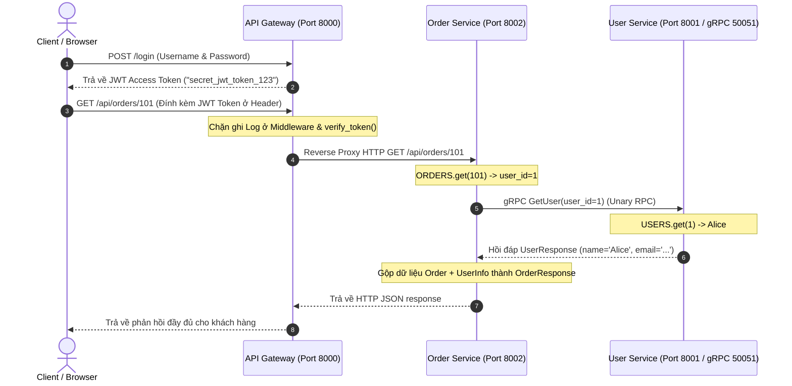

# 🐳 Docker Deployment & Architecture Guide

Tài liệu này dùng để giải thích cho giảng viên về cách chúng ta sử dụng công nghệ ảo hóa mạng của **Docker** và **Docker Compose** để kết nối các microservices, mô tả chi tiết mô hình thiết kế và quy trình giao tiếp chéo. Bạn có thể sao chép thông tin và sơ đồ này vào Slide PPTx.

---

## Sơ đồ Thiết kế & Quy trình Hệ thống (Design & Process Diagrams)

### Sơ đồ 1: Kiến trúc Triển khai (Deployment Topology)
Mô tả cách thức API Gateway làm chốt chặn duy nhất mở cổng ra thế giới và các Service nội bộ được cô lập an toàn bên trong mạng ảo Private Docker Network.

```mermaid
graph TD
    Client["Client (Trình duyệt/Postman)"] -- "HTTPS (Port 8000)" --> Gateway["API Gateway (python_gateway_service)"]
    
    subgraph Private Docker Network (micro-network)
        Gateway -- "Reverse Proxy / HTTP" --> Order["Order Service (python_order_service: Port 8002)"]
        Order -- "gRPC Unary / Stream (Port 50051)" --> User["User Service (python_user_service: Port 8001 / gRPC 50051)"]
    end
```

### Sơ đồ 2: Kịch bản Giao tiếp khi lấy Đơn Hàng (Sequence Process)
Quy trình bất đồng bộ tuần tự từ khâu Authentication, ghi Log giám sát, gọi API, gọi gRPC nội bộ và đóng gói dữ liệu phản hồi chéo.



---

## 1. Cấu trúc Hình thái (Topology Setup)
Chúng ta có 3 block độc lập hoàn toàn (cả về mã nguồn lẫn biến môi trường):
- **Node A**: User Service (FastAPI REST + gRPC Server)
- **Node B**: Order Service (FastAPI REST + gRPC Client)
- **Node C**: API Gateway (FastAPI Auth + Proxy Server)

Nếu không có Docker, 3 hệ thống này muốn nói chuyện được với nhau phải hard-code bằng các IP ảo (localhost) và tự quản lý môi trường Python rất rườm rà.

## 2. Lát cắt Dockerfile
Cả 2 dịch vụ đều được gói trong Alpine/Slim Python image siêu nhẹ (`python:3.10-slim`).
Điểm nổi bật của file `Dockerfile`:
- Nó tự động tải thư viện Protobuf và **biên dịch (compile)** file `service.proto` ra Python Scripts ảo trước khi Server hoạt động. Tức là người Review Code không bao giờ thấy thư viện sinh tự động rác trên Github, nó chỉ tồn tại bên trong Docker.
- Code đảm bảo sạch, tuân thủ Continuous Integration (CI).

## 3. Cấu hình Docker Compose Network
Quan sát file `docker-compose.yml`, chúng ta rút ra các điểm ăn tiền:
1. **Private Network**: Định nghĩa `networks: micro-network`. Hai service nằm gọn trong cái private net này. An toàn tuyệt đối.
2. **DNS Resolution**: Trong code của Order Service, mình không hề trỏ `127.0.0.1` hay `192.168.x.x` để tìm User Service. Mình gọi trực tiếp biến môi trường:
   `USER_SERVICE_URL=user-service:50051`.  
   -> Docker tự động làm **Service Discovery** phân giải cái chữ `user-service` thành IP mạng nôi bộ. Rất linh hoạt và đáp ứng đúng Concept "Decoupled Microservices" mà giảng viên dạy trên lớp. 
3. **Orchestration**: Lệnh `depends_on: - user-service` bắt buộc Docker phải khởi động dịch vụ User lên trước, cắm gRPC server sẵn sàng đi rồi nó mới nhả Order Service lên sau, nhằm tránh việc Order Service bị ném Exception "Connection Refused" ngay phút đầu chạy ứng dụng.
