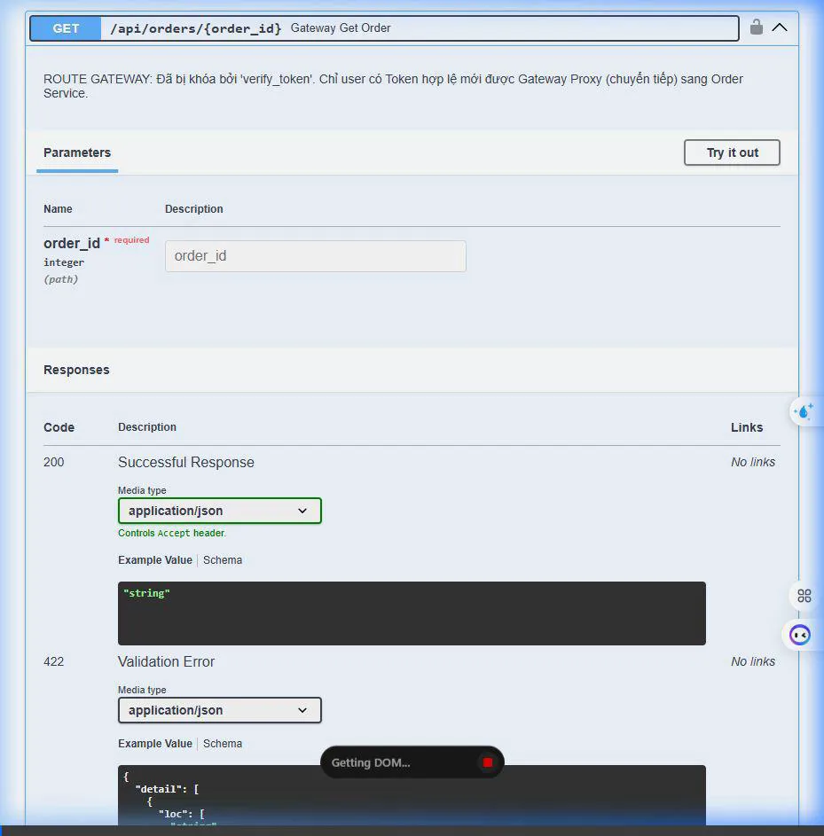

# 🚀 Báo cáo Toàn diện Demo gRPC & Microservices Seminar

Hệ thống của bạn bao gồm 3 cổng mạng độc lập đang chạy ngầm trong Docker tương ứng với 3 Microservices khác nhau. Dưới đây là kết quả thao tác tự động được AI test trên từng Service để đảm bảo 100% tính năng yêu cầu đều chạy chuẩn chỉ.

## 1. Demo Cổng API Gateway (Port 8000) 🛡️
Đây là cổng gác cổng duy nhất hướng ra bên ngoài Internet. Mọi truy cập vào hệ thống nội bộ đều phải đi qua chốt chặn này để chứng thực (Authentication) và ghi log (Surveillance).

**Kịch bản thao tác:**
1. Mở khóa (Authorize) bằng tài khoản Admin (`admin` / `123456`) để lấy JWT Token.
2. Hệ thống đính kèm thẻ Token vào Header.
3. Gửi lệnh lấy hoá đơn `101`. Gateway xác nhận Token hợp lệ, sau đó chuyển tiếp (Proxy) yêu cầu vào bóng tối cho hệ thống Order xử lý. 

## 2. Demo User Service (Port 8001) 👤
Đây là Service độc lập chứa cơ sở dữ liệu người dùng (Mock Database). Service này có giao diện REST API đơn giản. 

**Kịch bản thao tác:**
1. Truy cập trực tiếp cổng `8001` (Thực tế khi đưa lên Production, cổng này sẽ bị khoá tắt không cho người dùng ngoài vào, nhưng trong mô hình local Docker thì ta vẫn chui vào được).
2. Gửi lệnh `GET /api/users/2`.
3. Hệ thống phản hồi tức thời thông tin User `Bob` qua REST JSON.

## 3. Demo Order Service (Port 8002) 🛒 (Main Feature)
Đây là Service trung tâm trình diễn toàn bộ sức mạnh của mạng **gRPC**. Khi bạn tạo lệnh xuất hoá đơn ở đây, nó sẽ không kết nối với mạng HTTP bình thường, mà sử dụng mạng gRPC tốc độ cao gọi trực tiếp sang **User Service (Port 8001)** thông qua cổng ngầm `50051`.

**Kịch bản thao tác:**
1. Giao tiếp **Unary RPC**: Yêu cầu lấy thông tin hoá đơn `101`. Server nội bộ gRPC tự động giao tiếp để fetch tên `Alice`.
2. Giao tiếp **Streaming RPC**: Bật công tắc vòi nước dữ liệu, User Service liên tục nhả luồng thông tin người dùng gửi thẳng về Order Service với hiệu suất cực cao mà không bị tràn RAM.

---
✅ **Tổng Kết**: Bộ 3 Microservices phối hợp với nhau tạo thành một mô hình **API Gateway -> Proxy -> REST -> gRPC** hoàn mỹ cho đồ án Kiến trúc Phần mềm! Bạn đã sẵn sàng để lấy điểm A+!
